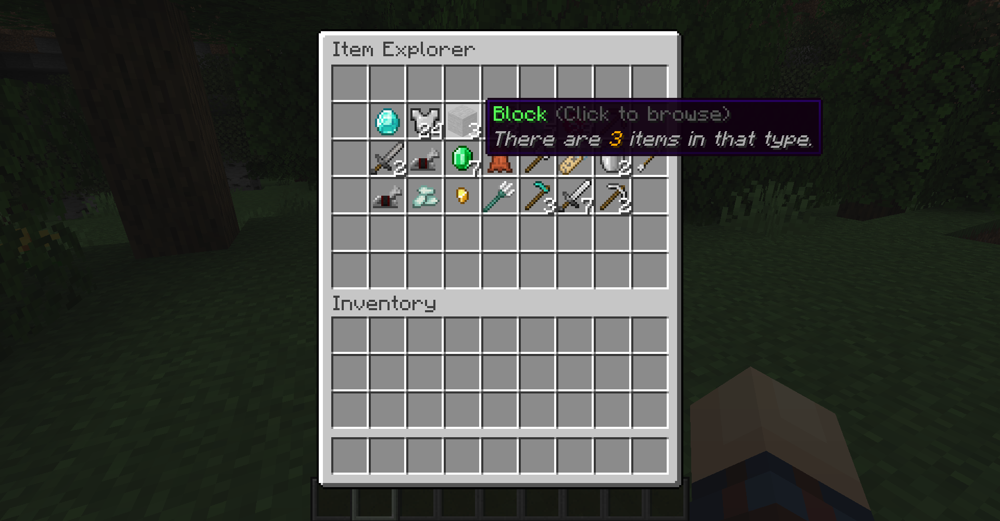
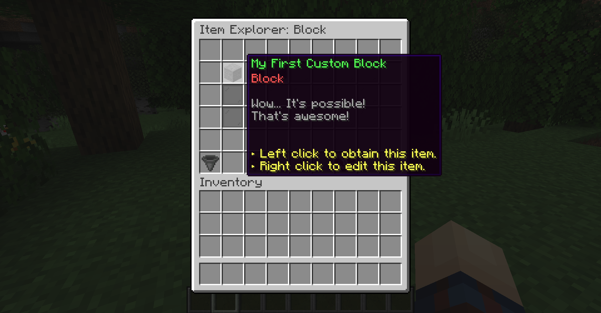
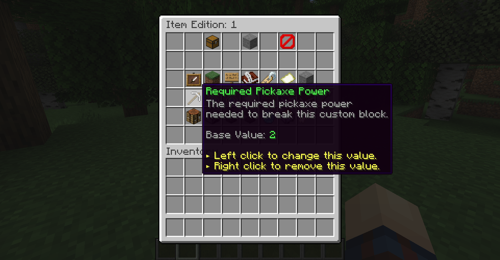
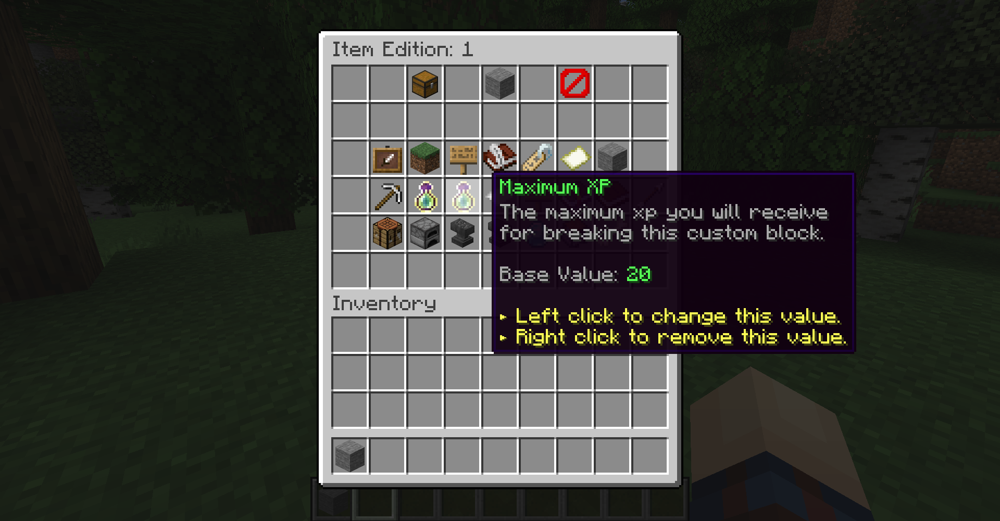
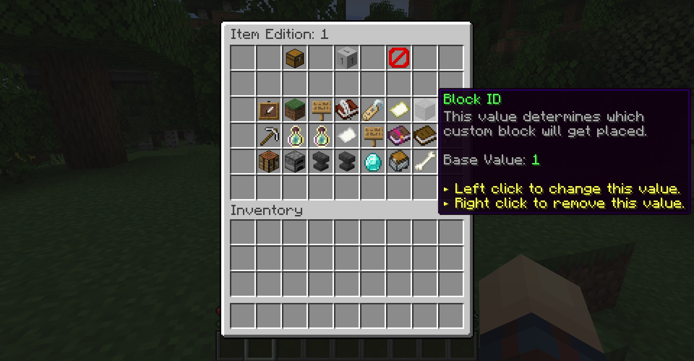
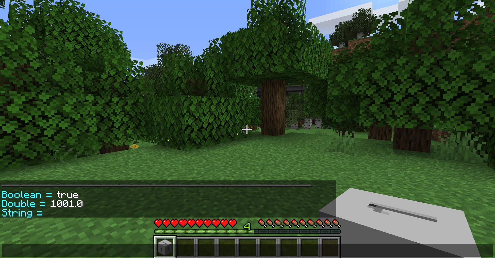
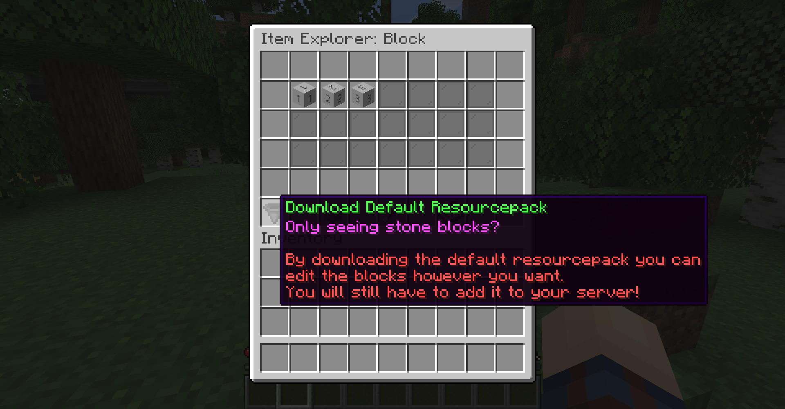
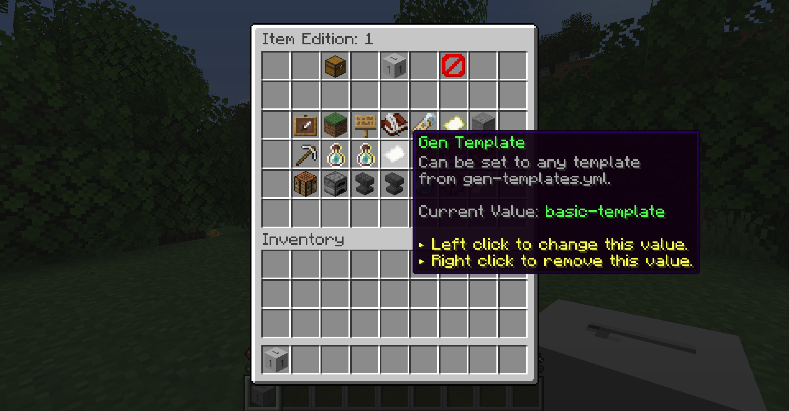

Using MMOItems 5+ you may implement blocks with a custom texture. You can even them spawn and define how rare they are using [world generation templates](World Generation Templates), configure with what tool it should be broken by players, decide what it loots using MMOItems drop tables and bind a random amount of exp to it.

## Creating and editing a custom block
You can browse current custom blocks using `/mi browse blocks`. When using the item browser, you may use the small item indicator at the bottom right of the GUI to switch to the Block Browser. Just like with the item browser, you can right click your custom blocks to edit them.







Here is a config template from `blocks.yml`
```
1:
    display-name: "&aMy First Custom Block"
    lore:
    - "&7Wow... It's possible!"
    - "&7That's awesome!"
```
## Pickaxe Power
`required-power` defines the pickaxe power your tool must have in order to break that block. If it is set to 3, players must use a MMOItem tool with a `Pickaxe Power` higher than 3. 



By default, vanilla pickaxes have a pre-defined pickaxe power as follows:
```
WOOD_PICKAXE = 5
STONE_PICKAXE = 10
GOLDEN_PICKAXE = 15
IRON_PICKAXE = 20
DIAMOND_PICKAXE = 25
NETHERITE_PICKAXE = 30
```

## Block Break XP
If `min-xp` and `max-xp` are added, breaking a custom block rolls a random amount of exp chosen between `min-xp` and `max-xp` and spawns an exp orb on the block just like regular ores.



## Custom Texture
If you know how resource packs and custom model data works, you can texturize your custom block by defining its `Custom Model Data` through `block-id`.


A `block-id` doesn't absolutely mean `CustomModelData` tag in the item. If an item has a `block-id` of `300`, its `CustomModelData` will become `1300`. This is because MMOItems will add `1000` to the assigned `block-id` as its `CustomModelData`. A useful command to use is `/mi debug checktag CustomModelData` to see the value of the tag from the block you are currently holding.



A link to download the sample texture pack is also included in the block browser GUI ingame.


## World Generation
A custom block can be included in the world generation given that it has a `block-id`. To include a custom block in the world generation, you need add a `Gen Template` to your block so that it will be registered when new chunks are loaded in your world. You can check out the [world generation templates](World Generation Templates) guide for more info about setting up/customizing generation.

