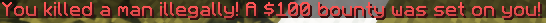
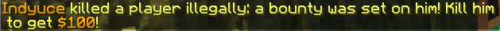

# ⛓️‍💥 Automatic Bounties

Auto bounties allow you to punish players for killing people _illegally_. An illegal kill is a kill done on a player who does not have any bounty placed on them. This feature is useful to avoid random killing and to encourage players to only kill those who have bounties on them.

If the player already has a bounty on them, the auto-bounty system will simply increase the current bounty instead of creating a new one.





## Configuration

```yml
# When enabled, it will automaticaly place a bounty onto any
# player who kills a player with no bounty on them (illegal kill).
auto-bounty:
  enabled: false

  # Bounty reward
  reward: 100

  # Chance of applying
  chance: 100

  # If the auto bounty should keep increasing a bounty if it's already set
  increment: true
```

Set `enabled` to `false` to completely disable the auto-bounty. `reward` defines the default bounty reward. `chance` defines the chance (in %) for a player to trigger the auto-bounty system when killing someone illegally.