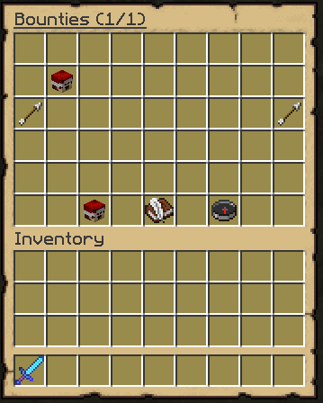
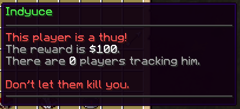
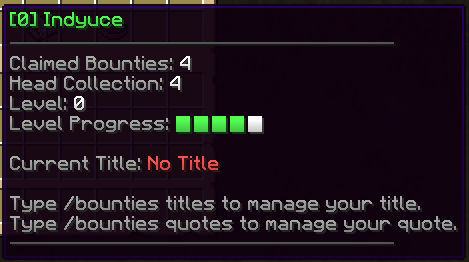

# 📜 Bounties

## Creating a bounty

Any player with the permission `bountyhunters.add` can use the /bounty command to set a bounty onto someone's head. The sender has to specify the target name: `/addbounty <target> <reward>`.\
You can also do the exact same command even if the player already has a bounty on him, it will just increase the bounty by a certain amount and display a message in the chat again. This can be used by players to get someone else killed faster by other bounty hunters.

If you have the `bountyhunters.immunity` permission node, players who do not have the `bountyhunters.immunity.bypass` perm node will not be able to set a bounty on you. This feature may be used by admins to prevent other players from setting bounties onto them.

The bounty list can be accessed using `/bounties`.



## Bounty List UI

By hovering the different player heads in the GUI, you can see information about all the current bounties. You can see what the current reward is, how many players are currently **tracking** the bounty target. You can also determine by reading the first line, the creator of the bounty, if the bounty was created by a player or if the bounty was generated automatically due to an illegal kill.



This menu will also display some of your statistics, like your level, claimed/successful bounties, level progress, etc. You can see these stats by hovering the player head on the bottom left corner of the GUI. All the stats that are displayed there can also be accessed using placeholders.



## Editing this menu

Item names, lores, materials, slots... are completely editable in the `gui/bounty-list.yml` config file.

::: details Default Config (might be outdated)
```yml
# GUI display name
name: 'Bounties ({page}/{max_page})'

# Number of slots in your inventory. Must be
# between 9 and 54 and must be a multiple of 9.
slots: 54

items:

  display_bounty:
    slots: [ 10,11,12,13,14,15,16,19,20,21,22,23,24,25,28,29,30,31,32,33,34 ]
    function: bounty

    # When there is no bounty in the given slot
    no_bounty:
      item: GRAY_STAINED_GLASS_PANE
      name: '&cNo Bounty'
      hide_tooltip: true

    # General language options
    last_update_date_format: 'dd/M/yyyy' # Date format used for date placeholders
    no_creator_placeholder: '&cServer'
    creator_line:
      self: '&7You created this bounty.'
      other: '&7{creator} created this bounty.'
      none: '&cThis player is a criminal!'
    action_line:
      target: '&cPeople are looking for you.'
      contributor: '&eRight click to take away your contribution.'
      none: '&eKill them to claim the bounty.'
    hunter_line:
      target: null # Hide line for target of bounty
      hunter: '&7▸ Click to stop &ctracking &7them.'
      none: '&7▸ Click to &ctrack &7them for ${target_tax}.'

    item: PLAYER_HEAD
    name: '&6{target}'
    # You can set custom model data int and string here
    #custom_model_data_string: 'something'
    #custom_model_data: 1234
    lore:
      - ''
      #- '{creator_line}'
      - '&f 💵&7 Reward of &f${reward}' # claim tax can be accessed {claim_tax}
      - '&f ⚔&7 Contributors: &f{contributors}'
      - '&f ☠ &7Hunters: &f{hunters}'
      - '&f ⏳ &7Last Update: &f{last_update}'
      - ''
      - '{action_line}'
      - '{hunter_line}'

  buy_bounty_compass:
    function: bounty_compass
    slots: [ 51 ]

    item: COMPASS
    name: '&6Bounty Compass'
    lore:
      - ''
      - '&eClick to buy the bounty compass for &6${price}'

  how_to_create_bounty:
    slots: [ 49 ]

    name: '&6How to create a bounty?'
    item: WRITABLE_BOOK
    lore:
      - 'Use /bounty <player> <reward>'
      - 'to create a bounty on a player.'
      - ''
      - '&6How to increase a bounty?'
      - 'Use /bounty <player> <amount>'
      - 'to increase an existing bounty.'
      - ''
      - '&6How to remove a bounty?'
      - 'Take off your contribution by right'
      - 'clicking the bounty item in this menu.'

  player_profile_item:
    function: player_profile
    slots: [ 47 ]

    no_title_placeholder: '&cNo Title'

    item: PLAYER_HEAD
    name: '&6[{level}] {name}'
    lore:
      - ''
      - 'Claimed Bounties: &f{claimed_bounties}'
      - 'Head Collection: &f{successful_bounties}'
      - 'Level: &f{level}'
      - 'Level Progress: {level_progress}'
      - ''
      - 'Current Title: &f{current_title}'
      - ''
      - 'Use /bounties titles to check your hunter titles.'
      - 'Use /bounties animations to check your death animations.'


  next_page_item:
    function: next_page
    slots: [ 26 ]

    item: PLAYER_HEAD
    texture: eyJ0ZXh0dXJlcyI6eyJTS0lOIjp7InVybCI6Imh0dHA6Ly90ZXh0dXJlcy5taW5lY3JhZnQubmV0L3RleHR1cmUvMTliZjMyOTJlMTI2YTEwNWI1NGViYTcxM2FhMWIxNTJkNTQxYTFkODkzODgyOWM1NjM2NGQxNzhlZDIyYmYifX19
    name: '&6Next Page'
    lore: { }

  prev_page_item:
    function: previous_page
    slots: [ 18 ]

    item: PLAYER_HEAD
    texture: eyJ0ZXh0dXJlcyI6eyJTS0lOIjp7InVybCI6Imh0dHA6Ly90ZXh0dXJlcy5taW5lY3JhZnQubmV0L3RleHR1cmUvYmQ2OWUwNmU1ZGFkZmQ4NGU1ZjNkMWMyMTA2M2YyNTUzYjJmYTk0NWVlMWQ0ZDcxNTJmZGM1NDI1YmMxMmE5In19fQ==
    name: '&6Previous Page'
    lore: { }

```
:::