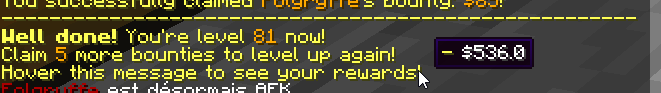

# 🏅 Levels & Rewards

Players can level up by claiming a specific amount of bounties. When leveling up, players earn money and may unlock new perks like hunter titles, which will be displayed on the hunter leaderboard, and bounty animations.




## Titles

```yaml
reward:
    # The player title is displayed in the bounty
    # leaderboard as well as when the player claims a bounty.
    # It can also be obtained using a placeholder.
    title:
        HEAD_HUNTER:
            format: 'Head Hunter'
            unlock: 1
        HEAD_COLLECTOR:
            format: 'Head Collector'
            unlock: 2
        EXPERIENCED_HUNTER:
            format: 'Experienced Hunter'
            unlock: 3
        # ....
```

In order to create a hunter title, you will have to specify the title format (how it looks in game) and the level at which it will be unlocked. The string like `HEAD_HUNTER` is the title ID, it's not displayed anywhere in game and is just used internally by BountyHunters to differenciate all the titles. Just make sure two titles don't share the same ID.

## Bounty Animations

Bounty animations are composed of two things: one **death quote**, which is a message displayed in the chat whenever you claim a bounty, and a **particle effect** whihc is summoned around the killed player.

```yaml
reward:
    # 'Bounty Animations' display a message in the chat
    # and play a particle effect around the killed player
    # when claiming a bounty.
    #
    # For no particle effect, remove the
    # 'effect: ..' line or leave it to NONE.
    #
    # For head hunting, the animation plays when killing
    # the player and collecting the head.
    #
    # You can access the bounty quote using a PAPI placeholder.
    animation:
        # ....
        SHEEP:
            format: 'Watch as I turn him into a sheep!'
            unlock: 12
            effect: METAMORPHOSE
        GIT_GUD:
            format: 'Git gud'
            unlock: 15
            effect: FLAME_VORTEX
        CENA:
            format: 'You can''t see me!!'
            unlock: 20
            effect: METEOR
```

In order to setup a bounty animation, you will have to specify the death quote (which is the `format` section), the level at which it will be unlocked, and the particle effect which must be one element of the following list.

| Particle Effect | Description |
|-----------------|-------------|
| TOTEM | Summons two interwoven bright jets of particles |
| FLAME_VORTEX | Summons two interwoven flame jets |
| GOLD | Spawns many gold nuggets flying out of the player's corpse |
| SMOKE | Summons a sphere of smoke around target player |
| BLOODBATH | Summons blood marks on the ground |
| WITCHCRAFT | Summons three waves of dark energy spreading across the ground |
| METAMORPHOSE | Summons a baby sheep with the target player's name |
| METEOR | Summons three meteors dashing at the target location |
| NONE | No particle effect. |

## Rest of Config

```yml
    # ....

    # Commands sent when leveling up.
    commands:
        '1':
        - "say %player% reached level 1!"
        
    # Currency earned when leveling up.
    # cash earned = <base> + ( <per-level> * <player level> )
    money:
        base: 50
        per-level: 6
        
# Bounties players need to claim to level up.
bounties-per-level: 5
```

The `bounty-per-level` option corresponds to the amount of bounties players must claim in order to level up. The `commands` section lets you setup commands which will be performed by the console whenever a player levels up. These commands support PlaceholderAPI placeholders. The `money` section lets you configure the money earned by hunters when leveling up.

## Disabling Leveling Rewards

To disable leveling rewards, delete the content of the `levels.yml` config file. Do not delete the file itself, otherwise it will restore its default content.