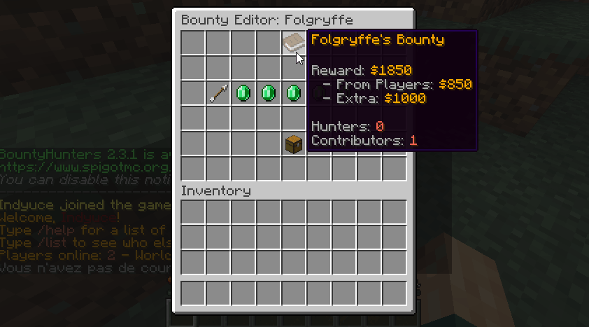

# 🔧 Miscellaneous

## Bounty Editor

This GUI can be used to edit a current bounty. It can be used to visualize both the players who put money into that bounty and the portion of the bounty that is due to [automatic bounties](auto-bounties.md). Use `/bounties edit <player>` to open up that edition GUI.



"Contributors" are all the players who put extra money in that bounty. Using that menu you may change how much money every player has added. Editing this value is done via chat input (everything is explaining in-game when using the GUI).

Coupled with bounty logs, this menu lets you completely manipulate current bounties on your server.

## Cooldowns

You can choose the amount of time players need to wait before either creating a bounty or adding extra money to an existing bounty.

```yaml
# Time to waiting before using /bounty again. In seconds.
bounty-set-restriction: 120
```
You can also choose the amount of time players need to wait before targeting again another player using the bounty menu. First of all, 

```yaml
# Player tracking lets player use a tracking compass to hunt
# down their bounty target. On the one hand, it gives an
# advantage to the hunters because they can find the player, but
# it also lets the target know how many players are tracking him.
player-tracking:
    ...
    # Cooldowns players need to wait before tracking a player.
    cooldown: 240
```

## Bounty Commands

You can configure BountyHunters to perform commands whenever a player claims a bounty and whenever a player receives an automatic bounty. These commands can be configured in the config.yml config file.

```yml
# Commands sent by the console when a player claims a bounty.
# {target} returns the target's name and {player} the claimer's
# name. Commands support PlaceholderAPI placeholders.
bounty-commands:

  # When a player claims a bounty.
  claim: [ ]
  # - '/give {player} minecraft:diamond 10'
  # - '/tell {target} Someone claimed your bounty.'

  # When a bounty is placed. {reward}
  place:
    player: [ ]
    console: [ ]
    # When a player kills another player illegaly.
    auto-bounty: [ ]

  # When a bounty is increased by {amount}
  increase:
    player: [ ]
    console: [ ]
    # When a player kills another player illegaly.
    auto-bounty: [ ]
```

These commands support placeholders from **PlaceholderAPI**, however you may also use ``%player%`` which returns the player/sender (the one who claimed/created/increased the bounty) name or %target% which returns the bounty target name.

Bounties can be created either by players, or by the console (or by the [auto bounty](auto-bounties.md) feature). Different sets of commands can be performed when the bounty creation/increase reason isn't the same.
