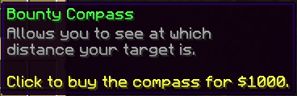

# 🏃‍♀️ Player Hunting

To create more incentive for players to hunt each other down for bounties, players can track players with bounties set on them, using a **Tracking Compass**. This compass can be bought in the bounty menu and will stay in the player's inventory.



This compass will indicate if you are in the same world as your target, and if you are, it will indicate the distance to your target, as well as the direction to follow to find him. Players with the `bountyhunters.untargetable` perm node can't be tracked down by other players except if they have the `bountyhunters.untargetable.bypass` perm node.

## Configuration

You may configure the tracking compass in the main plugin config file. You can disable it and change its price and the format that is used to display the distance number decimals when used by players. Last but not least you can also change the delay players need to wait before targeting a new player. Setting this cooldown to 0 can be dangerous since the alert sent to the player being targeted can spam his chat & headphones if sent many times.

```yml
# Player tracking lets player use a tracking compass to hunt
# down their bounty target. On the one hand, it gives an
# advantage to the hunters because they can find the player, but
# it also lets the target know how many players are tracking them.
player-tracking:
  enabled: true

  # Set to true if you want players able to
  # target bounties which they contributed in
  can-track-own-bounties: true

  # Should the compass show the distance to
  # the target player
  show-distance: true

  # Price of the tracking compass.
  price: 1000

  # Time players need to wait when tracking some
  # player before tracking another player.
  cooldown: 240
```