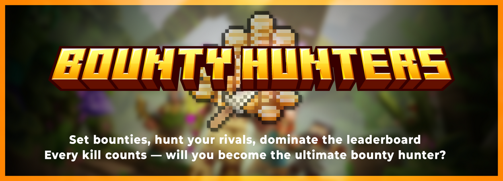

# 🏠 Home

Use the [Gitlab issue tracker](https://gitlab.com/phoenix-dvpmt/bounty-hunters/-/issues) for general bugs and issues! You can purchase the resource over [SpigotMC](https://www.spigotmc.org/resources/72142/) or download an older build for free [here](https://www.spigotmc.org/resources/bountyhunters-legacy.40610/) compatible with 1.8 to 1.14.

If you are still running a 1.8 server, download the latest version of [BountyHunters Legacy over Spigot](https://www.spigotmc.org/resources/bountyhunters-legacy.40610/). This is an outdated version of the plugin, and updating from Legacy to Premium is not possible without a config and data reset.

::: info
We do our best to keep this wiki up to date with the latest Premium build! There is no available wiki for the Legacy version of BountyHunters.
:::

BountyHunters is _plug n' play_. Simply drag & drop the jar file in your plugins folder and restart your server!