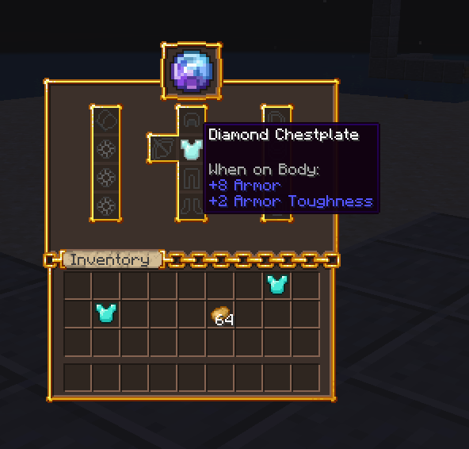

# 💎 Oraxen

## Custom Textures

MMOInventory 1.6.5 introduces native Oraxen support. Since MMOInventory requires the use of a custom resource pack, MMOInventory will detect Oraxen on startup and inject the required items into its registry. The only thing you **MUST** do is to place all of your item textures into one specific folder, that is `Oraxen\pack\textures\items\mmoinventory`. Your textures must be .PNG files, and the name must follow the `lower_case_format`. There must be a perfect ONE-TO-ONE matching between your `slots.yml` configuration and your Oraxen texture folder! If there is any error, Oraxen will probably output a texture error. Example with the default MMOInventory `slots.yml` config:


If you see a file named `mmoinventory-hook.yml` located in the `Oraxen/items/` folder, do **NOT** touch it! It's generated automatically by MMOInventory and handles all the Oraxen compatibility stuff by registering the items in your resource pack.

## Custom GUI Textures

Using Oraxen you can also setup glyphs which let you add a custom texture to your inventory. To use a glyph, remember you can use the PAPI placeholder `%oraxen_<glyph_id>%`. Also make sure you remove the filler item config section from the `items.yml` config section when using a custom GUI texture.



It's super easy to use Oraxen glyphs inside the inventory name. Head to the `language.yml` config file:

```yml title="language.yml"
inventory-name:
    self: '&f%oraxen_shift_16%%oraxen_shift_2%%oraxen_mmoinv_default%'
```

If you have never heard about custom emojis/GUI textures/icons before but are hyped by the previous screenshot, you should definitely learn more about it. Oraxen basically automates the use of custom item/GUI/emoji textures.