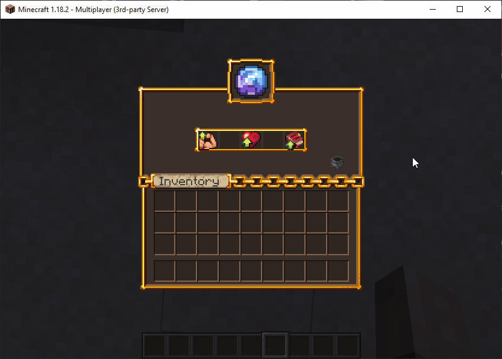

# 💎 Resource Pack Plugins

By resource pack plugins we refer to plugins which automate the creation and deployment of a resource pack for your server, the most popular being:
- [ItemsAdder](https://www.spigotmc.org/resources/%E2%9C%A8itemsadder%E2%AD%90emotes-mobs-items-armors-hud-gui-emojis-blocks-wings-hats-liquids.73355/)
- [Nexo](https://polymart.org/product/6901/nexo)
- [Oraxen](https://www.spigotmc.org/resources/%E2%98%84%EF%B8%8F-oraxen-custom-items-blocks-emotes-furniture-resourcepack-and-gui-1-18-1-21-8.72448/)

With little to no effort, you can apply custom UI textures to any inventory in MMOCore using one of these plugins. In fact, you don't need any of these plugins to have custom UI textures for MMOCore, but it's a little easier when using one of these.

## Custom GUI Textures

The following example makes use of Oraxen to apply a custom texture to the [attribute](../features/attributes.md) GUI. The following syntax snippet is to be used inside the `gui/attribute-view.yml` config file.
```yml
# GUI display name
name: '&f%oraxen_shift_16%%oraxen_shift_2%%oraxen_mmocore_attr%'

#.......
```

The `%oraxen_<glyph_id>%` placeholder has the effect of overlaping the default GUI texture with the newly configured glyph texture. Using `shift` placeholders you can also correct the small horizontal offsets you might get when using the glyph placeholder alone (try it and see).

