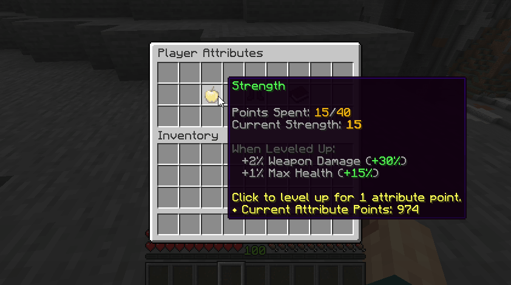

# 💪 Attributes

Attributes are super classic RPG "stats" which players can level up to unlock new perks. These perks includes additional stats (max health, damage, cooldown reduction...) and the ability to use certain items. This very classic RPG feature adds more theory crafting material to your server.



MMOCore’s attributes are fully integrated with **MMOItems**, allowing you to set **attribute requirements** for items. This means you can configure an MMOItem so that a player can only equip or use it if they have at least a certain number of points in a specific MMOCore attribute. For example, you could make a legendary sword require **15 Strength** before it can be wielded, or a mystical staff require **20 Intelligence** before it can be used. This creates a natural progression system where players need to invest in the right attributes to unlock access to more powerful gear.

**Attributes can also grant fully custom perks** — for example, they can run commands, send messages, or unlock skills when leveled up. Using PAPI placeholders you can also get the current value of a player's attribute and use these values inside custom conditions anywhere you need them (MythicMobs skills, MythicLibs scripts....).

## Attribute Menu

Use `/attributes` to open up the attribute menu. Players can see the current value of their stats, spend points to level up their attributes, or reallocate their attribute points (also referred to as _respec_).

You will need one _attribute point_ to level up once one single attribute.

To reallocate your attribute points, click the _Reallocate Skill Points_ button. You will need one _attribute reallocation point_, that you can give to players using an [admin command](../general/commands.md).

::: details Other Looks for the Menu

Check out [this wiki page](Oraxen%20Support) to learn about custom GUI textures.


<summary>
Here is a better looking version of the same GUI.
</summary>
</details>


<details>


<summary>
Here is another look for the same GUI using another custom texture.
</summary>
</details>

## Default Attributes & Ideas

This section covers the attributes that are provided in the default MMOCore attributes configuration file. You are encouraged to edit and balance them to your liking, as this should serve as a reference/inspiration for you. The default MMOCore attributes are Strength, Dexterity and Intelligence which are inspired from the game _Path of exile_.

* The **Strength** attribute is meant to be leveled up by warriors, tanks, paladins as it grants both additional **weapon damage** and **maximum health** for extra tankiness and survivability.
* Warriors, rogues or marksmen may focus on leveling up their **dexterity** because it increases their movement speed (either to escape for lighter classes like rogues or marksmen, or to run in the fight for warriors), their **projectile damage** for marksmen and their **physical damage** (both physical skills and weapons).
* **Intelligence** is mainly for wizards, mages as it increases damage dealt by magical skills. It also reduces cooldowns of skills, which could justify spending some points in this attribute even for non-skill oriented classes.

As a reference, _The Elder Scrolls Online_ has three "attributes" which are _Health_, _Stamina_ and _Magicka_. Health increases maximum health, Stamina increases max stamina (used to cast stamina-based skills), while Magicka is the equivalent of mana (used to cast magicka-based skills). Depending on the class chosen, you want to focus either on Health (tank classes or bruiser fighters, heavy armor), Stamina (medium/light armor, DPS classes) and Magicka (DPS classes, medium/light armor, burst magic damage).

## Default Config File

The default config file is named `default_attributes.yml` and is located in the folder `MMOCore/attributes`. You can add as many YAML config files and subfolders as you like inside the main attribute folder for clean file organization.

```yml
# Attribute ID
strength:

    name: Strength
    
    # Maximum amount of points players 
    # may spend in this attribute.
    max-points: 40
    
    # Buffs given every 1 attribute point spent
    # in this specific attribute.
    buff:
        weapon_damage: 2
        max_health: 1%

dexterity:
    name: Dexterity
    max-points: 40
    buff:
        physical_damage: 1.5
        projectile_damage: 1
        attack_speed: 0.5%

intelligence:
    name: Intelligence
    max-points: 40
    buff:
        magical_damage: 2
        cooldown_reduction: 1
```

Every config section corresponds to a player attribute. Remember, you can add as many as you want (one config section per attribute), and you may also remove the default ones.

You need to specify the attribute name which will be used to display the attributes inside GUIs, the maximum amount of **attribute points** you can spend in that specific attribute, and the stat buffs the attribute gives. These buffs correspond to the stats given to the player for **every attribute point spent in that attribute.**

## **Virtual Attributes (that don't save to player data)**

There is one last use case for attributes. You might want to create attributes that reproduce 1-to-1 an existing stat. In the following example, every _Health_ attribute point grants 1% of maximum health is provided to the player. If you do not want the attribute to be leveled up by the player and only use the stat buff feature, you can toggle off the `save-to-player-data` option. This is purely optional and reduces database cluter.

```yml
health:
    name: Health
    save-to-player-data: false
    # (Not needed) max-points: 40
    buff:
        max_health: 1%
```

## **Disabling attributes**

If you do not plan on using the MMOCore attribute system, you can disable it, and it's super easy to do so.

* Empty the `MMOCore/attributes` folder (don't delete it, otherwise it will regenerate with default config files)
* Comment out/delete the `/attributes` command inside the `commands.yml` file

## Editing the Attributes GUI

What you have done so far is registering the player attributes in MMOCore. Yet your players won't be able to interact with them if you don't add them to the attributes menu that players can access using `/attributes` (see above). To do that, you may open the `gui/attribute-view.yml` file.

```yml

# GUI display name
name: Player Attributes

# Number of slots in your inventory. Must be
# between 9 and 54 and must be a multiple of 9.
slots: 27

items:
    reallocate:
        slots: [26]
        function: reallocation
        item: CAULDRON
        name: '&aReallocate Skill Points'
        lore:
        - ''
        - 'You have spent a total of &6{total}&7 skill points.'
        - '&7Right click to reallocate them.'
        - ''
        - '&eCosts 1 attribute reallocation point.'
        - '&e◆ Attribute Reallocation Points: &6{points}'
    str:
        slots: [11]
        function: attribute_strength
        name: '&a{name}'
        item: GOLDEN_APPLE
        lore: # {buffs} returns amount of buffs
        - ''
        - '&7Points Spent: &6{spent}&7/&6{max}'
        - '&7Current {name}: &6&l{current}'
        - ''
        - '&8When Leveled Up:'
        - '&7  +{buff_weapon_damage}% Weapon Damage (&a+{total_weapon_damage}%&7)'
        - '&7  +{buff_max_health} Max Health (&a+{total_max_health}&7)'
        - ''
        - '&eClick to level up for 1 attribute point.'
        - '&e◆ Current Attribute Points: {attribute_points}'
    dex:
        slots: [13]
        function: attribute_dexterity
        name: '&a{name}'
        item: LEATHER_BOOTS
        hide-flags: true
        lore:
        - ''
        - '&7Points Spent: &6{spent}&7/&6{max}'
        - '&7Current {name}: &6&l{current}'
        - ''
        - '&8When Leveled Up:'
        - '&7  +{buff_physical_damage}% Physical Damage (&a+{total_physical_damage}%&7)'
        - '&7  +{buff_projectile_damage}% Projectile Damage (&a+{total_projectile_damage}%&7)'
        - '&7  +{buff_attack_speed} Attack Speed (&a+{total_attack_speed}&7)'
        - ''
        - '&eClick to level up for 1 attribute point.'
        - '&e◆ Current Attribute Points: {attribute_points}'
    int:
        slots: [15]
        function: attribute_intelligence
        name: '&a{name}'
        item: BOOK
        lore:
        - ''
        - '&7Points Spent: &6{spent}&7/&6{max}'
        - '&7Current {name}: &6&l{current}'
        - ''
        - '&8When Leveled Up:'
        - '&7  +{buff_magic_damage}% Magic Damage (&a+{total_magic_damage}%&7)'
        - '&7  +{buff_cooldown_reduction}% Cooldown Reduction (&a+{total_cooldown_reduction}%&7)'
        - ''
        - '&eClick to level up for 1 attribute point.'
        - '&e◆ Current Attribute Points: {attribute_points}'
```

The first few things to notice are these configuration sections called `dex`, `str` and `int` which all correspond to one specific attribute. These are the items you can click in the GUI as seen in the GIF above. If you modify one attribute in the `MMOCore/attributes.yml` config, you might have to update that config file as well. Let's now go through everything you can modify in this config file.

You can edit the general GUI settings like its name and slots.

```
name: Player Attributes
slots: 27
```

Notice how the config sections that fall under the `items` section share very similar properties: `name` (the item display name), `lore` (the item description/lore), `item` (the item material), `slots` (where the item is placed in the inventory, it can be a list) and `function` (what the item does). These can (and should) all be edited to your needs.

### Editing Item Slots

If you want to have your item displayed on multiple slots, use something like

```
slots: [1, 2, 3, 4]
```

The following formats won't work

```
slots: 1
```

```
slot: 1
```

### Item Functions

`function` might be the most confusing config option. It's used by MMOCore to understand how the item should behave when clicked, and what placeholders to apply in the item lore. A general rule when editing MMOCore GUIs is to **never touch them**. You can add items with no function to change the appearance of your GUI, you may edit already existing items without editing their function, but you can't randomly edit them as this will mess with MMOCore functionalities.

Editing item functions is required tho when adding or changing existing attributes. Notice how the function for the item which corresponds to the Strength attribute is `attribute_strength`. If you are adding an attribute which id is `some_attribute_id`, the corresponding item function is `attribute_some_attribute_id`. Here is an example of a working `attributes.yml` setup + item setup pair.

```
vigour:
    name: Vigour
    max-points: 30
    buff:
        max_health: 2
```

```
items:
    vigour_item:
        slots: [15]
        function: attribute_vigour
        name: '&a{name}'
        item: BOOK
        lore:
        ....
```

### Lore placeholders

Choosing some function for your GUI item unlocks a specific set of placeholders that you can use in the item lore. For instance, using the `attribute_<attribute_name>` function unlocks these placeholders

- `{spent}` - Amount of attr. pts spent by the player in that attribute
- `{max}` - Maximum amount of attr. pts you may spend in that attribute
- `{name}` - Attribute name
- `{current}` - The current attribute of the player. It differs from `{spent}` because it takes into account attribute modifiers which can be granted by items or external plugins
- `{buff_<stat_name>}` - a specific buff that is granted for each point spent in that attribute
- `{total_<stat_name>}` - the total buff granted by all the points spent in that attribute

If you try to use a placeholder which MMOCore cannot find, it will display `PHE` (PlaceHolderError)

Last thing: adding new buffs to your custom attribute does NOT automatically update the GUI item lore (which is being used to display the attribute buffs). Make sure you update this manually as well. For instance, the following configs match:

```
intelligence:
    ...
    buff:
        magical_damage: 2
        cooldown_reduction: 1
```

```
items:
    ...
    int:
        ...
        lore:
        ...
        - '&8When Leveled Up:'
        - '&7  +{buff_magic_damage}% Magic Damage (&a+{total_magic_damage}%&7)'
        - '&7  +{buff_cooldown_reduction}% Cooldown Reduction (&a+{total_cooldown_reduction}%&7)'
```

But these two don't match, a projectile damage buff was registered in the attributes.yml config, but it was not added to the item lore, so there is no way for the player to know that this attribute grants extra projectile damage.

```
dexterity:
    ...
    buff:
        physical_damage: 1.5
        projectile_damage: 1
        attack_speed: 0.5%
```

```
items:
    ...
    int:
        ...
        lore:
        ...
        - '&8When Leveled Up:'
        - '&7  +{buff_physical_damage}% Physical Damage (&a+{total_physical_damage}%&7)'
        - '&7  +{buff_attack_speed} Attack Speed (&a+{total_attack_speed}&7)'
```

These two don't match either. The `{buff_projectile_damage}` placeholder doesn't exist because projectile damage was not defined as a buff from the dexterity attribute.

```
dexterity:
    ...
    buff:
        physical_damage: 1.5
        attack_speed: 0.5%
```

```
items:
    ...
    int:
        ...
        lore:
        ...
        - '&8When Leveled Up:'
        - '&7  +{buff_physical_damage}% Physical Damage (&a+{total_physical_damage}%&7)'
        - '&7  +{buff_projectile_damage}% Projectile Damage (&a+{total_projectile_damage}%&7)'
        - '&7  +{buff_attack_speed} Attack Speed (&a+{total_attack_speed}&7)'
```