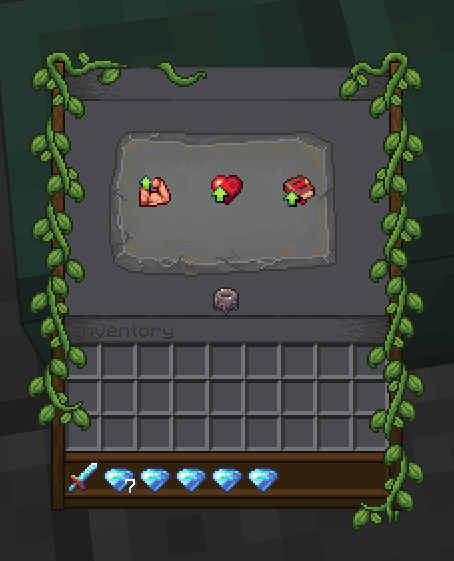

# 💪 Attributes

Attributes are super classic RPG "stats" which players can level up to unlock new perks. These perks includes additional stats (max health, damage, cooldown reduction...) and the ability to use certain items. This very classic RPG feature adds more theory crafting material to your server.


MMOCore’s attributes are fully integrated with **MMOItems**, allowing you to set **attribute requirements** for items. This means you can configure an MMOItem so that a player can only equip or use it if they have at least a certain number of points in a specific MMOCore attribute. For example, you could make a legendary sword require **15 Strength** before it can be wielded, or a mystical staff require **20 Intelligence** before it can be used. This creates a natural progression system where players need to invest in the right attributes to unlock access to more powerful gear.

**Attributes can also grant fully custom perks** — for example, they can run commands, send messages, or unlock skills when leveled up. Using PAPI placeholders you can also get the current value of a player's attribute and use these values inside custom conditions anywhere you need them (MythicMobs skills, MythicLibs scripts....).

## Attribute Menu

Use `/attributes` to open up the attribute menu. Players can see the current value of their stats, spend points to level up their attributes, or reallocate their attribute points (also referred to as _respec_).

You will need one _attribute point_ to level up once one single attribute.

To reallocate your attribute points, click the _Reallocate Skill Points_ button. You will need one _attribute reallocation point_, that you can give to players using an [admin command](../general/commands.md).

::: details Other Looks for the Menu

Check out [this wiki page](../compatibility/rp-plugins.md) to learn about custom GUI textures. Here is a better looking version of the same GUI.


Here is another look for the same GUI using another custom texture.



:::

## Default Attributes & Ideas

This section covers the attributes that are provided in the default MMOCore attributes configuration file. You are encouraged to edit and balance them to your liking, as this should serve as a reference/inspiration for you. The default MMOCore attributes are Strength, Dexterity and Intelligence which are inspired from the game _Path of exile_.

* The **Strength** attribute is meant to be leveled up by warriors, tanks, paladins as it grants both additional **weapon damage** and **maximum health** for extra tankiness and survivability.
* Warriors, rogues or marksmen may focus on leveling up their **dexterity** because it increases their movement speed (either to escape for lighter classes like rogues or marksmen, or to run in the fight for warriors), their **projectile damage** for marksmen and their **physical damage** (both physical skills and weapons).
* **Intelligence** is mainly for wizards, mages as it increases damage dealt by magical skills. It also reduces cooldowns of skills, which could justify spending some points in this attribute even for non-skill oriented classes.

As a reference, _The Elder Scrolls Online_ has three "attributes" which are _Health_, _Stamina_ and _Magicka_. Health increases maximum health, Stamina increases max stamina (used to cast stamina-based skills), while Magicka is the equivalent of mana (used to cast magicka-based skills). Depending on the class chosen, you want to focus either on Health (tank classes or bruiser fighters, heavy armor), Stamina (medium/light armor, DPS classes) and Magicka (DPS classes, medium/light armor, burst magic damage).

## Default Config File

The default config file is named `default_attributes.yml` and is located in the folder `MMOCore/attributes`. You can add as many YAML config files and subfolders as you like inside the main attribute folder for clean file organization.

```yml
# Attribute ID
strength:

  name: Strength

  # Maximum amount of points players 
  # may spend in this attribute.
  max-points: 40

  # Buffs given every 1 attribute point spent
  # in this specific attribute.
  buff:
    weapon_damage: 2
    max_health: 1%

dexterity:
  name: Dexterity
  max-points: 40
  buff:
    physical_damage: 1.5
    projectile_damage: 1
    attack_speed: 0.5%

intelligence:
  name: Intelligence
  max-points: 40
  buff:
    magical_damage: 2
    cooldown_reduction: 1
```

Every config section corresponds to a player attribute. Remember, you can add as many as you want (one config section per attribute), and you may also remove the default ones.

You need to specify the attribute name which will be used to display the attributes inside GUIs, the maximum amount of **attribute points** you can spend in that specific attribute, and the stat buffs the attribute gives. These buffs correspond to the stats given to the player for **every attribute point spent in that attribute.**

## **Virtual Attributes (that don't save to player data)**

There is one last use case for attributes. You might want to create attributes that reproduce 1-to-1 an existing stat. In the following example, every _Health_ attribute point grants 1% of maximum health is provided to the player. If you do not want the attribute to be leveled up by the player and only use the stat buff feature, you can toggle off the `save-to-player-data` option. This is purely optional and reduces database cluter.

```yml
health:
  name: Health
  save-to-player-data: false
  # (Not needed) max-points: 40
  buff:
    max_health: 1%
```

## **Disabling attributes**

If you do not plan on using the MMOCore attribute system, you can disable it, and it's super easy to do so.

* Empty the `MMOCore/attributes` folder (don't delete it, or it will regenerate)
* Comment out/delete the `/attributes` command inside the `commands.yml` file

## Editing the Attributes GUI

The `/attributes` folder is for defining the attributes and their buffs. However, you also need to edit the `/gui/attribute-view.yml` config file to make sure players can see and interact with the attributes you have defined in the previous config file.

::: tip
We recommend opening this file with a text editor on the side while reading the rest of this section.
:::

First, please refer to this [wiki page](../../mythiclib/misc/ui-syntax.md) to learn about the general MMOCore UI syntax.

Under the `items` config section, there should be one config section per attribute. By default, their names are `dex`, `str` and `int` for _Dexterity_, _Strength_ and _Intelligence_ respectively. Each correspond to the clickable items inside the GUI, as seen on the GIF above.

### Adding a new attribute

In order to add a new attribute:

1. Add a new config section in of the config files inside the `/attributes` folder as described in the previous sections,
2. Add a new config section in the `attribute-view.yml` GUI config, and make sure to set the item function to `attribute_<attribute_id>` (for instance, `attribute_vigour` for an attribute with id `vigour`) so that MMOCore can apply the correct placeholders in the item lore and make the item behave correctly when clicked.

::: warning
If you forget the second step, your attribute will exist but players won't be able to see, or interact with it in the attribute menu.
:::

### Adding a buff to an attribute

In order to add a buff to an existing attribute:

1. Add the buff to the attribute config section in the `/attributes` folder,
2. Optionally, update the lore of the item corresponding to that attribute in the `attribute-view.yml` file to display the new buff. If you don't do that, players will get the buff but won't be aware of it. You can somehow display it elsewhere, but most users would want to display it here.

### Common issue with lore placeholders

The lore placeholders `{buff_xxx}` and `{total_xxx}` are only defined for the set of stats provided by the attribute. If these placeholders seem to not be parsing correctly, double check that your attribute does provide a buff for that stat.

For instance, the following configs match:

::: details Example 1

```yml
# attributes/default_attributes.yml
intelligence:
  #...
  buff:
    magical_damage: 2
    cooldown_reduction: 1
```

```yml
# gui/attribute-view.yml
items:
  #...
  int:
    #...
    lore:
    ...
    - '&8When Leveled Up:'
    - '&7  +{buff_magic_damage}% Magic Damage (&a+{total_magic_damage}%&7)'
    - '&7  +{buff_cooldown_reduction}% Cooldown Reduction (&a+{total_cooldown_reduction}%&7)'
```
:::

But these two don't match, a projectile damage buff was registered in the `attributes.yml` config, but it was not added to the item lore, so there is no way for the player to know that this attribute grants extra projectile damage. The plugin will not fail, but players will be confused.

::: details Example 2
```yml
# attributes/default_attributes.yml
dexterity:
  # [...]
  buff:
    physical_damage: 1.5
    projectile_damage: 1
    attack_speed: 0.5%
```

```yml
# gui/attribute-view.yml
items:
  # [...]
  int:
    # [...]
    lore:
    ...
    - '&8When Leveled Up:'
    - '&7  +{buff_physical_damage}% Physical Damage (&a+{total_physical_damage}%&7)'
    - '&7  +{buff_attack_speed} Attack Speed (&a+{total_attack_speed}&7)'
```
:::

These two don't match either. The `{buff_projectile_damage}` placeholder doesn't exist because projectile damage was not defined as a buff from the _Dexterity_ attribute. The plugin will fail at parsing placeholders.

::: details Example 3

```yml
# attributes/default_attributes.yml
dexterity:
  #...
  buff:
    physical_damage: 1.5
    attack_speed: 0.5%
```

```yml
# gui/attribute-view.yml
items:
  #...
  int:
    #...
    lore:
      #...
      - '&8When Leveled Up:'
      - '&7  +{buff_physical_damage}% Physical Damage (&a+{total_physical_damage}%&7)'
      - '&7  +{buff_projectile_damage}% Projectile Damage (&a+{total_projectile_damage}%&7)'
      - '&7  +{buff_attack_speed} Attack Speed (&a+{total_attack_speed}&7)'
```