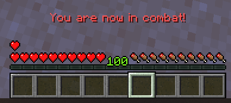

# ⚔️ Combat

## Combat Logging

Combat logging is a useful feature that lets players know when they enter or quit combat. Combat log is handled via chat messages. It is a very simple feature in itself, but **it ties in so nicely with other mechanics like skills**.



For instance, there is a built-in MMOCore skill that makes players deal increased melee damage when entering combat. Using the `%mmocore_since_enter_combat%` placeholder, you could also imagine a skill that increases damage dealt based on how long the player has been in combat.

## Resource Regeneration

Combat log also dictates when the player should be able to regen their [resources](../misc/resources.md) (health, mana and stamina).

For instance, you can set up a _Warrior_ class with a base flat health regeneration rate, and with an additional 10% missing health regeneration per second **when out of combat**. This can be applied to any class, any resource, the off combat option can be disabled, the % can scale on the player's level, and you can make it so the regenerated amount also scales on the player's **missing** health instead.

## Placeholders

MMOCore features multiple [PlaceholderAPI placeholders](../general/placeholders.md#combat) that you can use to check if a player is in combat, in PvP Mode (see below), the time since the last hit...

## Friendly Fire

Everyone knows the concept of friendly fire: the ability to accidentally or intentionally harm allies with attacks. In MMOCore, this concept is extended to all player interactions, not just offensive skills.

These rules are referred to as "interaction rules". They define when and how a player can "interact" with another player, whether through a skill or a weapon attack. For example, you might want to prevent players from using offensive skills on members of the same guild, faction, or party, while still allowing them to cast healing or buffing skills on each other. Simply disabling all skills would not work, since support interactions are also essential.

::: tip
In short, interaction rules in MMOCore define _Friendly Fire_ for any skill or attack, offensive or supportive.
:::

### Configuration

MythicLib lets you configure a three-dimensional array where you can choose to enable OR disable interactions for any combination of these three parameters:
- if PvP is enabled (`on` or `off`)
- the interaction type (`support` or `offense`)
- the players' relationship (`party_member`, `guild_enemy` etc.)

This code snippet is located in the MythicLib `config.yml`.

```yaml
interaction_rules:

  # When enabled, apply PvP interaction rules for skills, melee and projectile hits.
  # This option is toggled off by default to reduce confusion for new users.
  enabled: true

  # When disabled, support-based skills (buffs or heals)
  # may only be applied onto players.
  support_skills_on_mobs: true

  # When PvP is turned off
  pvp_off:

    # Ability to heal other players when PvP is off
    support:
      party_member: true
      party_other: true
      guild_ally: true
      guild_neutral: true
      guild_enemy: true

  ## When PvP is turned on
  pvp_on:

    # Ability to heal other players when PvP is on
    support:
      party_member: true
      party_other: false
      guild_ally: true
      guild_neutral: true
      guild_enemy: false

    # Friendly fire for guilds/parties
    offense:
      party_member: false
      guild_ally: false
      guild_neutral: true
```

The `support_skills_on_mobs` determines if you can cast support skills/heals/buffs onto monsters. This applies to all built-in MythicLib skills. To have this option apply to custom skills as well, you need to use the `mmoCanTarget` MythicMob custom condition (see [below](#using-mythicmobs-skills)).

### Supported Plugins

Please refer to [this wiki page](parties.md) to see the list of party plugins supported by MMOCore. MMOCore will take into account party members during friendly fire checks.

Please refer to [this wiki page](guilds.md) to see the list of group plugins supported by MMOCore (_by "groups", we mean factions, guilds, clans, kingdoms, etc_). MMOCore will take into account group members during friendly fire checks.

### Where do these rules apply?

These rules apply to:

- all PvP/PvE melee attacks,
- damage dealt by vanilla projectiles,
- all skill damage dealt by MythicMobs custom skills,
- damage or buffs inflicted by [built-in MythicLib skills](../../mythiclib/skills/builtin.md)...

### Inside MythicMobs Skills

You can check if a player can interact with a given entity, from inside a MythicMob custom skill, using the `mmoCanTarget` condition. Please refer to [this wiki page](../../mythiclib/skills/custom/mythic.md#checking-if-the-skill-caster-can-target-another-entity) for more information.

This condition has a very interesting side effect. Without this condition, offensive projectiles stop on the target entity, even if this entity cannot be damaged. The `damage` mechanic calls a Bukkit damage event, which MMOCore then cancels as it notices that the two players are in the same party/guild...

Then, no damage is dealt, but MythicMobs still kills the projectile. Had the `mmoCanTarget` condition been used, the skill would have checked ahead of time that the entity was damageable, and the entity would have been ignored by the projectile.

## PvP Mode

This feature is specially designed for PvE-focused servers which still want to leave some options for players to fight. In specific WorldGuard regions where PvP is disabled by default, players can use `/pvpmode` to toggle on PvP back and fight other players! **Only players with PvP enabled can fight and attack each other.** Furthermore, this feature is fully compatible with the PvP interaction rules defined above.

This works well for RPG or even profession/job-oriented survival servers.

::: warning
PvP Mode only works with WorldGuard! It won't work with other flag plugins like Residence.
:::

### How to setup PvP Mode

- first setup PvP interaction rules as explained above
- select an existing/create a new WorldGuard region
- toggle **ON** server PvP, world PvP as well as the PvP flag
- toggle on the `pvp-mode` WorldGuard flag. It is toggled off by default

You are now good to go! When the `pvp-mode` flag is on, players have access to the `/pvpmode` command and MMOCore will take care of the rest.

### Configuration

In order to prevent abuse, you can configure PvP Mode so that players can't exit it while they are still in combat. Moreover, you can setup cooldowns for that command.

The following code snippet is located in the MMOCore config `config.yml`.

```yaml
pvp_mode:

  # Requires /reload when changed
  enabled: false

  # Minimum level in order to fight other players.
  # Set to 0 to fully disable
  min_level: 0

  # Maximum level difference in order to fight other players.
  # Set to 0 to fully disable
  max_level_difference: 10

  # Delay after any attack during which the player will stay in PvP Mode (seconds)
  # Has to be lower than 'cooldown.combat'
  combat_timeout: 30

  # Invulnerability triggered when:
  # - entering a PvP region with PvP Mode turned on.
  # - using the /pvpmode command inside of a PvP region.
  invulnerability:
    time:
      region_change: 60
      command: 30

    # When enabled, players can damage other players
    # to end this invulnerable time period.
    can_damage: false

    # When enabled, leaving a no-PVP zone and entering a
    # PVP zone will apply the SAME invulnerability time.
    # Requires /reload when changed
    apply_to_pvp_flag: true

  cooldown:

    # Cooldown before being able to use the /pvpmode
    # command when entering a PvP Mode region.
    region_enter: 20

    # Cooldown before being able to use the /pvpmode
    # command when entering a PvP Mode region.
    region_leave: 20

    # Delay before being able to use /pvpmode after being in combat (seconds).
    # Has to be greater than the 'combat_timeout'
    combat: 45

    # Cooldown when toggling on PvP Mode, before being able to toggle it off (seconds)
    toggle_on: 5

    # Cooldown when toggling off PvP Mode (seconds)
    toggle_off: 3
```

### Disabling PvP Mode

In order to disable PvP Mode:
- remove the `pvp-mode` config section from `commands.yml`
- set `pvp_mode.enabled` to `false` inside `MMOCore/config.yml`