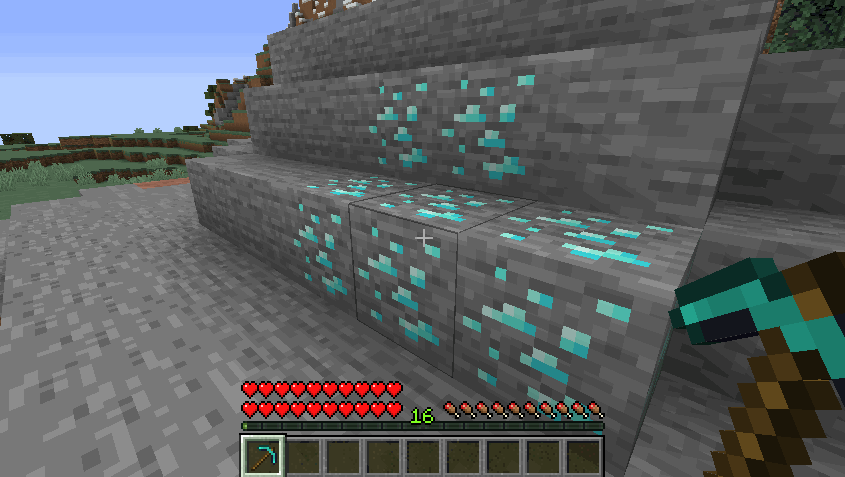

# ⛏️ Custom Mining

MMOCore features a custom mining system finetuned for RPG servers. Using this system, you can:

- prevent players from destroying blocks and terrain
- configure loots obtained when mining blocks
- have blocks naturally regenerate only after a set amount of time
- keep or delete vanilla block drop tables
- have blocks give profession/main class experience when mined
- require players to have a specific tool in order to break a block




## Enabling custom mining

Head to your `MMOCore/config.yml` config file and look for the config section named `custom-mining`.
```yml
custom-mining:

  # Enable or disable the CUSTOM MINING feature.
  enable: true

  # The list of all conditions which must be met
  # for the CUSTOM MINING feature to apply.
  #
  # UNCOMMENT TO ENABLE CUSTOM MINING SERVERWIDE
  #conditions: []
  conditions:
  - 'world{name="world,world_nether,world_the_end"}'
  - 'region{name="example_region,example_region2,__global__"}'

  # Enable tool restrictions. See the following wiki page for more info
  # https://gitlab.com/phoenix-dvpmt/mmocore/-/wikis/Tool%20Restrictions
  # Players need specific tools to break specific blocks
  enable-tool-restrictions: false

  # Set to true to prevent vanilla blocks from being broken
  # "Vanilla blocks" refer to blocks with no config set in the
  # Mining profession config file.
  protect-vanilla-blocks: false
```

Toggle off the `enable` option to disable custom mining serverwide. You can also selectively enable it in specific worlds/regions, where custom mining is enabled. In the following example, custom mining is enabled in worlds `world` and `world_nether`, only inside the region with name `mmocore_custom_mining`.
```yml
custom-mining:
  enable: true
  conditions:
  - 'world{name="world,world_nether"}'
  - 'region{name="mmocore_custom_mining"}'
```


Last but not least toggling on the `protect-custom-mine` option will prevent players from destroying blocks that have no setup in the `on-mine` profession configuration section (see below). In other words, any block that has no drop/regen configuration would be protected by default.

Note that custom mining does not apply to creative mode.

## Mining Experience Source
```
mineblock{type=BLOCK_MATERIAL;silk-touch=true;crop=false;player-placed=false}
```

Players earn experience by mining a specific type of block. These can be crops or ores; there are some specific options to help you prevent players from abusing this exp source. The list of all crops can be found in the default Farming profession config file.

| Option | Default Value | Description |
|--------|---------------|------------------------|
| `material` | --- | The block you need to mine |
| `silk-touch` | true | When enabled, no EXP is earned when using silk touch |
| `crop` | false | When enabled, players don't get exp unless crops are fully grown |
| `player-placed` | false | When disabled, players don't get exp from blocks placed by players|

## Tool Restrictions

Tool restrictions (or _tool permission sets_) define what blocks a specific item can mine. This option is toggled off by default, but you can enable it by toggling on the following option in your MMOCore `config.yml`:
```yml
custom-mining:
  #.......
  enable-tool-restrictions: false
```

Please read this [wiki page](../misc/tool-restrictions.md) for more information about tool restrictions.


## Diamond Ore Example

The following example is part of the default `/professions/mining.yml` setup.

Note that in this example, custom mining is setup for ores (relative to the _Mining_ profession), but you can also use custom mining to setup drop tables and exp for woodcutting (wood, logs...).
```yml
on-mine:

  # One rule for one type of block
  diamond:
    # The material you need to mine
    material: vanilla{type=DIAMOND_ORE}

    # The drop table/loot table used by the block.
    drop-table:
      items:
      - 'vanilla{type=DIAMOND} 1 1-3'
      # - 'mmoitem{type=material;id=RARE_DIAMOND} .1 1-3'
      # - 'droptable{id=other-drop-table} .1'
  
    # Triggers when destroying the block, can
    # be used to give exp to a player!
    triggers:
    - 'exp{profession=mining;amount=20}'
    
    options:
      # Set to false if you want to disable vanila drops.
      vanilla-drops: false
    
    regen:
    
      # Ticks the block takes to appear again
      time: 2000
      
      # The temporary block which shows
      # during the block regen time.
      #
      # !! Warning !!
      # When using the temp-block option, make sure you choose
      # one temp block and don't use it anywhere else in the
      # configuration so that block regens do not affect each other
      temp-block: vanilla{type=STONE}
```

This config does the following when a vanilla diamond ore is broken:
- drop 1 to 3 diamonds in addition to the vanilla block drops
- temporarily replace the block with a stone block (for 100 seconds)
- give 20 _Mining_ experience to the miner

## Target Block

This parameter determines what block is affected. `vanilla` corresponds to the block type. There are three built-in [block types](../misc/block-types.md) in MMOCore: vanilla blocks, MMOItems custom blocks (only available when MMOItems is installed), and textured player heads/skulls.

```yml
on-mine:
    diamond_ore:
        material: vanilla{type=DIAMOND_ORE}
        # Other options:
        # material: vanilla{type=wheat;age=7}
        # material: mmoitems{id=10}
        # material: skull{value="........."}
        
        # .....
```

## Drop Table

This determines what drop table to call when the defined block is broken. It can either be a totally new drop table or a reference to an existing drop table from the `/drop-tables` folder. Please refer to [this wiki page](Drop%20Tables) to learn about the syntax of drop tables.
```yml
on-mine:
    diamond_ore:
        # .....
        drop-table:
            items:
            - 'vanilla{type=DIAMOND} 1 1-3'
            - 'vanilla{type=COBBLESTONE} 1 1-3'
           # - 'mmoitem{type=material;id=RARE_DIAMOND} .1 1-3'
           # - 'droptable{id=other-drop-table} .1'
```

## Vanilla Drops

Toggle on/off vanilla drops of the block being mined.

```yml
on-mine:
    diamond:
        # ....
        options:
            # Set to false if you want to disable vanila drops.
            vanilla-drops: false
```

## Block Regen

`time` is the amount of time (in ticks) before the block reverts back to its initial state after being mined. `temp-block` is the block that will physically replace the broken block, indicating to players that it has recently been mined and that it is still regenerating (and therefore that it cannot be mined again just yet).

Note that the `temp-block` option (what temporary block to place) follows the exact same one-line JSON syntax as the `material` option (target block) described above.

```yml
on-mine:
    diamond_ore:
        # .....
        regen:
            time: 2000
            temp-block: 'vanilla{type=STONE}'
```

### Known Issue with Player Heads

In recent Minecraft versions (1.20+), there is a known issue when using player heads as temporary blocks. If ALL of the following conditions are met,
- vanilla drops are enabled
- temporary block is set to a player head with texture
- the target block is NOT a player head with texture.

Then the skull texture of the temporary skull block will not show.

### Additional Example
```yml
on-mine:
    diamond_ore:
        # .....
    VOID_SHROOM:
        material: 'mushroom{type=BROWN_MUSHROOM_BLOCK;faces="SOUND,DOWN"}'
        conditions:
        - 'region{name=lapis,redstone}'
        drop-table:
            items:
            - 'mmoitem{type=QUEST;id=VOID_SHROOM} 1 1'
        options:
            vanilla-drops: false
        regen:
            time: 150
            temp-block: 'vanilla{type=BLACK_CONCRETE}'
        triggers:
        - 'exp{profession=mining;amount=4}'
```