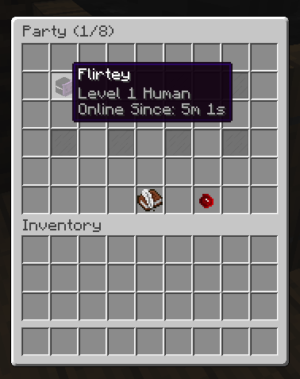
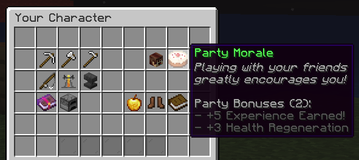

# 👯 Parties

Parties are an essential part of any RPG server. They usually provide teleportation perks or buffs to members within the same party.

While MMOCore does provide a decent built-in party system, it is fully compatible with the following plugins:

- [MythicDungeons](https://mythiccraft.io/index.php?resources/mythic-dungeons.869/) <Badge type="info" text="recommended" />
- [mcMMO](https://www.spigotmc.org/resources/official-mcmmo-original-author-returns.64348/)
- [Parties](https://www.spigotmc.org/resources/parties-an-advanced-parties-manager.3709/) <Badge type="info" text="recommended" />
- PartyAndFriends ([Spigot](https://www.spigotmc.org/resources/party-and-friends-extended-for-spigot-supports-1-7-1-19.11633/) & [Proxy](https://www.spigotmc.org/resources/party-and-friends-for-bungeecord-supports-1-7-x-to-1-19-x.9531/))
- [DungeonsXL](https://www.spigotmc.org/resources/dungeonsxl.9488/)
- [Heroes](https://www.spigotmc.org/resources/⚔-heroes-premium-⚔-best-minecraft-spigot-rpg-plugin-ever.24734/)
- [OBTeam](https://www.spigotmc.org/resources/obteam.108269/) ([DungeonMMO](https://www.spigotmc.org/resources/%E2%AD%90-dungeonmmo-%E2%AD%90-dungeon-world-generator-%E2%9C%85-create-your-dungeons-%E2%AD%95-endless-possibilities.106150/))


## Choosing your party plugin

Go to `MMOCore/config.yml` and set `party-plugin` to whatever plugin you want to use. Make sure you restart your server when editing this option.

```yml
# Choose the plugin handling parties here.
# Supported values (just copy and paste):
# - MMOCORE (Default built-in party system)
# - NONE (Used to fully disable parties)
# - DUNGEONSXL
# - HEROES
# - MCMMO
# - MYTHICDUNGEONS (Make sure `PartyPlugin` is set to `Default` in MythicDungeons)
# - MYTHICDUNGEONS_INJECT (Make sure `PartyPlugin` is set to `MMOCore` in MythicDungeons)
# - OBTEAM (Addon for DungeonMMO)
# - PARTY_AND_FRIENDS (When using Party and Friends (Extended) for Spigot)
# - PARTY_AND_FRIENDS_BUNGEECORD_VELOCITY ([When using Party and Friends (Extended) Edition for BungeeCord/Velocity. Requires https://www.spigotmc.org/resources/spigot-party-api-for-party-and-friends.39751/ to be installed])
# - PARTIES
party-plugin: MMOCORE
```

Using any party plugin that is not MMOCore will disable all party features from MMOCore (mostly the `/party` command).

#### MythicDungeons

You can either inject the MythicDungeons party system into MMOCore using `MYTHICDUNGEONS`, or inject the MMOCore party system into MythicDungeons using `MYTHICDUNGEONS_INJECT`.

## MMOCore Quests

MMOCore features a basic built-in party system where you and up to 7 friends can party up for extra boosts and perks!

::: info
The following wiki sections describe the built-in MMOCore party module.
:::

To begin, enter the `/party` command. If you are not already in a party, it will ask you if you want to create one.

After that, you will be shown the main party GUI, where you can see current party members and invite new people. By default, parties give a slight regeneration and experience boost. The more players in your party, the higher the buff (see below).



## Party Chat
Players can talk via party chat using `@` at the beginning of their message. This chat prefix can be edited in the main MMOCore config file (`party.chat-prefix`):


## Party Buffs

Party buffs are extra statistics that everyone in a party will get as long, as they are more than 2 members in the party. A party with one solo player will not get any buffs. The buffs increase proportionally to the number of players in the party. For example, a party of 4 players will get 3 times the buff amount configured (as the first player does not count towards buffs).

These buffs are configurable in the main MMOCore ``config.yml`` config file.
```yml
party:

  # Edit party buffs here. You may
  # add as many stats as you want.
  buff:
    health-regeneration: 3
    additional-experience: 5
  
  # Prefix you need to put in the chat
  # to talk in the party chat.
  chat-prefix: '@'
```

These buffs are displayed on a cake icon when opening the player stats menu, that you can configure under the `/gui/player-stats.yml` config file:


```yml
  party:
    slots: [16]
    function: party
    item: CAKE
    name: '&aParty Morale'
    lore:
      - '&7&oPlaying with your friends'
      - '&7&ogreatly encourages you!'
      - ''
      - '&7Party Bonuses ({count}):'
      - '&8- +{buff_additional_experience}% Experience Earned!'
      - '&8- +{buff_health_regeneration}% Health Regeneration'
```

## Exp splitting
Since MMOCore 1.9.3, the experience earned by any player is evenly split over all the party members. If your party has a total of 4 members you will only earn 25% of the exp you'd get with no party. This makes sure all the party members level up at the same time.

This feature creates an issue where low level players can join the party of high level players and get huge amounts of exp. This can be fixed by using the `max-level-difference` in the MMOCore main config file. For instance, setting this option to 5 will prevent level-1's from joining parties of level-7's or more. The level of the party is determined by the initial party owner's level.

That feature stays operational even if you are using another party plugin. It also supports profession experience.

## Using other party plugins


Just go in your main MMOCore config file and change this option to whatever plugin you have installed:
```yml
# Edit the plugin handling parties here.
# Supported values (just copy and paste):
# - mmocore
# - dungeonsxl
# - parties
# - party_and_friends (Use this one if you are using Party and Friends Extended for Spigot)
# - party_and_friends_bungeecord_velocity (Use this one if you are using Party and Friends For Bungeecord, Party and Friends For Velocity or Party and Friends Extended Edition for Bungeecord/Velocity. This one requires https://www.spigotmc.org/resources/spigot-party-api-for-party-and-friends.39751/ to be installed)
# - mcmmo
# - obteam (addon for DungeonMMO)
# - mythicdungeons (only when using default party handler)
party-plugin: mmocore
```
The exp splitting mechanism will work exactly in the same way as described above for all the plugins listed. The party buff system works for all of them except party-and-friends(PAF).
