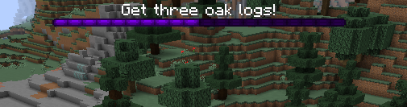
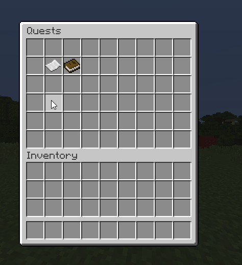

# 📖 Quests

## Modularity

MMOCore is **NOT** a quest plugin. It does provide a simple "list of objectives"-based quest solution, yet it does not provide complex storylines using NPC interactions or conditional events.

We encourage you to use the following plugins:
- [BetonQuest](https://www.spigotmc.org/resources/betonquest-all-your-adventure-supplies-versatile-quests-in-depth-conversations.2117/)
- [Quests](https://www.spigotmc.org/resources/quests.3711/)
- [BeautyQuests](https://www.spigotmc.org/resources/beautyquests.39255/)
- [QuestCreator](https://www.spigotmc.org/resources/questcreator-new-sqlite-support-and-data-conversion.38734/)

At the moment, this just mean you can fully disable the default quest module and use another plugin. In the future, features like quest-based conditions (having completed a specific quest) will be implemented to MMOCore and MythicLib.

## Disable MMOCore Quests

If you do not plan on using the MMOCore quest system, here is how you can quickly disable MMOCore quests altogether:
- empty (do not delete) the `/quests` folder
- 

## Integrated Quest System

Quests are series of objectives the players must complete in order to earn some loot and experience. There are various types of objectives, like going to a specific location, talking to an NPC, killing X mobs, bringing items back to an NPC... Some of these objectives require extra plugins like [Citizens](https://www.spigotmc.org/resources/citizens.13811/) for NPC objectives or [MythicMobs](https://www.mythicmobs.net/index.php) for extra mob objectives.

## Parent Quests
Quests may require that the player has completed some other quest beforehand, therefore you can setup some sort of storyline.

Quests have a specific set of actions (these are called _triggers_), like messages or commands, performed when the player completes an objective. These may be used to explain specific things to the player, or to give them quest items or rewards.

## Progression

Whenever a player starts a quest, he can keep track of the quest progression, both in the quest GUI and on the bossbar where he can see what his current quest objective is. The bossbar also tells him how close he is from finishing the quest.



## Quest Menu
Players can see available and unlocked quests in the quest menu, which they can access using `/quests`.



## Setting up quests
The following paragraphs go over setting up a new quest. All quest config files are located under the `/quest` folder.

## Quest Example

```yml
# Levels players must have in
# order to unlock this quest.
level-req:
    main: 10
    mining: 5

# Quest name displayed in the quest menu.
name: 'A Whole New World'

# Quest lore displayed in the quest menu.
lore:
- 'This is the tutorial quest.'
- 'Lore example...'
- ''
- '&eRewards:'
- '&7► Wooden Tools'
- '&7► Leather Armor'
- '&7► 100 EXP'

# Quests the player must finish
# in order to unlock this one.
parent: []

# Cooldown in hours. Don't put any
# to make the quest a one-time quest.
# Put it to 0 to make it instantly redoable.
delay: 12

# Objectives the player needs to
# complete. Once they're all complete,
# the quest will end.
objectives:
    1:
        type: 'clickon{world="world";x=56;y=68;z=115;range=5}'
        lore: 'Head to the camp.'
        bar-color: PURPLE
        triggers:
        - 'message{format="&aGood job, now get some oak logs!"}'
        - 'sound{sound=ENTITY_EXPERIENCE_ORB_PICKUP}'
    2:
        type: 'mineblock{type="OAK_LOG";amount=3}'
        lore: 'Get three oak logs!'
        triggers:
        - 'message{format="&aGood job, now give these logs to the blacksmith."}'
        - 'sound{sound="ENTITY_EXPERIENCE_ORB_PICKUP"}'
    3:
        type: 'getitem{type="OAK_LOG";amount=3;npc=0}'
        lore: 'Give these oak logs to the blacksmith.'
        triggers:
        - 'message{format="&aGood job, now talk to the blacksmith again to claim your weapons!"}'
        - 'sound{sound=ENTITY_EXPERIENCE_ORB_PICKUP}'
    4:
        type: 'talkto{npc=0}'
        lore: 'Get your weapons from the blacksmith!'
        triggers:
        - 'message{format="&aNow go kill 5 skeletal knights to finish tutorial!"}'
        - 'sound{sound=ENTITY_PLAYER_LEVELUP}'
    5:
        type: 'killmythicmob{name="SkeletalKnight";amount=5}'
        lore: 'Kill 5 skeletal knights!'
        triggers:
        - 'message{format="&a&lYou have successfully finished the tutorial!"}'
        - 'sound{sound="ENTITY_PLAYER_LEVELUP"}'
        - 'mmoitem{type=SWORD;id=CUTLASS}'
```

## Breakdown
The config above is one of the YAML file you can setup in the quests folder (one YAML config per quest). The first config option is `level-req` feature. This determines what level the player needs to be in order to unlock the quest. Our default config sets it to level 10 main, and level 5 mining profession.

After that, you can set the **name** of the quest that is displayed in the quest menu. The initial name that you set earlier is just for ID purposes in the config.

Next, you can set the **lore** of the quest that is displayed in the quest menu. Just a reminder, adding rewards here will not actually give rewards. It is just for show.

Next option is the **parent** option, this determines if there is another quest the player must finish in order to unlock the specific quest.

Next option is the **cooldown** on the quest. If you want it to be a one time quest, you put nothing in the option. If you want it to be instantly redoable, set it to 0. Otherwise, the cooldown is in hours.

## Objectives
Next, the quest file lets you put in the **objectives**. A quest is a series of objectives a player must complete in order to earn some rewards. Inside of an objective you have the type, lore, and the triggers. 

**Type** is what determines what the player must do, **Lore** defines what the quest tells the player to do, and **triggers** determine what happens when the player completes the actual objective.

Since the objective lore is displayed on a bossbar, you can change the color of the bar for every objective using `bar-color: <COLOR>`. A list of all the available colors can be found over the [Spigot javadocs](https://hub.spigotmc.org/javadocs/spigot/org/bukkit/boss/BarColor.html).

Triggers can be either used to give information to the player about the RPG story line or instructions for the next objective, or simply quest rewards.

| Objective | Description                                   | Format                                                        |
|-----------|-----------------------------------------------|---------------------------------------------------------------|
| clickon   | Player has to click somewhere in the map.     | `clickon{world=<world-name>;x=<x>;y=<y>;z=<z>;range=<radius>}` |
| mineblock | Player has to mine X blocks of the same type. | `mineblock{type=<MATERIAL>;amount=<amount>}`                  |
| killmob   | Player must kill X vanilla mobs.              | `killmob{type=<ENTITY_TYPE>;amount=<AMOUNT>}`                 |
| goto      | Player has to go to some location.            | `goto{world=<world-name>;x=<x>;y=<y>;z=<z>;range=<radius>}`   |
| getitem    | Player has to give a Citizen NPC an item.               | `getitem{type=<MATERIAL>;npc=<Citizen_ID>;amount=<AMOUNT>}`              |
| getmmoitem | Player has to give a Citizen NPC an item from MMOItems. | `getmmoitem{type=<MI_TYPE>;id=<MI_ID>;npc=<Citizen-ID>;amount=<AMOUNT>}` |
| talkto     | Player must talk to an NPC.                             | `talkto{npc=<Citizen_ID>}`                                               |
| killmythicmob | Player has to kill X mythic mobs. | `killmythicmob{name=<mythicMobsInternalName>;amount=<AMOUNT>}` |

### Trigger Types
A full list of available triggers to be used in conjunction with these
objectives can be found [here](Triggers).