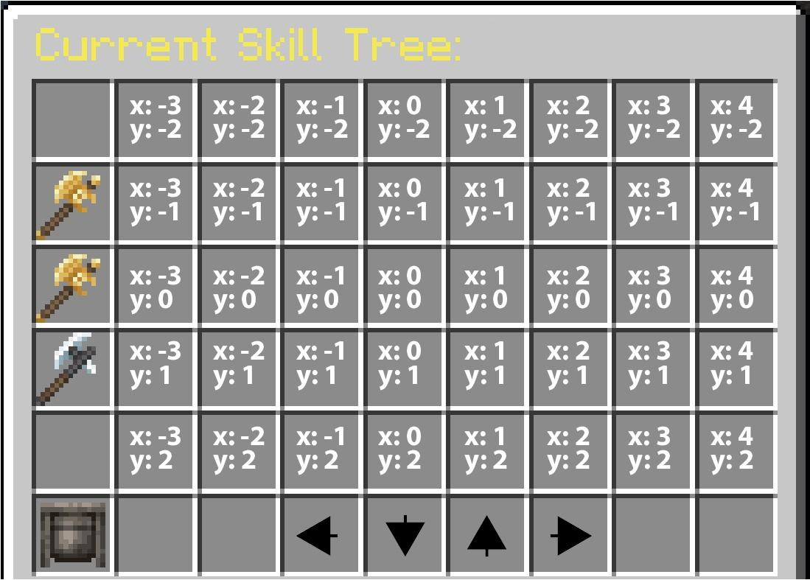
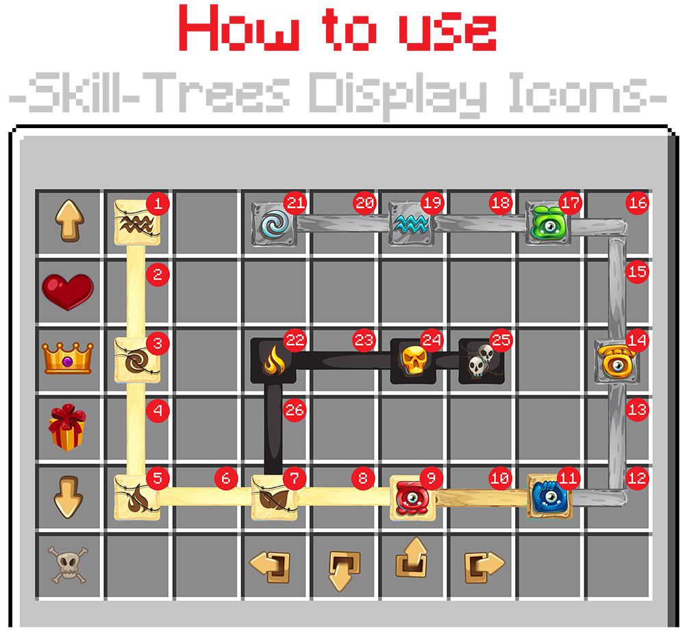

# 🌱 Skill Trees

Skill trees are a combination of nodes which can be unlocked/levelled-up using skill tree points. Levelling up a skill tree node can give stats or can run some triggers for the player. You can also reset the progress for a skill tree and gain the skill tree points spent for it by using a skill tree reallocation point.

::: details Skill Tree Basic Config Example

```yaml
id: "custom_combat" # Unique Identifier for the Skill Tree
name: "Combat" # Name of the skill tree that will be displayed in the GUI
type: custom # See below for explanations
max-points-spent: 20 # Maximum amount of points spent in that skill tree
lore:
  - "&6This skill tree is used for combat abilities!"
icon: # The item representing the skill tree in the GUI.
  material: GOLDEN_AXE
  item_flags: [HIDE_ATTRIBUTES]
  #custom_model_data: 10
  #custom_model_data_string: 'test'
  #item_model: 'minecraft:dirt'

nodes:
  a1:
    name: "Mana Regeneration"
    coordinates: -3,-2
    paths:
      a2:
        path1: -2,-2
        path2: -1,-2

    max-level: 2
    is-root: true
    point-consumed: 1
    experience-table:
      first_table_item:
        level: 1
        triggers:
          - 'stat{stat="MANA_REGENERATION";amount=1;type="FLAT"}'
      second_table_item:
        level: 2
        triggers:
          - 'stat{stat="MANA_REGENERATION";amount=1;type="FLAT"}'
    lores:
      0:
        - "&eMana regen in pts/sec +1"
      1:
        - "&eMana regen in pts/sec +1"
      2:
        - "&eMana regen in pts/sec +1"
```

:::

## Linking a skill tree to a class

Skill trees are class-based, which means that the skill trees you can see and your progress for them depends on your current [class](../features/classes.md). Each player can spend points in trees linked to its current class. You can link skill trees using the following syntax, inside any class configuration file:

```yaml
# MMOCore/classes/mages.yml

skill-trees:
  - "skill-tree-id1"
  - "skill-tree-id2"
```

## Skill Tree Points

You can use the following command to give skill tree points to players. The `id` represents the identifier of the skill tree you want to give points to. These points will only be usable for the corresponding skill tree. If you want to give skill tree points usable for any skill tree, use the id `global`.

```
/mmocore admin skill-tree-points give <player> <number> <id>
```

One of the main ways you will be giving players skill tree points is through command triggers in experience tables. In the following example, a player will receive 1 skill tree point useable for the skill tree with ID `archerSkillTree` every time they level up.

```yaml
# MMOCore/exp-tables/default_exp_tables.yml

example_archer_exp_table:
  give_one_skill_tree_point:
    period: 1
    triggers:
      - 'command{format="mmocore admin skill-tree-points give %player% archerSkillTree"}'
```

You can also use the following command to give skill tree reallocation points to players.

```
/mmocore admin skill-tree-realloc-points give <player> <number>
```

### Max Points Spent

This field corresponds to the maximum amount of points that a player can spend in a skill tree. If unspecified, there will be no limit to the amount of points a player can spend in the skill tree.

## Nodes

A skill tree is comprised of multiple nodes. Nodes are what the player interact with in order to unlock new skills and perks. These nodes can either be linked together through paths, requirements and incompatibilities, or be independently leveled up. Players spend skill tree points on specific nodes in order to unlock/level them up.

The skill tree nodes go under the `nodes` subsection in the skill tree YML config.

### Node States

A skill tree node can be in one of the five following states.

| State        | Description                                                                                       |
| ------------ | ------------------------------------------------------------------------------------------------- |
| Unlocked     | The node is at least at level 1 and is already unlocked                                           |
| Maxed Out    | The node has reached its maximum level.                                                           |
| Locked       | The node is not accessible to the player yet, but might be in the future                          |
| Fully Locked | The player made a branching choice, rendering this node inaccessible unless a respec is performed |
| Unlockable   | The node can be unlocked for N skill tree points                                                  |

You can modifiy the display name of each state in the `node-status` section in the `gui/skill-tree.yml` config file.

### Coordinates

To be represented in the GUI, each skill tree node has unique coordinates defining where it will be displayed. The coordinates can be as large as you want (e.g x:15 y:0). You might have to move around in the GUI using the arrows to see nodes that are further way from the origin `(x=0,y=0)`.

```yaml
nodes:
  a1:
    name: '&6Extra Atk Damage'
    ...
    coordinates: 0,0
```



### Parents (Strong)

All the strong parents of any node must be unlocked before that node can be unlocked.

<details>
<summary>Example 1</summary>

In the following example, `a2`, `a3` and `a4` are strong children of `a1`. In order to unlock `a2`, `a3` or `a4`, the player must get `a1` to level 2, 1 or 3 respectively.

```yaml
nodes:
  a1:
    ...
    children:
      strong:
        a2:
          level: 2
        a3:
          level: 1
        a4:
          level: 3
  a2:
    ...
  a3:
    ...
  a4:
    ...
```
</details>

<details>
<summary>Example 2</summary>

In the following example, `a1` is a strong parent of both `a2` and `a3`. In order to unlock `a2` or `a3`, the player must get `a1` to level 2 or 1 respectively.

```yaml
nodes:
  a1:
    ...
  a2:
    ...
    parents:
      strong:
        a1:
          level: 2
  a3:
    ...
    parents:
      strong:
        a1:
          level: 1
```
</details>

### Parents (Soft)

Soft parents are similar to strong parents, except that you only need to unlock at least one soft parent, instead of all of them.

<details>
<summary>Example 1</summary>

In the following example, reaching level 3 of `a1` is sufficient to unlock `a2`, and reaching level 2 of `a1` is sufficient to unlock `a3`. 

```yaml
nodes:
  a1:
    ...
    children:
      soft:
        a2:
          level: 3
        a3:
          level: 2
  a2:
    ...
  a3:
    ...
```

</details>


<details>
<summary>Example 2</summary>

In the following example, in order to unlock `a3`, the player can either reach level 3 of `a1` or level 2 of `a2` (one suffices).

```yaml
nodes:
  a1:
    ...
  a2:
    ...
  a3:
    ...
    children:
      soft:
        a1:
          level: 3
        a2:
          level: 2
```

</details>

If a node has both strong and soft parents, the requirements stack up. The player must unlock all the strong parent nodes, and at least one node among the soft parents.

::: info

Note that the `children` and `parents` options are pretty much symetrical. The following syntaxes are completely equivalent:

<Columns>
  <template #left>

```yml
nodes:
  a1:
    ...
    children:
      strong:
        a2: 3
  a2:
    ...
```

  </template>
  <template #right>

```yml
nodes:
  a1:
    ...
  a2:
    ...
    parents:
      strong:
        a1: 3
```

  </template>
</Columns>


You can either define `a2` as the child of `a1`, or `a1` as the parent of `a2`. Both of these syntaxes will lead to the exact same behaviors.

For each node config, you can define `parents` and/or `children`, or none.
:::

### Incompatible Nodes

Nodes can be incompatible with each other, meaning that they permanently lock if other nodes have already been unlocked.

::: tip
Although it is not its best use case, this feature can be used to recreate the `max-children` option (described [below](#maximum-children)). It is most useful in specific cases where you have two distant nodes that introduce incompatibilities or bugs when used together.
:::

In the following example, if `a2` reaches level 1, or if `a3` reaches level 2, `a1` permanently locks (until a respec).

```yaml
nodes:
  a1:
    name: '&6Extra Atk Damage'
    ...
    parents:
      incompatible:
        a2: 1
        a3: 2
```

### Lore

The `lore` is displayed in the skill-tree GUI through the `{node-lore}` placeholder in `gui/skill-tree.yml`. If you want to fully customize the lore each node has, you can include in it all the placeholders that are used for the node item lore in `gui/skill-tree.yml` (`{current-level}`, `{current-state}`, `{max-level}`...).

### Root Nodes

Root nodes are the first nodes to be unlocked in a skill tree. Note that skill trees should have at least one root node. To mark a node as a skill tree root, use the following syntax:

```yaml
nodes:
  a1:
    name: '&6Some Node'
    ...
    root: true # Here!
```

::: tip
It is possible for skill trees to have no root nodes, if you make sure some quest or event in your storyline unlocks the first skill tree node, through the use of a command for instance.
:::

### Permission Required

The option `permission-required` mandates that the corresponding permission is required to unlock the skill tree node. If this option is left unfilled, there will be no restrictions on permission to advance and unlock the skill tree node.

### Maximum Children

Nodes work under a parent/children system. A node may only be available if all (or at least N) of its parents are unlocked. The `max-children` option allows you to limit the number of unlocked children a parent node can have.

This has the effect of creating a fork in the skill tree, where players need to choose between two different play styles.

In the following example, the node `a1` has two children `a2` and `a3`. Since `max-children` is set to 1, the player can only unlock one of the two. As soon as the player unlocks any of the two, the other will be permanently locked (until a respec).

```yaml
nodes:
  a1:
    ...
    max-children: 1

  a2:
    ...
    parents:
      strong:
        a1:
          level: 1
  a3:
    ...
    parents:
        a1:
          level: 1
```

### Experience Tables

Each node has an experience table associated with it. More about Experience Tables [here](../level/tables.md)

### Node Display Options

The optional field `display` enables you to have a specific icon for the node depending on its state.

```yaml
nodes:
  a1:
    ...
    display:
      unlocked: 'WHITE_CONCRETE:0'
      unlockable: 'BLUE_CONCRETE:0'
      locked: 'GRAY_CONCRETE:0'
      fully-locked: 'BLACK_CONCRETE:0'
```

### Max Level

This is the maximum level you can reach for this skill tree node.

### Points Consumed

The optional field `point-consumed` lets you set the number of skill tree points required to upgrade this skill tree node. It defaults to 1.

## Paths

"Paths" are the connections in between nodes. They are only for visual representation, as players cannot directly interact with paths.

Any pair of (node, child) can have a path. A path consists in list of grid coordinates, that it should occupy inside the chest inventory.

### States

A path can exist in three different states, which will modify its appearance. More information about these icons can be found [here](#node-display-options). A path is considered "unlocked" if both of the nodes it connects are also unlocked. If one of the two nodes is fully locked, the path is considered "fully-locked." Otherwise, the path is simply "locked."

### Example

In the following example, the node `a1` has two children `a2` and `a3`. The `a1` to `a2` path occupies all grid coordinates in between these two nodes (same for `x=1,y=0` and `x=2,y=0`). Same for the path from `a1` to `a3`.

```yaml
nodes:
  a1:
    ...
    coordinates: 0,0
    children:
      strong:
        a2:
          level: 1
          paths: ['1 0', '2 0']
        a3:
          level: 1
          paths: ['-1 0', '-2 0']
  a2:
    ...
    coordinates: 3,0
  a3:
    ...
    coordinates: -3,0
```

Paths can take turn but cannot split. You cannot have one node linked to multiple other nodes using a single path. You must have one path per (node, parent) pair.

## Icons

You have the ability to fully customize the appearance of the skill tree graphical user interface (GUI) by creating different displays for each possible node or path configuration. To make these changes, you can modify the file located in `gui/skill-tree.yml`, which will automatically select the appropriate display for each node or path. This configuration can also be done in each skill-tree config in order to have different GUI display for each skill-tree. As stated above each node can have its own look by filling the display section for it.

Here is how the display will be chosen for a node / path:

- If it is a node and has a specific display corresponding to its state then this will be its display.
- Else if there is a display in the skill tree config it will take it.
- Else it will take the display specified in `gui/skill-tree.yml`.

Let's now dive in how the display section works in the skill-tree config and `gui/skill-tree.yml`:

The display of a node/ path depends on both its neighborhood and its state. You can for example define a display for each node in the unlocked state and with 2 path at its left and right by being in nodes.unlocked.right-left.

The process is exactly the same for paths with 4 possible state for each path:

- Unlocked if the 2 node it links are unlocked.
- Unlockable if one node is unlocked while the other is unlockable.
- Locked if one of the 2 nodes is locked.
- Fully locked if one of the 2 nodes is fully locked.

The neighborhood also impacts the display of a path. For instance, if a path has a branch that goes up and ones that goes right, it will take the item associated with "up," followed by "down-right," and finally "right." This is a symmetrical process, so if a path goes left and then down, it will look identical.

<!-- For example this path has 1 skill tree node at its left and one that is below him so it is a down-left path. -->

The same rule applies for nodes. For example, if a node is surrounded by four paths, it will display the "up-right-down-left" configuration. Alternatively, if a node has only three paths (up, left, and right), it will automatically select the "up-right-left" display.

Here is a full example to show what the display enables you to do:

<div>



</div>Here the nodes 1,3,5,7,9 are unlocked. This makes the display for paths 2,4,6,8 be unlocked as the 2 nodes each path is linking are unlocked. The node 11 is unlockable making the path 10 unlockable also. Finally 22,24,25 are fully locked making the corresponding path have the fully locked display. The rest corresponds to the locked state. Now regarding the direction, here is an extensive list of the directions and state of each node/path:

| No  | Display Icon                                      | No  | Display Icon           | No  | Display Icon      | No  | Display Icon            |
| --- | ------------------------------------------------- | --- | ---------------------- | --- | ----------------- | --- | ----------------------- |
| 1   | unlocked:down                                     | 8   | unlocked:right         | 15  | locked:up         | 22  | fully-locked:down-right |
| 2   | unlocked:up<br>(same as down as this is symetric) | 9   | unlocked:right-left    | 16  | locked:down-left  | 23  | fully-locked:right      |
| 3   | unlocked:up-down                                  | 10  | unlockable:right       | 17  | locked:right-left | 24  | fully-locked:right-left |
| 4   | unlocked:up                                       | 11  | unlockable: right-left | 18  | locked:right      | 25  | fully-locked:left       |
| 5   | unlocked:up-right                                 | 12  | locked:up-left         | 19  | locked:right-left | 26  | fully-locked:up         |
| 6   | unlocked:right                                    | 13  | locked:up              | 20  | locked:right      |     |                         |
| 7   | unlocked:up-right-left                            | 14  | locked:up-down         | 21  | locked:right      |     |                         |

```yaml
# Example config in skill-tree.yml or in skill-tree configs.
display:
  paths:
    unlocked:
      up: "WHITE_DYE:0"
      up-right: "WHITE_DYE:0"
      up-left: "WHITE_DYE:0"
      down-right: "WHITE_DYE:0"
      down-left: "WHITE_DYE:0"
      right: "WHITE_DYE:0"
      default: "WHITE_DYE:0"
    locked: ...
    unlockable: ...
    fully-locked: ...
  nodes:
    unlocked:
      up-right-down-left: "WHITE_CONCRETE:0"
      up-right-down: "WHITE_CONCRETE:0"
      up-right-left: "WHITE_CONCRETE:0"
      up-down-left: "WHITE_CONCRETE:0"
      down-right-left: "WHITE_CONCRETE:0"
      up-right: "WHITE_CONCRETE:0"
      up-down: "WHITE_CONCRETE:0"
      up-left: "WHITE_CONCRETE:0"
      down-right: "WHITE_CONCRETE:0"
      down-left: "WHITE_CONCRETE:0"
      right-left: "WHITE_CONCRETE:0"
      right: "WHITE_CONCRETE:0"
      left: "WHITE_CONCRETE:0"
      up: "WHITE_CONCRETE:0"
      down: "WHITE_CONCRETE:0"
      no-path: "WHITE_CONCRETE:0"
    locked: ...
    unlockable: ...
    fully-locked: ...
```

## Skill Tree GUI

There are 2 ways of opening a skill tree UI:

The first option is to use `/skilltrees`, which will open the GUI using the `gui/skill-tree.yml` configuration file. It allows you to browse through each skill tree within the GUI. You can enable or disable this feature by modifying the `enable-global-skill-tree-gui` field in the `config.yml` file.

The second option is to use `/skilltrees` to open a specific skill tree without the ability to browse between skill trees. This will utilize the GUI configuration file from `gui/specific-skill-tree/specific-skill-tree-<skill-tree-id>.yml`. Make sure that your skill tree IDs follow the YAML format to avoid any issues. If no configuration is found, it will load the GUI from `gui/specific-skill-tree/specific-skill-tree-default.yml`. You can also toggle this feature on or off by modifying the `enable-specific-skill-tree-gui` field in the `config.yml` file.

## Skill Tree Types (MMOCore 1.21.1+)

There are currently two types of skill trees. Using some type or another does not add, nor remove any feature from your skill tree, it only makes it easier to setup skill trees in certains scenarios, since skill tree config files can quickly get big.

### Custom Skill Trees

If you don't specify the `type` option for a skill tree, it will be set to `CUSTOM` by default. When using
a custom skill tree, you need to manually provide all relations between skill tree nodes, as well as the location of all the paths between the nodes. In order to create a custom skill tree, simply use the following syntax:

```yaml
id: "sample_skill_ree"
name: "&6My Skill Tree"
type: CUSTOM # <<==== Here
...
```

MMOCore will automatically infer that skill tree nodes with NO parents whatsoever are root nodes.

### Proximity Skill trees

Proximity skill trees are a simplified version of custom skill trees where you sometimes don't need to provide parenting relations between the nodes. In order to create a proximity skill tree, change the `type` config option to `PROXIMITY` inside your skill tree config file.

```yaml
id: "sample_skill_ree"
name: "&6My Skill Tree"
type: PROXIMITY # <<==== Here
...
```

Any two neighboring nodes are automatically marked as soft parents. In other words, leveling up any node automatically unlocks the neighboring nodes. Every skill tree node has four direct neighbors (up, down, left and right neighbor).

Some examples (click to expand):

<details>
    <summary>These two nodes are parents as they are direct neighbors.</summary>

```yaml
nodes:
  a1:
    name: 'Cooldown Reduction I'
    ...
    coordinates: 2,1

  a2:
    name: 'Cooldown Reduction II'
    ...
    coordinates: 2,2
```

</details>

<details>
  <summary>These 2 nodes are NOT parents, as they are not direct neighbors.</summary>

```yaml
nodes:
  a1:
    name: 'Cooldown Reduction I'
    ...
    coordinates: 2,1

  a2:
    name: 'Cooldown Reduction II'
    ...
    coordinates: 2,4
```

</details>

When setting up a proximity skill tree, you can still make use of custom soft/hard/incompatible node parenting rules as well as paths. Using a proximity skill tree simply gives you a skeleton for your skill tree and spares you some syntax.

<details>
<summary>Defining parents inside a proximity skill tree</summary>

```yaml
nodes:
  a1:
    name: 'Cooldown Reduction I'
    ...
    coordinates: 2,1
    children: # This syntax still works.
      strong:
        a1: 1

  a2:
    name: 'Cooldown Reduction II'
    ...
    coordinates: 2,4
```

</details>

It is impossible for MMOCore to infer skill tree roots from a linked skill tree, because every non-isolated skill tree node has at least one parent/child node. For this reason, you need to specify at least one root node manually in your proximity skill tree! As a reminder, this is done using the following option:

```yaml
nodes:
  a1:
    name: '&6Some Node'
    root: true # This option
    ...
```
