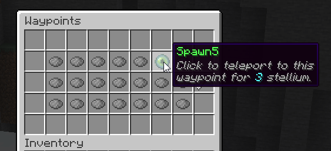

# 📌 Waypoints

Waypoints are a way for players to save their world exploration progression. Waypoints are configurable spots in your worlds that can link together as a player unlocks them to create a form of fast travel system. They can be unlocked by pressing \[sneak\] while standing on them. Each waypoint is linked to others waypoints with a cost corresponding to it. You can travel between 2 waypoints if they are linked and if you unlocked them.

By default a player has no waypoints unlocked, but as the player explores the world and discovers waypoints A, B, and D, the player may **fast travel** between those waypoints. If the player has not discovered waypoint C, then the player will not see it or be able to fast travel to it. When standing on/near a waypoint, you simply shift to open up the fast travel menu.

Traveling using waypoints costs **Stellium**, which is a resource just like mana but which regenerates much slower. Stellium is used to balance waypoints.

## Waypoint List

Players may open the waypoints menu by using `/waypoints` This menu displays every waypoint in the server, including locked ones. Unlocked waypoints are displayed using an ender eye. This menu can only be used to visualize waypoints, indeed waypoints may only be used when standing on a waypoint and pressing \[sneak\]: the same menu will open, however the waypoint you are standing on will be highlighted (using the vanilla glowing effect) and you will be able to use your stellium to teleport to any waypoint.



There is a **cool animation** for unlocking and teleporting to an existing waypoint as well, with sound effects.

## Disabling Waypoints

MMOCore waypoints are an optional feature. If you don't want to use it, follow these steps:
- empty the `/waypoints` folder (do not delete it or it will regenerate),
- comment out the `/waypoints` command section inside `MMOCore/commands.yml` to disable the waypoint UI command.

## Waypoint Config Example

The `/waypoints` folder is where you can place as many YML files/subfolders as you want to register new waypoints.

::: details Full Config Example
```yaml
# Waypoint identifier, used as reference for admin commands.
# Make sure all the waypoints have different identifiers.
spawn:

  # Name of waypoint displayed in the waypoint GUI.
  name: Spawn

  # Location of waypoint: <world> <x y z> <yaw> <pitch>
  # Yaw and pitch represent where the player will be looking at when teleported.
  location: 'world 69 71 136 136 0'

  # Radius of waypoint around the specified location.
  radius: 2.0

  # Time it takes to warp to target location when using
  # the waypoint through the GUI.
  warp-time: 100

  cost:
    # Cost when not standing on any waypoint to dynamically teleport to this one.
    dynamic-use: 5

  option:

    # When enabled, players can unlock the waypoint
    # by sneaking on it (true by default)
    unlockable: true

    # When enabled, opens up the teleportation menu
    # when sneaking (true by default)
    enable-menu: true

    # When set to true (false by default) players don't
    # have to be standing on any waypoint to teleport
    # to that waypoint. This could be a nice option for
    # spawn waypoints alongside with the 'default' option.
    dynamic: false

    # Should the waypoint be unlocked by default?
    default: true
  
  # All the waypoints you can teleport to when standing
  # on that waypoint. Each value is associated with the cost of the travel.
  linked:
    spawn1: 2
    spawn2: 3
    forest: 4
```
:::

| Option | Description |
|--------|-------------|
| Name | Name displayed for the waypoint in the `/waypoints` menu. This is different then the internal ID which is only used for config purposes. |
| Location | This is where you define where the waypoint block is. Your options are WORLD, X, Y, Z, PITCH, YAW. Yaw and pitch define the player's camera orientation. |
| Radius | This defines how close a player has to be to the source waypoint block to shift and unlock it. Radius is in blocks, and 5 blocks means that if a player shifts anywhere within 5 blocks of the waypoint, they will unlock it. It should somewhere near half the diameter of the monument/shrine/.. which serves as physical waypoint. |
| Default | Whether or not this waypoint is unlocked by default. |
| Dynamic | See [below](#dynamic-waypoints). |
| Enable Menu | When set to ``true``, sneaking on the waypoint will open up the waypoint teleportation menu. |
| Unlockable | When set to ``true``, players will unlock that waypoint by crouching on the waypoint location. |
| Destinations | The list of other waypoints you can jump to when standing on your waypoint. Each neighbor waypoint is associated to the cost (in stellium) of the A -\> B waypoint travel. |

### Dynamic Waypoints

Dynamic waypoints can be used anywhere on the map when opening the waypoints menu. Any player can teleport to a dynamic waypoint at any time, they don't need to be standing on any waypoint.

### Waypoint Link Reciprocity

By default, Waypoint A being linked to waypoint B does not mean B is linked to A. In other words, waypoint connections are not reciprocal, unless you toggle on the following option inside the MMOCore `config.yml`:

```yaml
waypoints:
  # ...
  link_reciprocity: true
```

This option applies to all waypoints.

## Waypoint Books

Waypoint books can be given to players using the following command. 

```
/mmocore waypoints item <waypointId> <playerName>
```

When right clicked, the book will be consumed, unlocking the specified waypoint. You can change how the item looks in the `items.yml` config file.

```yaml
WAYPOINT_BOOK:
  item: BOOK
  name: '&6Waypoint Book: {waypoint}'
  lore:
    - '&7Click to unlock {waypoint}'
```

## Waypoint Path Calculation

When enabling this option in the main MMOCore plugin config file, MMOCore will perform automatic path calculation across the waypoints that the player has collected.
```yaml
waypoints:
  # ...
  auto_path_calculation: false
```

Let's take the following scenario:

- Player is standing at waypoint A. They would like to teleport to waypoint C
- Waypoint A is not directly connected to waypoint C
- Waypoint A is connected to an intermediate waypoint B, and B is connected to C

Even if waypoint A is not directly linked to waypoint C, MMOCore will look through the entire waypoint map and find the path A -> B -> C, rendering waypoint C accessible. MMOCore always finds the shortest paths between waypoints, and takes into account dynamic waypoints.

## Disabling waypoints

If you do not plan on using the MMOCore waypoint system, here is what you can do to disable it:
- empty the `waypoints` folder,
- comment out the `waypoints` command in the `commands.yml` config file.