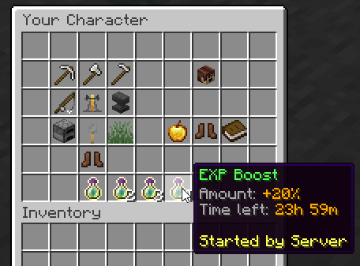

# ⭐ Experience Boosters

Admins can use a [command](Commands) in order to create EXP boosters which apply for every online player in the server! Using the `/rpg booster create` command, you can specify how much extra % EXP players will earn, and even **which profession** the booster applies for.

## Compatibility Options
This type of EXP Boosters 100% EULA compliant. **The best way to utilize these boosters is to have plugins like MMOItems or MythicMobs create items which perform that booster admin command when right clicked, applying an EXP booster for every online player!**\
The `/rpg booster create` command has an optional `player` parameter that you can use to specify the booster creator _(therefore, other online players can see who created the booster)_.

When a booster is created, a message is broadcast in the entire server:

## Active Boosters
Active boosters are displayed in the player stats menu which you can access using `/player` as seen on the following screenshot. Players can see the time left before the booster expires, who created the bounty, and potentially the profession which the booster applies for.

