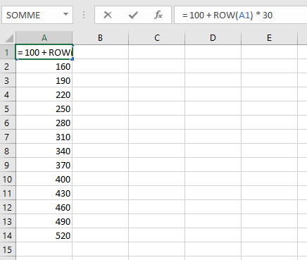
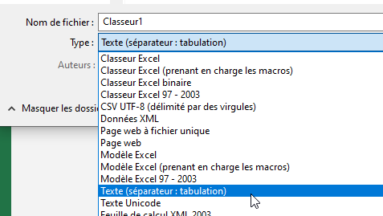

# 📈 Experience Curves

Experience curves allow you to define how much experience a player needs in order to level up. Both [professions](../profession/intro.md) and [classes](../features/classes.md) have experience curves.


## Basic Config

All exp curves can be found under the `/MMOCore/exp-curves` folder. You can setup an exp curve by creating a `.txt` file with the following format:
```txt
200
400
600
800
1000
1200
1400
1600
1800
2000
2200
2400
2600
[...]
```

The first line says how much exp a player needs in order to reach level 2, second line for level 3 and so on. Exp curves are **NOT cumulative**, they indicate the amount of experience needed to level up, regardless of how many levels the player has already reached.

If your exp curve file is called `exp-curves/levels.txt`, you can assign it to a class or profession by using the following syntax. This works for both professions and classes:
```yaml
# MMOCore/class/mages.yml
# MMOCore/profession/mining.yml

exp-curve: levels
```

## Generating an EXP curve using Excel

Using Excel (you can use it for free online on the Microsoft website) you can easily generate a MMOCore exp curve **if you have a formula of needed exp as a function of the player level**.



On Excel, you can use the `ROW(CELL_NAME)` function to retrieve the cell line number. You can therefore, for instance, use this formula: `= 100 + ROW(A1) * 30` and duplicate the cell all the way down to generate a list of numbers which correspond to the amount of experience needed to reach the n-th level.

Once you have this setup, save/export your file as a `.txt` file using the `Text (tab separator)` file type. Make sure there is only one column so that no separator appears in the resulting text file.



## Curves as Formulas

Instead of using a text file located in the `/MMOCore/exp-curves` folder, you can also define exp curves using mathematical formulas to reduce the number of files required.

Inside of your class/profession config, use the following syntax:
```yaml
exp-curve-formula: "min(100 + {level} * 50, 1000)"
```
The `{level}` placeholder will be replaced by the target level number when calculating the required exp. This formula also supports PAPI placeholders. Basic math functions like `min`, `max`, `sqrt`... are supported. If the formula happens to return a decimal number, it will be rounded down to the nearest integer.

## Exp Level Overflow

If the player has more than the required amount of exp when reaching a new level, the remaining exp is kept and applied towards the next level. For this reason, a player can level up multiple times in one go, if provided with enough exp points.