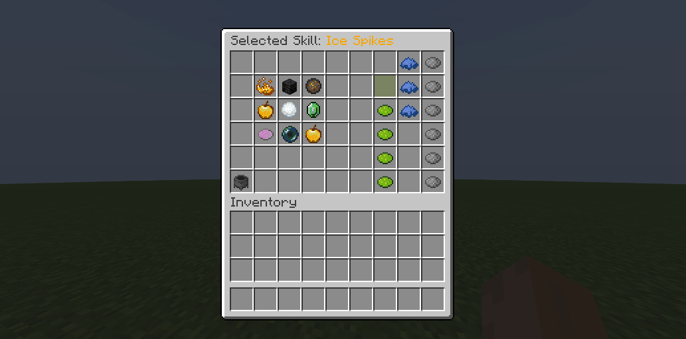
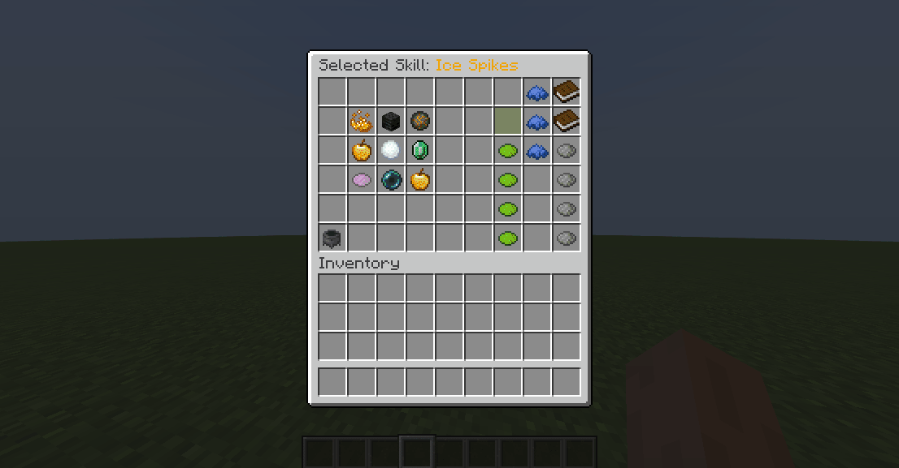

# 🔗 Binding Skills

In order to be cast, skills need to be bound to specific skill slots. There can be at most one skill bound to one skill slot. Each skill slot corresponds to a different keybind, or key combo.

For example, a skill bound to skill slot n1 could be cast by pressing the [1] key (or combo _Left-Right_), while the skill bound to skill slot n2 could be cast by pressing [2] (or by performing combo _Left-Right_). In principle, players choose what skill they want to bind to each skill slot/keybind.

## Skill Slots

Skill slots are class-specific, which means that classes can have a varying number of skill slots, as well as different skill slot properties. Magic-oriented classes like Mages, Wizards, Paladins could have more skill slots than weapon-oriented classes like Warriors or Brutes.

To edit the skill slots of a class, open up the class config file and look for/create the `skill-slots` section. Each entry under this config section corresponds to a single skill slot.
```yaml
# classes/mage/mage.yml

skill-slots:

  # First skill slot
  '1':
    name: "Skill Slot I"
    lore:
      - "&eReduces by &610% &ethe cooldown of"
      - "&ethe skill bound to it."
    can-manually-bind: true
    unlocked-by-default: true
    formula: "<ACTIVE>" # Can only be bound to active skills.
    # This decreases by 10% cooldown of bound skill
    skill-buffs:
      - 'skill_buff{modifier="cooldown";amount=-10;type="RELATIVE"}'
  
  # Second skill slot
  '2':
    name: "Skill Slot II"
    lore: 
      - "&eGives &640 &eadditional damage to"
      - "&ethe skill bound to it!"
      - "&eThis slot is for Aqua/Fire active skills."
    can-manually-bind: true
    unlocked-by-default: true
    formula: "(<AQUA> && <ACTIVE>) || (<FIRE> && <ACTIVE>)"
    # This gives +40 Damage to bound skill
    skill-buffs:
      - 'skill_buff{modifier="damage";amount=+40;type="FLAT"}'
  #........
```

Let's go over each parameter one by one.

### Name and lore

These are the name and lore of your skill slot. They will be used to show your skill slot in the skill viewer GUI, which can be opened using `/skills`.

### Other Options

`can-manually-bind` determines if the player is allowed to manually bind skills to this slot. It is set to `true` by default. When set to `false`, the only way to bind skills to this slot is by using an admin command.

`unlocked-by-default` is set to `true` by default. When set to `false`, this skill slots needs to be [unlocked](#unlocking-skill-slots), just like a skill in order to be usable. Until it is unlocked, the player cannot bind any skill to it.

### Formula

Each slot also has a formula (specified by the `formula` entry) which determines the set of **compatible skills**, i.e skills that can be bound to that slot.

::: tip
Comment this line out or set it to `"true"` to disable this option.
:::

This option can be used to create things like _Passive skill slots_, where the player can only bind passive skills. If other skill slots are _Active-only_ then you can make sure the player has at most one passive skill. The only limit is your imagination. Here are some examples of formulas you can use.

| Formula | Usage |
|---------|-------|
| `<passive>` | Only passive skills |
| `<active>` | Only passive skills |
| `<active> && <fire>` | Only active skills with category `fire` |
| `<active> && (!<fire>)` | Any skill that does not have category `fire` |
| `<passive> \|\| <fire>` | Only passive skills with category `fire` |
| `(<passive> && <fire>) \|\| <active>` | Only passive skills with category `fire`, OR active skills |
| `<firebolt> \|\| (!<water>)` | Only skill named `firebolt`, or any skill that does not have category `water` |

These formulas uses [skill categories](config.md#skill-categories) and support boolean algebra operators: `!<aaa>` (logical not),  `<aaa> && <bbb>` (logical and), `<aaa> || <bbb>` (logical or).

### Skill Buffs

Skill buffs can also be granted to skill slots. A skill buff is a specific buff applied on one specific parameter of a set of skills, for instance _+10% Damage_ or _-10% Cooldown_. These skill buffs will only apply to the skill bound to that skill slot.

This feature can be used to create, for instance, _Fire slots_ or _Water slots_ which provide additional damage to lower cooldowns to a specific set of skills (which can be specified using skill formulas, see above).

## Unlocking Skill Slots

All skill slots are unlocked by default (see above). When they are not, they can be unlocked using the following command, where `<slot_number>` starts at 1 (not 0). 
```
/mmocore admin slot lock <player> <slot_number>
/mmocore admin slot unlock <player> <slot_number>
```

Locked skill slots are not visible in the skill GUI.

::: details Default Config for Skill Slots
```yaml
# classes/mage/mage.yml

skill-slots:
  '1':
    name: "&aSkill Slot I"
    unlocked-by-default: true
  '2':
    name: "&aSkill Slot II"
    unlocked-by-default: true
  '3':
    name: "&aSkill Slot III"
    unlocked-by-default: true
  '4':
    name: "&aSkill Slot IV"
    unlocked-by-default: true
  '5':
    name: "&aSkill Slot V"
    unlocked-by-default: true
  '6':
    name: "&aSkill Slot VI"
    unlocked-by-default: true
```
:::

## Binding active skills

Since active skills are proactively [cast](casting.md) by players, they all require to be bound to a specific skill slot before being used.

Players can bind skills to skill slots from inside the `/skills` GUI. In the skill GUI, available skills are displayed on the left. Click the skill you would like to bind (the GUI name should update), then on the rightside, click the skill slot where you'd like to bind your skill. Once an active skill is bound, you can [cast](casting.md) it.



## Binding passive skills

Passive skills might or might not require binding to take effect. In your class skill configuration, set the `needs-bound` field to `false` to make your passive skill **permanent**. Permanent skills always take effect, as soon as they are unlocked by the player, and do not require binding. Only passive skills can be permanent.

In the following example taken from the `classes/mage/mage.yml` config file, the _Power Mark_ passive skill for the _Mage_ class does not require binding in order to take effect.

```yml
# classes/mage/mage.yml

# Other class options......

skills:
  # Other skills.....
  POWER_MARK:
    level: 5
    max-level: 30
    # .......
    needs-bound: false # Does not need to be bound to apply its effects
```

The default MMOCore config files for the _Mage_ class features three _Passive skill slots_ where players can only bind passive skills.



In the main MMOCore configuration file, you can also toggle off the option `passive-skill-need-bound`. By default, this option is set to ``true``. This means that, unless specified otherwise, passive skills must all be bound to a skill slot in order to take effect.

## Using commands

If you don't want players to bind their skills and keybinds, you can use the following command to bind skills to specific slots instead.
```
/mmocore admin slot bind <player> <slot_number> <skill>
/mmocore admin slot unbind <player> <slot_number>
```

The bind command will work, even if the designated skill OR skill slot is not unlocked by the player. If the designated skill is not unlocked by the player, the skill will be bound but the skill will remain locked, and the player will get a friendly error message when trying to cast it. If the designated skill slot is not unlocked, the skill will be castable but the skill slot will remain locked.