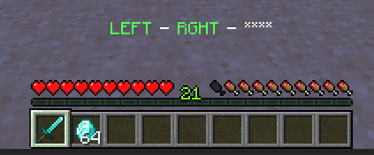
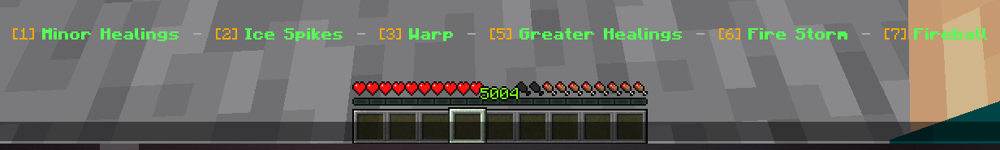

# 💫 Skill Casting

Make sure you first learn about [skills](skills.md) and [skill slots](binding.md#skill-slots). MMOCore offers multiple ways of casting skills:

- using key combos <Badge type="info" text="most popular!" />
- using the [1] to [9] keys (_skill bar_)
- using the mouse scroller
- using a command

Make sure you restart your server when editing your skill casting configuration.

## Key Combos

Key combos like Left-Right-Left can be used to cast skills. Players can start a combo by pressing the first key of any of the configured combos, which will temporarily alter the player's action bar, and display their current key combo there. As soon as MMOCore recognizes a valid key combo that is bound to some skill slot, it will cast the corresponding skill.


One combo can be used to cast the skill bound to one specific slot. Therefore, there are as many valid key combos as there are skill slots. This implies that a specific key combo won't make two players cast the same skill (unless they have bound the same skill to the same skill slot). A few examples (the default configuration):

- LEFT -> RIGHT -> LEFT will cast the skill on the 1st slot
- LEFT -> RIGHT -> RIGHT will cast the skill on the 2st slot
- LEFT -> RIGHT -> DROP will cast the skill on the 3st slot
- And so on...



### Keybind List

These are the different keybinds that you can use inside of a combo. For instance, you can choose to start every combo with a right click, and then every combo is a combination or right or left clicks. Bukkit click events are canceled when performing a combo, which means you are temporarily unable to interact with any item/spell when performing a combo.

| Keybind | Comment |
|---------|---------|
| `LEFT_CLICK` | When left clicking |
| `RIGHT_CLICK` | When right clicking |
| `DROP` | Only works when holding an item |
| `SWAP_HANDS` | When swapping main and off hand items |
| `CROUCH` | When enabling crouch mode |

### How to use key combos

Head to `MMOCore/config.yml` and replace the `skill-casting` config section for the following code snippet:

::: details Place inside `config.yml`

```yaml
skill-casting:
  mode: KEY_COMBOS

  # General options
  initializer-key: SWAP_HANDS # Optional. Press to enter skill casting, otherwise any combo key will automatically have the player enter skill casting.
  quit-key: SWAP_HANDS # Optional. Press to quit skill casting. Can be the same as the 'initializer-key'
  stay-in: false # When enabled, player will remain in skill-casting after casting a skill.
  allowed-keys: # Disable some keys here, MMOCore will stop listening to them.
  - LEFT_CLICK
  - RIGHT_CLICK
  - DROP
  - SWAP_HANDS
  - CROUCH

  # Sound options
  sound:
    begin-combo: # When entering combo casting
      sound: BLOCK_END_PORTAL_FRAME_FILL
      volume: 1
      pitch: 2
    combo-key: # The click sound whenever pressing a keybind
      sound: BLOCK_LEVER_CLICK
      volume: 1
      pitch: 2
    fail-combo: # If the keybind sequence does not correspond to any preconfigured combo
      sound: BLOCK_FIRE_EXTINGUISH
      volume: 1
      pitch: 2
    fail-skill: # If you cast a skill but it fails.
      sound: BLOCK_FIRE_EXTINGUISH
      volume: 1
      pitch: 2

  # Action bar options
  action-bar:
    prefix: "&c❤ {health}/{max_health} &f|  "
    suffix: "  &f| {mana_icon} {mana}/{max_mana} &f| &7⛨ {armor}"
    is-subtitle: false #If the message is shown as a subtitle rather than in the action-bar.
    separator: ' - '
    no-key: '****'
    key-name:
      LEFT_CLICK: 'LEFT'
      RIGHT_CLICK: 'RGHT'
      DROP: 'DROP'
      SWAP_HANDS: 'SWAP'
      CROUCH: 'SHFT'

  # Edit default combos here
  combos:
    '1':
      - LEFT_CLICK
      - LEFT_CLICK
    '2':
      - LEFT_CLICK
      - SWAP_HANDS
    '3':
      - RIGHT_CLICK
      - LEFT_CLICK
    '4':
      - SWAP_HANDS
      - RIGHT_CLICK
    '5':
      - RIGHT_CLICK
      - SWAP_HANDS
    '6':
      - LEFT_CLICK
      - RIGHT_CLICK
```

:::

The `initializer-key` option is optional. It is the key players need to press first in order to start any combo. When unset, pressing the first key of any combo will start a new combo.

Similarily, the `quit-key` is optional. This key will cancel the current combo when pressed. Additionally, if the `stay-in` option is toggled on, players can cast as many combos as they want in a row without leaving skill casting (action bar stays on).

### Class-Specific Key Combos

Every class can have different combo-to-slot mappings. Class mappings take precedence over mappings defined in the plugin main config (see above). In order to setup class-specific combo mappings, paste the following code snippet into your `MMOCore/class/<...>.yml` config file and edit it to your liking.

```yaml
# Inside your class config file.

key-combos:
  '1':
    - RIGHT_CLICK 
    - LEFT_CLICK
    - RIGHT_CLICK
  '2':
    - RIGHT_CLICK 
    - RIGHT_CLICK
  '3':
    - RIGHT_CLICK
    - LEFT_CLICK
  '4':
    - RIGHT_CLICK
    - SWAP_HANDS 
  '5': 
    - RIGHT_CLICK
    - SWAP_HANDS
  '6':
    - LEFT_CLICK
    - RIGHT_CLICK
```

## Skill Bar

This way of casting skills utilizes the action bar. Players must press some key ([F] by default) which will have them enter _casting mode_. While in casting mode, the player's bound skills are displayed onto the action bar, along with their respective cooldown if they happen to be on cooldown. Skills that are castable appear green, skills on cooldown appear red, and skills which you cannot cast due to low mana appear blue.

While in casting mode, pressing any key from [1] to [6] will cast the skill bound to that slot.



Players can leave casting mode by pressing the same key again. They can't enter the casting mode while in creative.

### How to use

Head to `MMOCore/config.yml` and replace the `skill-casting` config section for the following code snippet:

::: details Place inside `config.yml`

```yaml
skill-casting:
  mode: SKILL_BAR

  # General options
  open: SWAP_HANDS
  ignore-sneak: false
  use-lowest-keybinds: true

  # Messages and sounds
  message:
    enter:
      message: '&e&l☄ &a&lSKILL CASTING &e&l☄'
      action-bar: true
      duration: 20
      priority: 31
      sound: BLOCK_END_PORTAL_FRAME_FILL,1,2
    quit:
      message: '&e&l☄ &c&lSKILL CASTING &e&l☄'
      action-bar: true
      priority: 31
      sound: BLOCK_FIRE_EXTINGUISH,1,2

  # Action bar format
  action-bar:
    split: '&7 &7 - &7 '
    ready: '&6[{index}] &a&l{skill}'
    on-cooldown: '&6[{index}] &c&l{skill} &6(&c{cooldown}&6)'
    no-mana: '&6[{index}] &9&l{skill}'
    no-stamina: '&6[{index}] &9&l{skill}'
```
:::

`disable-sneak` prevents the skill bar from opening if the player is sneaking when pressing the input keybind.

`use-lowest-keybinds` makes MMOCore choose the lowest available keybinds for castable skills. Since you can leave some skill slots empty or even bind a passive skill (uncastable) to a skill slot, the player might have empty slots before their first active (castable) skill. By toggling on this option, all active skills are "shifted to the left" to use the lowest available keybinds ([1] first, then [2], etc...)

### Skill Slot Offset

You may notice the keys you need to press on the screenshot are not exactly all the keys from [1] to [6]. Since the player's held item slot is currently the 4th slot of his hotbar, he cannot press [4] (Minecraft does not register useless slot swaps) and therefore he cannot cast the skill he bound to his 4th skill slot. This is why all the skill slots after the 4th slot have been offset by 1.\
_If the player holds his item in the 7th, 8th or 9th slot of his hotbar, there will be no offset_.

## Skill Scroller

The player first presses a specific key (set to [F] by default) to enter casting mode. From there, they use the mouse scroller to navigate through their skill list. The skill currently selected appears on the player's action bar. They then press another key (set to [R] by default) to cast the selected skill.

### How to setup

Head to `MMOCore/config.yml` and replace the `skill-casting` config section for the following code snippet:

::: details Place inside `config.yml`

```yaml
skill-casting:
  mode: SKILL_SCROLLER

  # General options
  action-bar-format: 'CLICK TO CAST: {selected}'
  quit-on-cast: false # Should the player quit casting mode when skill is cast?
  quit-on-switch-empty-hand: false # Player quits casting mode when switching to an empty hand
  ignore-sneak: false # Ignore pressed keys when player is sneaking

  # Keybinds
  enter-key: SWAP_HANDS
  cast-key: LEFT_CLICK
  scroll-key:
    key: RIGHT_CLICK
    sneak: false # No sneak + right click
  scroll-back-key:
    key: RIGHT_CLICK
    sneak: true # Sneak + right click

  # Edit sounds here
  sound:
    enter:
      sound: BLOCK_END_PORTAL_FRAME_FILL
      volume: 1
      pitch: 2
    change:
      sound: BLOCK_LEVER_CLICK
      volume: 1
      pitch: 2
    change-back:
      sound: BLOCK_LEVER_CLICK
      volume: 1
      pitch: 1.5
    leave:
      sound: BLOCK_FIRE_EXTINGUISH
      volume: 1
      pitch: 2
```
:::

| Parameter          | Optional | Description |
|-----------------|----------|-------------|
| `scroll-key` | Yes | Optional: comment the line to disable. When set, the mouse scroller no longer scrolls through the skill list, and the player has to press this keybind to scroll through their skill list. |
| `scroll-back-key` | Yes | Optional: comment the line to disable. When set, the mouse scroller no longer scrolls through the skill list, and the player has to press this keybind to scroll through their skill list. |
| `cast-key` | | Keybind you need to press in order to cast the currently selected skill. |
| `quit-on-cast` | Yes | When enabled, players quit casting mode when casting the selected skill. |
| `quit-on-switch-empty-hand` | Yes | When enabled, players quit casting mode when scrolling to an empty hotbar slot. |
| `ignore-sneak` | Yes | When enabled, keys pressed while crouching are ignored. |

## Using commands

MMOCore features commands to cast skills. These commands work anytime even if skill casting is disabled, if WorldGuard/Residence flags prevent players from casting skills...

The following command will cast the n-th castable skill of the given player.

```shell
/mmocore cast first <player> <slot>
```

The following command will have the given player cast the skill on their n-th skill slot.

```shell
/mmocore cast specific <player> <slot>
```

For example, let's say a player has four skill slots and the corresponding skill bindings:

| Slot 1 | Slot 2 | Slot 3 | Slot 4 |
|--------|--------|--------|--------|
| - | Passive Skill | Active Skill n1 | Active Skill n2 |

`/mmocore cast first <player> 1` will cast the 1st castable skill, hence on slot 3. The skill on slot 2 cannot be cast since it is passive, it is therefore ignored by this command. `/mmocore cast first <player> 2` will cast the 2nd castable skill, hence on slot 4. `/mmocore cast first <player> 3` and higher indices will return an error.

`/mmocore cast specific <player> 1` will result in an error as there is no castable skill currently in slot 1. `/mmocore cast specific <player> 2` will also result in an error because the skill on slot 2 is not castable (as it is a passive skill). `/mmocore cast specific <player> 3` will cast the skill on slot 3.

## Disable skill casting

If you are not using class skills or if you are not planning on adding active skills, you can just disable skill casting by using the following config syntax snippet inside `config.yml`.

```yaml
skill-casting:
  mode: NONE
```

This will disable skill casting altogether. We generally recommend using this if you plan on either not using skill casting at all, or if you only want to cast skills through commands.


## Editing the skill casting particle effect

By default, MMOCore displays a small helix particle effect around players that are currently in casting mode. You can edit the particle used, size and color. Add the following code snippet to your MMOCore class config file.

```yml
# Particles displayed around players when in casting mode.
cast-particle:
  particle: CRIT # Mandatory

  # Mandatory for colored particles (DUST) 
  #size: 2
  #color: 
  #  red:
  #  green:
  #  blue:

  # Mandatory for block-based particles (BLOCK, FALLING_DUST, DUST_PILLAR, BLOCK_CRUMBLE, BLOCK_MARKER)
  #material: DIRT 
```

In order to disable the skill casting particle effect, you need to delete/comment out the `cast-particle` configuration section from your MMOCore class configuration file.

## Timeout for skill casting

Since MMOCore 1.12.1 development builds, you can add a timeout to skill casting. If no activity is detected for more than X seconds, skill casting will end instantly. It's very simple to setup, just add the following option to your existing `skill-casting` config section. This option supports all casting modes.

```yaml
skill-casting:
  # ...
  time-out: 200 # 10 seconds (in ticks)
```

If do not plan on using skill casting timeuot, simply do not use this parameter inside the `skill-casting` config section.