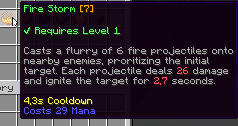

# 🗃️ Configuration

## Class-Specific Skills

Skills are class-specific - a given class can only execute a set of predefined skills.

To define what skills each class can use, open up the class config file inside the `MMOCore/classes` folder, and look for the `skills` config section. Each entry under this section corresponding to a single class skill.

```yaml
skills:

  # First skill
  FIRE_STORM:
    level: 1
    max-level: 30
    unlocked-by-default: true

    # Skill modifeirs
    damage:
      base: 5.0
      per-level: 3.0
    cooldown:
      base: 5.0
      per-level: -0.1
      max: 5.0
      min: 1.0
    #....
  
  # Second skill
  POWER_MARK:
    level: 3
    max-level: 30
    unlocked-by-default: true
    needs-bound: true
    #.....
  
  # Some test passive skill
  A_PASSIVE_SKILL:
    level: 10
    max-level: 30
    trigger: TIMER # Runs on a timer
    timer: 5 # Runs once every 5 seconds
    cooldown:
      base: 5.0
      per-level: -0.1
      max: 5.0
      min: 1.0

  #..........
```

### Skill Level

`level` indicates the level at which the class naturally unlocks this skill. `max-level` is the maximum level for that class skill. Once reached, the player can no longer [upgrade](intro.md#upgrading-a-skill) this skill.

### Unlocked by Default

`unlocked-by-default` indicates if this skill should be unlocked by default. It is set to `true` by default. When toggled off, this skill has to be [unlocked](unlocking.md) through the use of a command, quest trigger, skill book, exp table...

### Needs Binding

Another option is `needs-bound`. This option is only relevant for passive skills, as active skills must all be bound. When set to `false`, the passive skill takes effect even if not bound (and therefore can no longer be bound to any skill slot).

### Skill Parameters

You might also want to change the skill numerical parameters, so that a fireball cast by the _Mage_ class deals more damage than a fireball cast by the _Paladin_ class. Each parameter of each skill can be edited by adding the corresponding entry to the class skill config. For instance (see above), the `damage` parameter for the _Fire Storm_ skill is set to equal 5 Dmg, plus 3 Dmg per skill level. These skill parameters do not scale with the player's level but rather with the skill level. The skill level increases when a skill is [upgraded](intro.md#upgrading-a-skill).



## Skill Folder

You might feel like the configs above might be lacking essential information, like its name, description icon, what it does, etc.

Note that the configs above ("class skill" configs) do not create skills, they simply allow skills to be used by a certain class. Skills are created/defined inside the `MythicLib/skill` folder. Please refer to [this wiki page](../../mythiclib/skills/custom/mythic.html#_2-declare-it-as-a-mythiclib-skill) for more information.

So you define a class skill with ID `FIRE_STORM` like in the example above, that skill has to exist inside the MythicLib skill registry for it to work.

## Passive Skills

To create a passive skill, all you have to do is specify a [trigger](../../mythiclib/skills/triggers.md) for that skill.

The following skill is a passive skill that runs once every 5 seconds. It uses the `TIMER` trigger with the `timer` modifier set to `5`.
```yml
skills:

  # Some test passive skill
  SOME_SKILL_TEST:
    level: 1
    max-level: 30
    trigger: TIMER
    timer: 5
    cooldown:
      base: 5.0
      per-level: -0.1
      max: 5.0
      min: 1.0
```
