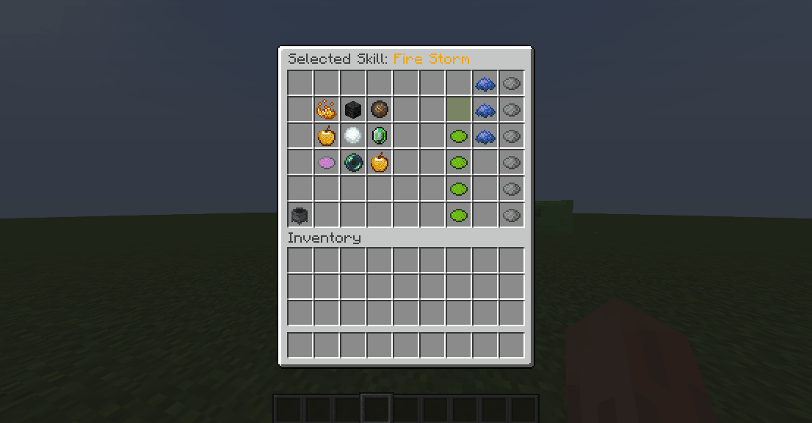

# 🔥 Skills

Skills are amazing and unique abilities that players can use to defeat their enemies or buff their party mates fighting and surviving.

Skills are either **active or passive**. Active skills refer to skills proactively [cast by the player](casting.md). Passive skills cannot be cast - instead, they automatically trigger on specific events (attacks, clicks, movements, other skills...).

Skills are class-specific. When changing class, the player will "lose" the progress they made on their skills and unlock new ones. Previous progress is recovered when switching classes again.

## Custom Skills

While MMOCore comes with more than 90 built-in skills, you can create as many custom skills as you want using the most popular skill/scripting languages available, including MythicMobs, MythicLib or Fabled.

Note that skills are registered in MythicLib. Any skill you register in MythicLib will be usable in both MMOCore and MMOItems. Please read [this wiki page](../../mythiclib/skills/intro.md) to learn how to create and register custom skills.

## Overview

In order to use a skill, players need to:
1) Choose a [class](../features/classes.md) <Badge type="info" text="optional" />
2) [Unlock]() that skill <Badge type="info" text="optional" />
3) [Bind](binding.md) that skill to a compatible skill slot <Badge type="info" text="optional" />
4) [Cast](casting.md) that skill.

Fortunately, the MMOCore skill system is really permissive:
1) The default class can also have skills, so technically players do not need to choose a class to be able to cast skills. If you don't plan on using the class system, you can still use MMOCore skills.
2) Skills can be unlocked when reaching a certain level, finishing a quest, unlocking a node in a skill tree or virtually anything else. Skills can also be made unlocked by default.
3) Skills can be automatically bound to skill slots if you don't like the MMOCore skill binding feature.
4) Obviously skill casting is a mandatory step, this is the step you really can't avoid!

## Skill GUI

Players can open up the skills GUI by using `skills`. This UI allows players to visualize their available skills and their effects, upgrade their available skills, and bind their skills to skill slots.

## Upgrading a skill

Upgrading a skill **increases its power**. Players can choose the skill they would like to upgrade based on their play style and skill path they want to follow. Upgrading a skill takes **one skill point**.

Skill points are a currency which players can use to upgrade their skills. One upgrade costs one skill point. Skill points can be granted using an [admin command](../general/commands.md).



In the GUI, select the skill you'd like to upgrade by clicking it (the UI name should update). You can then upgrade the selected skill by clicking the _Upgrade Skill_ button. Items next to the _Upgrade Skill_ button let the user visualize how strong the skill would be with a higher level.


**Examples slot config for class file.** For more details check [Skill Slots](binding.md#skill-slots)

```
# The valid format for 
formula: "<FIRE_STORM>" #Will only target fire storm
formula: "!<PASSIVE>&&<FIRE>" #Will target active skills with the fire category
#This is the same as <ACTIVE>&&<FIRE> 
```

**Example categories add to the skill file in the skills folder**

```
categories:
- "CATEGORY_1" #Referened with <CATEGORY_1> in a formula
- "CATEGORY_2"
```

## Skill Buffs

A skill buff modifies the value of a certain skill modifier. It can target one or multiple skills using [category formulas]() and can only target 1 modifier. Skill Buffs can only be created through [skill slots](binding.md#skill-slots) and [triggers](../misc/triggers.md).

```
#Example

triggers: 
- 'skill_buff{formula="true";modifier="cooldown";amount=-10;type="RELATIVE"}' #-10% cooldown to all skills.
- 'skill_buff{formula="<FIRE_STORM>";modifier="damage";amount=20;type="FLAT"}'#+20 dmg to fire storm.
- 'skill_buff{formula="<MY_OWN_CATEGORY>";modifier="damage";amount=20;type="FLAT"}'
#Will target all the skills who have MY_OWN_CATEGORY in their categories list.
```


## Editing the skill GUI

The skill GUI can be edited by modifying the `gui/skill-view.yml` config file.

```yml
# GUI display name
name: 'Selected Skill: &6{skill}'

# Number of slots in your inventory. Must be
# between 9 and 54 and must be a multiple of 9.
slots: 54

items:
  skill:
    slots: [ 10,11,12,19,20,21,28,29,30,37,38,39]

    function: skill
    name: '&a{skill} &6[{level}]'
    lore:
      - ''
      - '{unlocked}&a✔ Requires Level {unlock}'
      - '{locked}&c✖ Requires Level {unlock}'
      - '{max_level}&e✔ Maximum Level Hit!'
      - ''
      - '{lore}'
  next:
    slots: [ 47 ]
    function: next
    item: PLAYER_HEAD
    texture: eyJ0ZXh0dXJlcyI6eyJTS0lOIjp7InVybCI6Imh0dHA6Ly90ZXh0dXJlcy5taW5lY3JhZnQubmV0L3RleHR1cmUvMTliZjMyOTJlMTI2YTEwNWI1NGViYTcxM2FhMWIxNTJkNTQxYTFkODkzODgyOWM1NjM2NGQxNzhlZDIyYmYifX19
    name: '&aNext'
    lore: { }
  previous:
    slots: [ 2 ]
    function: previous
    item: PLAYER_HEAD
    texture: eyJ0ZXh0dXJlcyI6eyJTS0lOIjp7InVybCI6Imh0dHA6Ly90ZXh0dXJlcy5taW5lY3JhZnQubmV0L3RleHR1cmUvYmQ2OWUwNmU1ZGFkZmQ4NGU1ZjNkMWMyMTA2M2YyNTUzYjJmYTk0NWVlMWQ0ZDcxNTJmZGM1NDI1YmMxMmE5In19fQ==
    name: '&aPrevious'
    lore: { }

  reallocate:
    slots: [45]
    function: reallocation
    item: CAULDRON
    name: '&aReallocate Skill Points'
    lore:
      - ''
      - 'You have spent a total of &6{total}&7 skill points.'
      - '&7Right click to reallocate them.'
      - ''
      - '&eCosts 1 skill reallocation point.'
      - '&e◆ Skill Reallocation Points: &6{points}'

  slot:
    slots: [ 8,17,26,35,44,53 ]
    function: slot
    item: GRAY_DYE

    name: '&aSkill Slot {slot}'
    no-skill: '&cNone'
    lore:
      - '&7Current Skill: &6{skill}'
      - ''
      - '{slot-lore}'
      - ''
      - '&7&oCast this spell by pressing [F] followed'
      - '&7&oby the keybind displayed on the action bar.'
      - ''
      - '&e► Left click to bind {selected}.'
      - '&e► Right click to unbind.'
      - '&e► Shift left click to select.'
  skill-level:
    slots: [ 6,15,24,33,42,51 ]
    function: level

    # Skill level offset, should be changed
    # according to the amount of inventory
    # slots the skill-level item occupies.
    offset: 2

    # Item displayed if the skill level is
    # too low to display a level item in the GUI
    too-low:
      item: AIR

    item: LIME_DYE
    name: '&a{skill} Level {roman}'
    lore:
      - ''
      - '{lore}'
  upgrade:
    slots: [ 15 ]
    function: upgrade
    item: GREEN_STAINED_GLASS_PANE
    name: '&a&lUPGRADE {skill_caps}'
    lore:
      - '&7Costs 1 skill point.'
      - ''
      - '&eCurrent Skill Points: {skill_points}'
```

First of all you can edit the general GUI settings like its name and slots.

```yml
name: Your Skills
slots: 45
```

Notice how the config sections that fall under the `items` section share very similar properties: `name` (the item display name), `lore` (the item description/lore), `item` (the item material), `slots` (where the item is placed in the inventory, it can be a list) and `function` (what the item does). These can (and should) all be edited to your needs.

### Editing Item Slots

If you want to have your item displayed on multiple slots, use something like

```yml
slots: [1, 2, 3, 4]
```

The following syntaxes do NOT work

```yml
slots: 1
```

```yml
slot: 1
```

### Item Functions

`function` is the most confusing option when editing MMOCore custom GUIs. This option dictates how the item behaves when clicked, and what placeholders to parse in the item lore. Let's go over all the items in the GUI specifically.

`next` and `previous` are the easiest ones, these are the items used for pagination.

`skill` is the item displayed for every skill available to the player. Its lore is a bit complicated

- The line starting with {unlocked} only displays if the player has unlocked the skill
- The line starting with {locked} only displays if the player has NOT unlocked the skill yet
- The line starting with {max_level} displays when the player has reached the max skill level
- `{lore}` pastes the entire skill description


`switch` is the item that you'd click when switching from binding to upgrading mode\


`skill-slot` is the item used in the binding mode\


`skill-level` are the items used to tell the player how the selected skill would behave if it had a higher level\


`upgrade` is the item clicked when you want to upgrade the selected skill\
