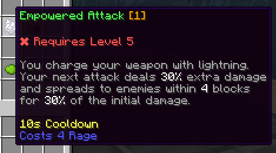
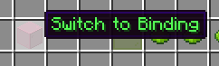
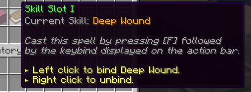
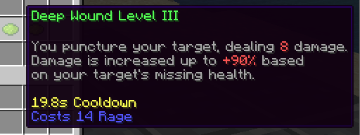
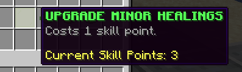

# 🔥 Skills

Skills are amazing and unique abilities that players can use to defeat their enemies or buff their party mates fighting and surviving.

Skills are either **active or passive**. Active skills refer to skills proactively [cast by the player](casting.md). Passive skills cannot be cast - instead, they automatically trigger on specific events (attacks, clicks, movements, other skills...).

Skills are class-specific. When changing class, the player will "lose" the progress they made on their skills and unlock new ones. Previous progress is recovered when switching classes again.

## Custom Skills

While MMOCore comes with more than 90 built-in skills, you can create as many custom skills as you want using the most popular skill/scripting languages available, including MythicMobs, MythicLib or Fabled.

Note that custom skills are registered in MythicLib. Any skill you register in MythicLib will be automatically forwarded to both MMOCore and MMOItems. Please read [this wiki page](../../mythiclib/skills/intro.md) to learn how to create and register custom skills.

## Overview

In order to use a skill, players need to:
1) Choose a [class](../features/classes.md) <Badge type="info" text="optional" />
2) [Unlock]() that skill <Badge type="info" text="optional" />
3) [Bind](binding.md) that skill to a compatible skill slot <Badge type="info" text="optional" />
4) [Cast](casting.md) that skill.

Fortunately, the MMOCore skill system is really permissive:
1) The default class can also have skills, so technically players do not need to choose a class to be able to cast skills. If you don't plan on using the class system, you can still use MMOCore skills.
2) Skills can be unlocked when reaching a certain level, finishing a quest, unlocking a node in a skill tree or virtually anything else. Skills can also be made unlocked by default.
3) Skills can be automatically bound to skill slots if you don't like the MMOCore skill binding feature.
4) Obviously skill casting is a mandatory step, this is the step you really can't avoid!

## Skill GUI

Players can open up the skills GUI by using `/skills`. This UI allows players to visualize their available skills and their effects, upgrade their available skills, and bind their skills to skill slots.

## Upgrading a skill

Upgrading a skill **increases its power**. Players can choose the skill they would like to upgrade based on their play style and skill path they want to follow. Upgrading a skill takes **one skill point**.

Skill points are a currency which players can use to upgrade their skills. One upgrade costs one skill point. Skill points can be granted using an [admin command](../general/commands.md).


In the GUI, select the skill you'd like to upgrade by clicking it (the UI name should update). You can then upgrade the selected skill by clicking the _Upgrade Skill_ button. Items next to the _Upgrade Skill_ button let the user visualize how strong the skill would be with a higher level.


#### Examples slot config for class file

For more details, check out the [Skill Slots](binding.md#skill-slots) wiki page

```yml
# The valid format for 
formula: "<FIRE_STORM>" #Will only target fire storm
formula: "!<PASSIVE>&&<FIRE>" #Will target active skills with the fire category
#This is the same as <ACTIVE>&&<FIRE> 
```

#### Example categories add to the skill file in the skills folder

```yml
categories:
- "CATEGORY_1" #Referened with <CATEGORY_1> in a formula
- "CATEGORY_2"
```

## Skill Buffs

A skill buff modifies the value of a certain skill modifier. It can target one or multiple skills using [category formulas]() and can only target 1 modifier. Skill Buffs can only be created through [skill slots](binding.md#skill-slots) and [triggers](../misc/triggers.md).

```
#Example

triggers: 
- 'skill_buff{formula="true";modifier="cooldown";amount=-10;type="RELATIVE"}' #-10% cooldown to all skills.
- 'skill_buff{formula="<FIRE_STORM>";modifier="damage";amount=20;type="FLAT"}'#+20 dmg to fire storm.
- 'skill_buff{formula="<MY_OWN_CATEGORY>";modifier="damage";amount=20;type="FLAT"}'
#Will target all the skills who have MY_OWN_CATEGORY in their categories list.
```


## Editing the skill GUI

The skill GUI can be edited by modifying the `gui/skill-view.yml` config file.

::: tip
We recommend opening this file with a text editor on the side while reading the rest of this section.
:::

First, please refer to [this wiki page](../../mythiclib/misc/ui-syntax.md) to learn about the general MMOCore UI syntax.

### Item Functions

The `next` and `previous` functions are used for pagination.

`skill` is the item displayed for every skill available to the player. Its lore is a bit complicated:

- The line starting with `{unlocked}` only displays if the player has unlocked the skill
- The line starting with `{locked}` only displays if the player has NOT unlocked the skill yet
- The line starting with `{max_level}` displays when the player has reached the max skill level
- `{lore}` just copies and pastes the entire skill description



`switch` is the item that you'd click when switching from binding to upgrading mode



`skill-slot` is the item used in the binding mode



`skill-level` are the items used to tell the player how the selected skill would behave if it had a higher level



`upgrade` is the item clicked when you want to upgrade the selected skill


