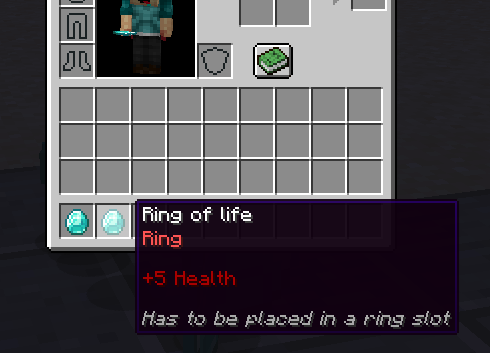
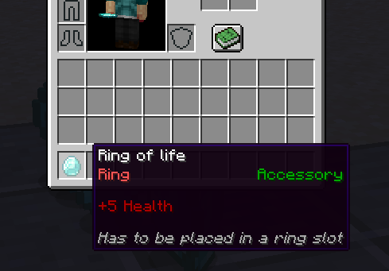

# 🔌 Other Plugins

MMOInventory features native support for other item plugins. It can detect specific item from other plugins like _LoreAttributesRecoded_, _Oraxen_ or _Nexo_, but **only using the item lore** by detecting specific patterns inside of it. For instance, if your Sword items all have `&cSword` in their item lore, MMOInventory is able to detect it and consequently apply slot restrictions to these items.

This has the effect of creating "fictive item types", these are not real item types like with MMOItems but are still categories of items which share one property (that specific lore pattern).

`loretag{tag="&cRing"}` will only accept items which have a lore line that exactly matches `&cRing`. Basic color codes are fully supported by this slot restriction. `loretag{tag="&cSword";check=EQUALS}` will have the very same behaviour. The following item matches the slot restriction, as it has a lore line that exactly matches `&cRing`.

`loretag{tag="&cRing";check=CONTAINS}` will accept items which have a lore line that contains `&cRing`. The following item matches the slot restriction, even if the line where `&cRing` appears also contains other text.

Other possible checks are `STARTS_WITH` and `ENDS_WITH` which checks if any of the item lore lines starts/ends with the given string.