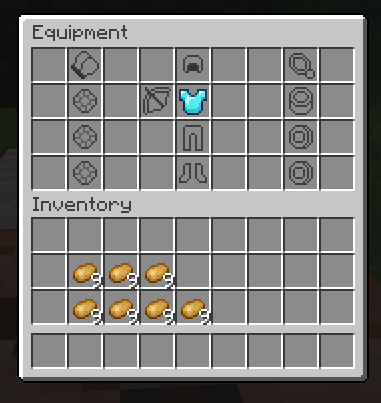
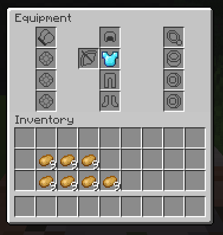
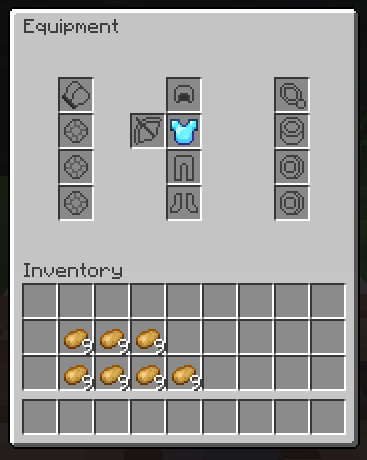
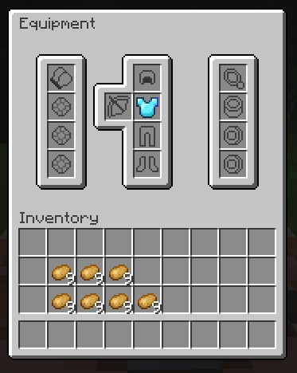
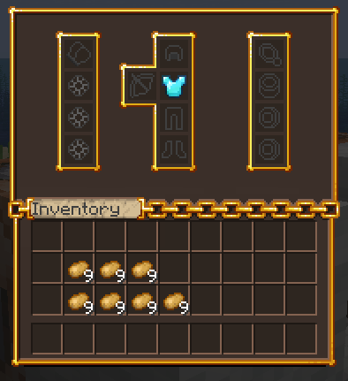

# 🎨 Custom Inventory Textures

This page explains how to apply a custom texture to any player inventory in MMOInventory.

## The Problem

Below is a screenshot that shows a very barebones setup of a custom inventory. As you can see, the vanilla grid pattern is very ugly and we would like to hide it.



### Using a custom font

Custom fonts are now part of the default MMOInventory config files. For this tutorial, we will consider the inventory located at `.\inventory\default_mmoinventory.yml`.

```yml
ui_layout:
  # .....
  name:
    self: "&f%mythiclib_space_-17%\u40E0%mythiclib_space_-169%<#3F3F3F>Equipment"
    other: "&f%mythiclib_space_-17%\u40E0%mythiclib_space_-169%<#3F3F3F>Equipment of {name}"
```

Note that there are two names, one for opening your own inventory, and another one when opening the inventory of another player. Also note that:
- `\u40E0` is a custom font character introduced by the default MMOInventory resource pack.
- `%mythiclib_space_-17%` is a placeholder introduced by MythicLib which inserts 17 negative spaces.
- `<#3F3F3F>` is the default Minecraft font color for inventory names (as of 1.21.8).

MMOInventory comes with **four ready-to-use inventory textures**. Choose the one you prefer the most! You'll find below a table with all built-in inventory textures.

| Texture | Row Count | Code | Screenshot |
|---------|------|------------|---------|
| Classic | 4 | `\u40E0` |  |
| Classic | 6 | `\u40E0` |  |
| Enhanced | 6 | `\u40E0` |  |
| Oraxen-like | 5 | `\u40E3` |  |

## 1.20.x and below

In 1.20.x and below, there used to be a workaround using the _display.gui.scale_ parameter of item models. When using a gray uniform texture as a "filler" texture, you could set the _scale_ parameter to something like 1.1 (110% apparent texture size), which would cause the item texture to overflow and cover up the vanilla inventory grid pattern.

<details>

<summary>
Old model file
</summary>

For reference, this is the model file that was used for the filler texture. Note that the `item/fill` texture is a gray uniform texture with color code `#C6C6C6` (vanilla inventory background color, as of 1.21.8).

```json title="fill.json"
{
  "parent": "item/handheld",
  "textures": {
    "layer0": "mmoinventory:item/fill"
  },
  "display":{
    "gui": {
        "rotation": [ 0, 0, 0 ],
        "translation": [ 0, 0, 0 ],
        "scale": [ 1.1, 1.1, 1.1 ]
    }
  }
}
```
</details>

<br></br>

This no longer works in recent versions (1.21 and above). While the scale parameter still exists, the texture overflow mecanism was patched. In recent versions, we recommend using a custom font to completely override the vanilla inventory texture. Good news, this is super easy to do, and you can also use this to fully 