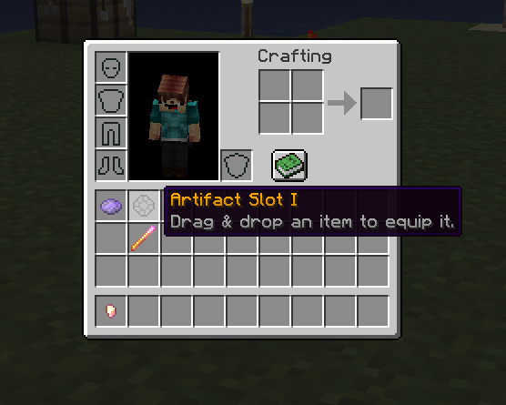

# 🎒 Custom Inventory

::: warning
This page is subject to change in the future as MMOInventory 2 introduced multiple custom inventories (as well as an option to simultaneously use the vanilla player inventory). This page will be updated when MMOInventory 2 is released.
:::

## Using a GUI
Leave the `no-custom-inventory` config option to `false`. When using `/mmoinventory` players can open their custom inventory where they can interact with their armor and custom inventory slots. Shift clicks are 100% supported.


## Slot Restrictions
Slot restrictions are conditions you can add to any custom slot which players must meet in order to use the slot.

| Restriction | Usage |
|-|-|
| `milevel{}` | When used, players can't place an item which they can't use in a custom slot (MMOItems) |
| `mitype{type=RING}` | Restrain a slot to a specific MMOItems item type |
| `unique` | Cannot put twice the same MMOItem in two different slots |
| `class{name="Warrior,Mage,..."}` | Restrain a slot to a certain class |
| `level{min=10}` | Low level players cannot use this slot |
| `perm{perm=some.perm.node}`| Players cannot use this slot unless they have one permission |

A list of all the RPG plugins supported by the class and level slot restrictions above is available on [this wiki page](compatibility/rpg_plugins).

## Using no GUI
Toggle on the `no-custom-inventory` config option (requires a server reload). Also make sure players don't have access to the `/mmoinv` command by taking away the `mmoinventory.open` permission from them.

Using this option, any slot you configure in the `items.yml` config file will appear in the player's inventory instead. It works just like with the inventory GUI: players can drag & drop items onto custom slots to equip items. Slot items (the ones displayed "Bracelet Slot" or "Ring Slot") appear on player login, so **restarting your server after changing this option is highly recommended.**



When using no inventory GUI the `save-on-leave` and `drop-on-death` MMOInventory config options become 100% useless. You also don't need the item slots like `Chestplate Slot`, `Offhand Slot` or `Filler` that are configured by default in `items.yml`. In fact your `items.yml` config should only contain custom slots, here is an example:

```yml
RING:
    type: accessory
    material: DIAMOND_HOE
    durability: 7
    name: '&6Ring Slot'
    slot: 9
    restrictions:
    - 'mmoitemstype{type=RING}'
    lore:
    - Drag & drop an item to equip it.

AMULET:
    type: accessory
    material: DIAMOND_HOE
    durability: 5
    name: '&6Amulet Slot'
    slot: 10
    restrictions:
    - 'mmoitemstype{type=AMULET}'
    lore:
    - Drag & drop an item to equip it.

ARTIFACT:
    type: accessory
    material: DIAMOND_HOE
    durability: 10
    name: '&6Artifact Slot'
    slot: 11
    restrictions:
    - 'mmoitemstype{type=ARTIFACT}'
    - 'unique{enabled=true}'
    lore:
    - Drag & drop an item to equip it.

```

## Extra options for items.yml
Since MMOInventory 1.7.4 development builds, you can add a texture to a player head using the following format:
```
ARTIFACT:
    ...
    material: PLAYER_HEAD
    texture-value:
    ... 
```