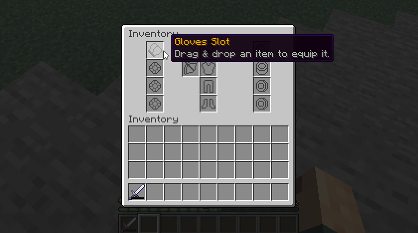

# 🎒 Custom Inventories

MMOInventory allows you to create an unlimited number of custom inventories with specific item slots.



## Introduction

Inside these inventories, players can drag and drop their items inside the corresponding slots. If the item is a ring, it should be placed inside one of the the _Ring_ slots. **Any item from MMOItems placed in a custom inventory will provide its stats to the player.**

Notice how these custom inventories also have armor slots. These slots are directly connected to the player armor slots, so placing a new chestplate there for instance will instantly have the player equip that chestplate.

## Basic Configuration

Every inventory has its own config file inside the `MMOInventory/inventory` folder. Below you will find the beginning of the config file of the default MMOInventory inventory.
```yml
# Do NOT change this! Choose one and stick to it.
#.........
id: mmoinventory1_legacy

# Toggle on/off for temporary disabling this inventory.
enabled: true

# Either 'custom' for custom inventories or 'vanilla' for the vanilla inventory.
# There can be only one vanilla inventory at a time!
type: custom

# Should items from this custom inventory be dropped on death.
# This option is only for custom inventories, as vanilla inventory
# is already supported by the keepInventory world flag.
drop_on_death: false

#........
```

You can easily enable/disable custom inventories by toggling on or off the `enabled` parameter in this config file. The `id` is a small piece of text used by MMOInventory to save player data, so you need to choose one and never change it again.

`drop_on_death` defines if items from inside this custom inventory should drop when the player dies.

`type` must be set to either `vanilla` or `custom`. Leave it to `custom` for now. If you'd like to learn how to use the vanilla player's inventory as a MMOInventory inventory, please refer to [this wiki page](vanilla-inventory.md).

## Open Command

For every custom inventory, you can define a command that players can use to open this inventory. You can edit the command name, permission and aliases. You can also translate the messages sent to the player in case of any error when performing the command.

Set `enabled` to `false` to disable this feature.

```yml
# Command to be used in order to open the custom inventory.
# This option is only for custom inventories.
open_command:
  enabled: true
  name: 'custominv'
  permission: 'custom_inv.open.mmoinventory_default'
  aliases: [ mmoinv, rpginv, rpginventory ]

  output:
    player-command: '&cThis command is only for players.'
    specify-player: '&cPlease specify a player.'
    wrong-player: '&cCould not find the player called {arg}.'
    not-enough-perms: '&cYou don''t have enough permissions.'
```

Make sure you **restart** (or reload) your server when editing these, as a plugin reload using `/mmoprofiles reload` is usually not sufficient and you might experience ghost commands (once registered, it is very hard to unregister commands from the Bukkit command registry).

## Inventory Button

You may also place a permanent button/icon in your players' inventories which can be clicked to open the inventory. You may edit the slot of this button, its material, etc.

Set `enabled` to `false` to disable this feature.

```yml
# Adds a static item to players' inventories to open this custom inventory.
# Requires a server reload when changed.
inventory_button:
  enabled: false
  slot: 9
  item:
    material: CHEST
    name: '&6Custom Inventory'
    lore:
      - ''
      - '&eClick to open.'
    # custom-model-data: 1
    # skull-texture: eyJ0ZXh0dXJlcyI6eyJTS0lOIjp7InVybCI6Imh0dHA6Ly90ZXh0dXJlcy5taW5lY3JhZnQubmV0L3RleHR1cmUvYjg5Yjk4ZjA0YzMyMjdkMzdkMzE5YmJjZmZjNTFmNTJlNzhkOTZhMDViMTI4NTJkMWI0NjRiYjc0MDhhNzgxMCJ9fX0=
```

## Inventory Slots

This is where you get to define what slots the players will interact with: ring slots, amulet slots, armor slots, etc.... Note that there are no limitations for slot types, as you can always create one specific slot for a MMOItems item type, and you can create as many custom MMOItems item types as you like.

::: details Some examples
```yml
slots:

  # Vanilla slot type
  OFF_HAND:
    type: off_hand
    material: GOLD_NUGGET
    custom_model_data_string: 'off_hand'
    name: "&6Off Hand Slot"
    slot: 12
    lore:
      - Drag & drop an item to equip it.

  # Ring slot (custom slot)
  LEFT_RING:
    type: accessory
    material: GOLD_NUGGET
    custom_model_data_string: "ring1"
    name: "&6Left Ring Slot"
    slot: 34
    restrictions:
      - "mmoitemstype{type=RING}"
    lore:
      - Drag & drop an item to equip it.

  # Amulet slot (custom slot)
  AMULET:
    type: accessory
    material: DIAMOND_HOE
    durability: 5
    name: '&6Amulet Slot'
    slot: 10
    restrictions:
    - 'mmoitemstype{type=AMULET}'
    lore:
    - Drag & drop an item to equip it.

  # Artifact slot (custom slot)
  ARTIFACT:
    type: accessory
    material: DIAMOND_HOE
    durability: 10
    name: '&6Artifact Slot'
    slot: 11
    restrictions:
    - 'mmoitemstype{type=ARTIFACT}'
    - 'unique{enabled=true}'
    lore:
    - Drag & drop an item to equip it.
```
:::

There are various types of slots available for use.

| Slot Type | Description |
|-----------|-------------|
| `helmet`  | Vanilla helmet armor slot |
| `chestplate`  | Vanilla chestplate armor slot |
| `leggings`  | Vanilla leggings armor slot |
| `boots`  | Vanilla boots armor slot |
| `off_hand`  | Vanilla off/left hand slot |
| `accessory`  | **Any custom slot uses this** |
| `elytra`  | Elytra slot. Learn more on [this wiki page](elytra-slot.md) |
| `fill`  | Filler items |

By "custom" slots we mean slots introduced by MMOInventory that have no correspondence with any vanilla player inventory slot. Rings, amulets, artifacts.... are all custom slots and therefore should use the `accessory` slot type.

## Slot Restrictions

Slot restrictions are conditions you can add to any custom slot, which players must meet in order to place an item on a specific slot.

| Restriction | Usage |
|-|-|
| `milevel{}` | When used, players can't place an item which they can't use in a custom slot (MMOItems) |
| `mitype{type=RING}` | Restrain a slot to a specific MMOItems item type |
| `unique` | Cannot put twice the same MMOItem in two different slots |
| `class{name="Warrior,Mage,..."}` | Restrain a slot to a certain class |
| `level{min=10}` | Low level players cannot use this slot |
| `perm{perm=some.perm.node}`| Players cannot use this slot unless they have one permission |

A list of all the RPG plugins supported by the class and level slot restrictions above is available on [this wiki page](compatibility/rpg_plugins).

The most important slot restriction is `mitype`, as it is the one you should use to restrict a slot to a certain MMOItems item type. In order to create a _Ring_ slot, you can simply use the `mitype` slot restriction with `type` parameter set to `RING` (`RING` is the ID of the default Ring MMOItems item type).

## Inventory Items

This new features allows to add items which call [MythicLib scripts](../../mythiclib/scripts/intro.md) when clicked. These items do not correspond to any slot, players can't drag and drop any item onto them.

### Player Info Item

The following syntax snippet can be used to create an item which displays basic player information. When clicked, it opens up the MMOCore player information page through `/p`.

```yml
# Static items, not slots. Players can click
# on them but not move them around.
items:
  INFO:
    #item: GOLD_NUGGET
    #custom_model_data_string: "info"
    material: SPRUCE_HANGING_SIGN
    name: "&6Information"
    slot: 5
    lore:
      - ''
      - '&f ⌛ &7Level &f%mmocore_level%'
      - '&f %mythiclib_space_1%❣%mythiclib_space_1% &7Class: &f%mmocore_class%'
      - '&f ☄ &7Coins: &f%vault_eco_balance%'
      - ''
      - '&7Health: &f%mythiclib_stat_max_health%'
      - '&7Defense: &f%mythiclib_stat_defense%'
      - '&7Attack: &f%mythiclib_stat_attack_damage%'
    on_click:
      - 'sudo{format="p"}'
```

### Close Inventory

The following config snippet can be used to create an item which closes the inventory when clicked.
```yml
items:
  CLOSE:
    item: BARRIER
    name: "&cClose"
    slot: 35
    lore:
      - "&7Click to close this inventory."
    on_click:
      - 'close_inventory{}'
```