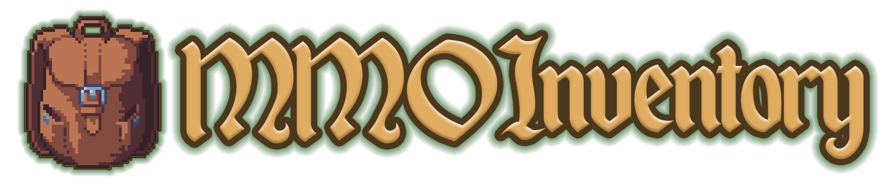

# 🏠 Home

MMOInventory is a powerful plugin that allows server administrators to create and manage custom inventories for players, while being 100% compatible with the rest of the MMO suite.

::: tip
Get MMOInventory on [Polymart](https://polymart.org/resource/mmoinventory.3414) or [SpigotMC](https://www.spigotmc.org/resources/mmoinventory.99445/)

:::

If something is not quite clear, please join our [Discord](https://phoenixdevt.fr/discord) server to get help from staff or community! We do our best to keep this wiki up to date. Let us know if you see a typo or anything outdated!

Navigate to the next page when you are ready to install MMOInventory!
