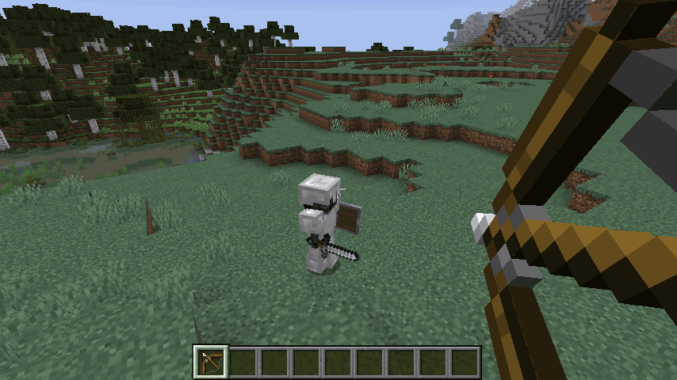
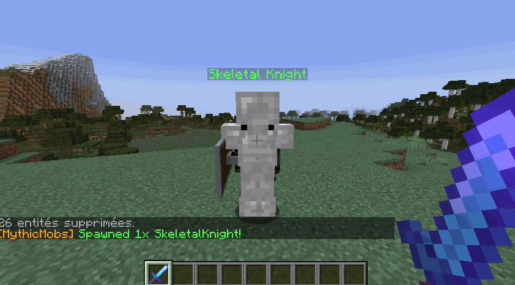

# 💥 Lootsplosion

_Lootsplosion_ is a nickname for an effect we mimicked from other games such as the Borderlands series. Instead of killing mobs, and getting very boring drops that go on the ground, now your drops can LOOTSPLODE!

```yml
# Offset is the distance traveled on X and Y coordinates
# Height is the Y velocity coordinate. Lootsplosions
# only trigger with MythicMobs monsters.
lootsplosion:
    enabled: true
    color: true
    offset: .4
    height: .5
```

Configurable in your ``config.yml``, you can change the X and Y variance at which items will fly out of mobs. Now you can kill bosses and have tons of glowing items go flying for your players to loot!

In order to enable lootsplosion for a certain MythicMob, you need to give him a `Lootsplosion` variable. The value can be anything, for example 1. This skill applies the variable to the mob as soon as it spawns:
`setvariable{var=Lootsplosion;scope=target;value=1} @self ~onSpawn`




Lootsplosion is fully compatible with MMOItems tiers. When **tiered** items are dropped using MythicMobs drop tables, the dropped items will leave behind them a trail of particles which color depend on their tier! Add to that MMOItems' hint and glowing system and you will have beautiful drops!



All you need to do in order to make an item have a lootsplosion particle is to setup the item tier color in the item tier MMOItems config file like so:
```yml
RARE:
    name: '&6&lRARE'
    unidentification:
        ...
    item-glow:
        color: 'ORANGE'
```
In this example, rare items will display an orange particle effect when looted on MythicMobs.