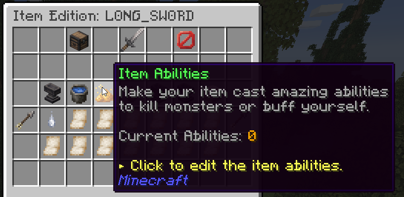

# 💫 Skills & Abilities

Abilities are unique skills which can be bound onto items to make them feel more unique. An important feature for configurability is the ability triggers/casting modes i.e the action you need to perform in order to cast the ability. Since MMOItems 6.6.2 these ability triggers are shared with MMOCore; the full list can be found [here](../../mythiclib/skills/triggers.md).



Using the right skill trigger, you can have an ability cast when the player kills an entity or when an arrow that you fired lands on the ground.

**Damaging** abilities can either deal **physical** or **magical** damage. Depending on their type, the ability damage can be increased by a specific item stat, either `Physical Damage` or `Magical Damage`. Physical abilities correspond to abilities which utilize items or weapons, like _Circular Slash_ or _Item Throw_. Magical abilities correspond to elemental/magical abilities like _Firebolt_, _Fire Comet_...

## Adding abilities to MMOItems using MythicMobs

Since MMOItems 6.7, custom skills are handled within MythicLib. Please refer to the [MythicLib wiki](../../mythiclib/skills/custom/mythic.md).

## Ability Triggers

Ability triggers define how an ability is cast. You will find them in the [MythicLib wiki](../../mythiclib/skills/triggers.md).

## Editing an ability

Go into the `MMOItems/skills` folder and locate the YML file corresponding to the ability you'd like to edit. For example, let's consider `arcane-rift.yml`

```yml
name: Arcane Rift
modifier:
  duration:
    name: Duration
    default-value: 1.5
  damage:
    name: Damage
    default-value: 5.0
  mana:
    name: Mana
    default-value: 0.0
  stamina:
    name: Stamina
    default-value: 0.0
  cooldown:
    name: Cooldown
    default-value: 10.0
  timer:
    name: Timer
    default-value: 0.0
  amplifier:
    name: Amplifier
    default-value: 2.0
  speed:
    name: Speed
    default-value: 1.0
```

You can edit the ability name, which is the name displayed in the item lore when binding an ability to an item. You can also modify the name and default value for every ability modifier. It is the numeric value that MMOItems will consider if none is specified in the item editor GUI when adding an ability to an item.
