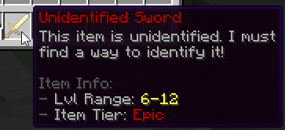
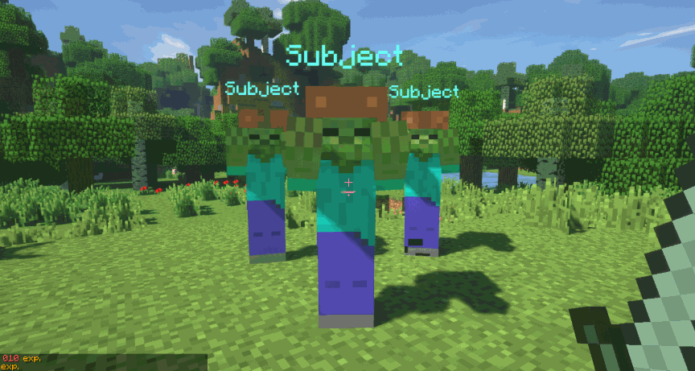
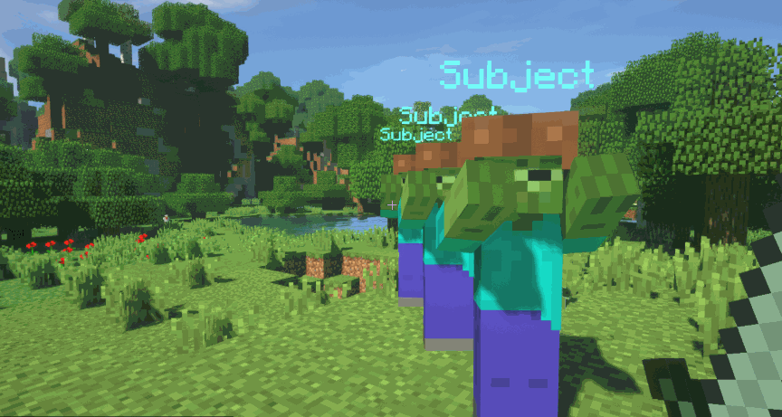
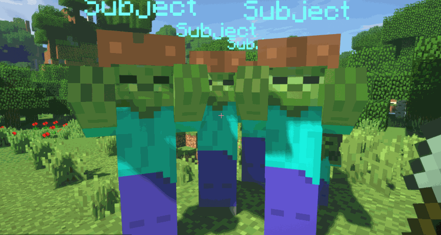

# 🛠️ Item Types

In MMOItems, all items are split up into categories which are called _item types_. Items may have different behaviours according to their types. They are broad categories indicating if your item is meant to be used as a weapon, as an item that the player can consume, as an item that can be applied onto another item, an accessory...

By default, the type of an item is indicated at the very top of the item tooltip.

## Hard-Coded Item Types

Most of MMOItems functionalities like gem stones, item identification, consumables... rely on hard-coded item types. While MMOItems does include hard-coded stuff, you can register brand new item types to MMOItems and modify their properties.

| Item Types | Description |
|------------|-------------|
| Swords, Daggers, Hammers | Hardcoded item types used for weapons. Items |
| Bows | The `BOW` item type should be used for any item that has its material set to `BOW` or `CROSSBOW`. Melee attacks are disabled, and the item attack damage applies to arrows fired by the item. Stats apply just like staffs (see below). |
| Staffs | Staffs should be used for **custom ranged weapon types**. Stats only apply in mainhand, unless they have a right-click effect, in which case weapon-specific stats - attack damage, on-hit effects - also apply during weapon attacks when held in offhand. |
| Catalysts | Items with the `CATALYST` item type are accessories which give their stats to the player when held in the main or off hand. Items with the `MAIN_CATALYST` type only apply their stats when held in the main hand. Items with the `OFF_CATALYST` type only apply their stats when held in the off hand. |
| Accessories | Accessories are item types which apply their stats when placed in accessory slots, when using MMOInventory. |
| Tools | Tools have extra hardcoded options for mining and breaking blocks, like _Autosmelt_ (automatically smelts ores) and _Bouncing Crack_ (breaks multiple blocks at once). Since tools are considered melee weapons, stats apply in mainhand only. |
| Item Skins | Item skins can be applied onto items to change their material, custom model data, skull texture, leather armor color... |
| Armor | `ARMOR` is the hardcoded item type for any piece of armor. Stats apply when worn in armor slots only. |
| Gem Stones | [Gem stones](gem-stones.md) can be applied onto items to grant them extra stats. |
| Consumables | Consumables can be consumed (eaten) by players to restore health, mana... get temporary buffs, run commands... Stats apply in mainhand only. |
| Miscellaneous | Anything else. Stats apply in mainhand only. |

Any hard-coded item type can be disabled hidden from the item browser by toggling on the following option in the `item-types` config file:

```yaml
SOME_ITEM_TYPE:
  hide-in-game: true
```

## Custom Item Types

Existing item types can be modified in the `item-types` config file. Every section in this config file corresponds to one item type ; you may write as many new config sections as you like, in order to register new item types. There's no limit on the number of item types. Do not forget to reload MMOItems using `/mi reload` after adding or modifying any item type. New item types should immediately appear inside the item browser (`/mi browse`).

Here is the general syntax:

```yaml
LONG_SWORD:
  display: 'IRON_SWORD:0'
  name: 'Long Sword'
  parent: 'SWORD'
  unident-item:
    model: 0 # (Optional) 1.14 Custom Model Data
    material: WOODEN_SWORD # (Optional) Change the item material
    item-model: # (Optional) 1.20.2+ Item Model name-spaced key

    name: '&f#prefix#Unidentified Long Sword'
    lore:
    - '&7This item is unidentified. I must'
    - '&7find a way to identify it!'
    - '{tier}'
    - '{tier}&8Item Info:'
    - '{range}&8- &7Lvl Range: &e#range#'
    - '{tier}&8- &7Item Tier: #prefix##tier#'
  
  disable-melee-attacks: false # Are melee attacks allowed with your type // is it ranged or melee?
  attack-cooldown-key: "staff"
  on-left-click: slashing_weapon_attack_effect               
  on-right-click: slashing_weapon_attack_effect_right_click  
  on-attack: slashing_weapon_on_hit_effect                   # Called when damaging entities
  on-entity-interact: slashing_weapon_special_attack         # Called when right-clicking entities
```

### ID/Name/Display

The `display` section corresponds to the icon used in the item browser for your item type. The `name` corresponds to the string tag players will see on the item tooltip. Finally, `LONG_SWORD` is the type ID, which you will use as a reference to your item type, when running commands.

### Parent Type

Every custom item type has a **parent type**. The parent type defines what stats the item can has. If the parent type is set to `CONSUMABLE`, your item type will inherit from all the item options and stats from the Consumable item type. Similarily, your item type inherit from the stat application rules given by the parent type. If the parent type is `SWORD`, the stats of any item will only apply in mainhand.

Types with multiple parents can also be used to display different item types in the item tooltips. It is completely fine to have types only differ by their names/tooltips: players will see something different in the item tooltips, and you can use those to organize your items inside your config files and in the item browser.

### Unidentified Item Template

The `unident-item` config section determines how an unidentified item from that item type looks like. You can edit its display material, name and lore (both name and lore supports provided placeholders). `#prefix#` returns the color prefix of the unidentified item tier. `#tier#` returns the display name of the unidentified item tier. `#range#` is the unidentified item's level range, which also depends on its item tier.

Lines starting with `{tier}` only display if the unidentified item has a tier. Similarly, lines starting with `{range}` only display if the item has some data associated to the _Required Level_ stat.



### Actions

These options are for custom weapons. They define what your weapon does, for both melee and ranged weapons.

| header | Description |
|--------|-------------|
| `on-left-click` | Skill cast when left clicking an item. Subject to weapon constraints like mana cost, attack speed... |
| `on-right-click` | Skill cast when left clicking an item. Subject to weapon constraints like mana cost, attack speed... |
| `on-attack` | Skill cast when attacking an entity (melee and range attacks are both supported). |
| `on-entity-interact` | Skill cast when right clicking an entity. |

The following will cast the builtin MythicLib ability `FIREBOLT` on right clicks:

```yaml
on-right-click: FIREBOLT
```

The following will cast a MythicMobs script called `FireBolt` when attacking an entity:

```yaml
on-attack:
  mythicmobs-skill-id: FireBolt

  extra-skills:
    FireBolt:
      Skills:
      - 'projectile{onTick=FireBolt-Tick;onHit=FireBolt-Hit;v=8;i=1;hR=1;vR=1;hnp=true} @targetLocation'
    FireBolt-Tick:
      Skills:
      - 'effect:particles{p=flame;amount=20;speed=0;hS=0.2;vS=0.2} @origin'
    FireBolt-Hit:
      Skills:
      - 'damage{a=10}'
```

You can cast any skill registered in MythicLib using this option, including builtin skills, skills created using MythicLibs, MythicMobs... You can find information on how to create/register a custom skill [over the MythicLib wiki](../../mythiclib/skills/intro.md).

`on-attack` and `on-entity-interact` are not subject to weapon constraints, these skills/scripts will trigger everytime you damage an entity, or every time you interact with one.

However, `on-left-click` and `on-right-click` are subject to weapon constraints. These scripts will only cast after checking the following weapon usage constraints:

- the player has enough resource (mana/stamina/...)
- the item has enough durability
- the item is actually usable (player has the right class, level, permission...)

### Attack Cooldown Key

Most ranged weapons like staffs, wands, whips have a cooldown associated to using the item (performing an attack), and this cooldown is usually just the invert of the attack speed. An attack speed of 2.5 means you can attack every 1/2.5 second.

Two items with the same type have the same item cooldown. If you cast a ranged attack with a wand and quickly switch to another wand, the second wand will be on cooldown, and this cooldown will be shared accross the two items.

Two types with the same attack cooldown key share item cooldowns. If types `WAND` and `STAFF` both have `MAGIC` as attack cooldown key, items will have shared cooldowns. This might be an important tool for balancing the gameplay of your items.

## Built-in Item Types

The following wiki section shows the default item types that come bundled with MMOItems. You are not required to use these item types; in fact you can even delete them if you don't want them to show in the item browser.

Blunt, Pierce and Slash weapons are built-in melee weapon types. Such items have an on-hit effect which typically propagates a fraction of the damage dealt to nearby enemies. These behaviours are **NOT** hardcoded into MMOItems, they are implemented using MythicLibs/MythicMobs skills/scripts. This means that you can fully finetune them to your liking by editing the scripts located in the `MythicLib/script/mmoitems_types.yml` config file. This config file contains all built-in softcoded on-hit attack effects that correspond to item types.

Staffs, muskets, wands... are built-in ranged weapon types. Their right/left click attack effects are also implemented using MythicLibs/MythicMobs scripts, which you can edit in the same config file.

<details>
<summary>Slashing Weapons</summary>
Slashing weapons perform AoE damage, in a cone behind the initial target. Slashing weapons include swords, greatswords, katanas, axes, greataxes, halberds.



</details>

<details>
<summary>Piercing Weapons</summary>
Similarily to slashing weapons, piercing weapons perform AoE damage on melee attacks in a cone behind the initial target. The angle of the cone is sharper, but the damage propagation ratio higher. Piercing weapons include thrusting swords, daggers, spears, lances.



</details>

<details>
<summary>Blunt Weapons</summary>
Similarily to Sweeping Edge, blunt weapons deal AoE damage and knockback on melee attacks. Blunt weapons include hammers, greathammers, gauntlets, lutes, staves, greatstaffes.Gauntlets also come with a default right-click ability which applies a knockback onto the target entity.



</details>

<details>
<summary>Whips & Muskets</summary>
Whips are ranged weapons with a special attack effect. They deal damage to the first enemy hit in the direction of the player's camera direction.Muskets are guns with extra item options. You can configure their recoil (how much they move around the player's camera direction when firing), knockback, reload time through attack speed...
</details>

<details>
<summary>Crossbows</summary>

The `CROSSBOW` item type is an item type that was added before Crossbows were implemented into vanilla Minecraft. Right click a crossbow to fire one arrow. The item attack speed dictates the frequency at which you may fire arrows.

</details>

<details>
<summary>Wands & Staffs</summary>
Wands and staffs are weapons for mages/wizards. They are usually ranged weapons with a special "smoky" attack effect. There are a few builtin attacks effects for wands and staffs, here is the exhaustive list:

</details>
