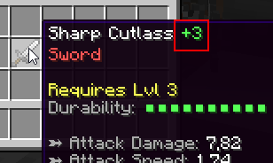

# 🔨 Item Upgrades

Item upgrades are a way of adding some progression to your items. When successfully upgrading an item, its item statistics are increased which essentially makes the item better. Players can upgrade their items either using the right consumable, or by using a station **upgrading recipe**.

When upgraded, items gain one level. The level is displayed next to the item display name. The display name suffix can be changed in the main plugin config file (_item-upgrading.name-suffix_). Make sure your item has a custom display name, otherwise the suffix with not show up.



There are 3 things to setup in order to have a working item upgrading system: first of all, you need to setup the upgrading template, which dictates what stats are increased (by how much) when successfully upgrading an item. Then you need to setup some extra upgrading options for the item you want to upgrade. The last step is to setup either an upgrading consumable or an [upgrading recipe](Upgrading-Recipes).

## Setting up the upgrading template

The upgrade templates can be setup in the **upgrade-templates.yml** config file. This step is pretty straight forward but might require a bit of time to spend in the configs balancing your upgrading setup. Open your templates config file:

```yml
# Template ID, only used as reference. This is the
# text you need to enter in the edition GUI in order
# to setup item upgrading for a specific item.
weapon-default:

  # Every time the item is upgraded, its attack damage
  # is increased by 3% (relative to the current value)
  attack-damage: 3%
  
  # Every time it is upgraded, it gets +2% aboslute 
  # critical strike chance (independent of current val.)
  critical-strike-chance: 2
  
  pve-damage: 1%

armor-template-example:
  armor: 3%
  armor-toughness: 2%
  block-rating: 5%
  dodge-rating: 5%
  parry-rating: 5%

another-example:
  attack-damage: 0.5%    
  critical-strike-chance: 0.1%
  critical-strike-power: 0.2%
```

Every configuration section in that config file corresponds to one **upgrading template**. You can add as many templates as you like, you may even add one per item (although multiple items may have the same upgrading template). Once setup, you will be able to bind these templates to specific items to determine how they behave when they are upgraded. Let's try to read what the config says step by step.

**weapon-template-example:** This is an upgrading template example for weapons. Every item upgrade, the weapon will 3% of its current attack damage _(meaning his current attack damage will be multiplied by 1.03)_, because the input ends with `%`. Every item upgrade, the weapon also gains 2% critical strike chance (not relative to its current critical strike chance, but since crit strike chance is in %, the item still gains 2% crit chance), as well as 1% PvE damage, relative to its current attack speed.

**armor-default:** When upgraded, an item with this upgrade template will gain 3% armor, 2% toughness, 5% block, dodge and parry rating, relative to its current stats since there is a `%`.

---

The `%` specified in the upgrade template does not have anything to do with the stat itself. It only means that the stat value gained by the item when upgrading is relative to the stat value that the previously item had. For instance, for a 8 Atk. Damage sword, gaining 3% attack damage (relative) isn't the same as gaining 3 attack damage (absolute).

Let's have a look at another example. Let's say we have a **sword with 10 Attack Damage** being upgraded, bound to the **weapon-default** upgrade template. This sword will thus gain 3% of its current damage, so at the end it will have `10 + (3% * 10) = 10 + 10 * 0.03 = 10.3 Atk. Damage`, as well as 2% Crit Chance since it didn't have any before, and since the crit chance earned per upgrade is independent of the current stat value. The sword does not have any PvE damage, so gaining 1% PvE damage relative to its current value doesn't increase the PvE damage, since 1% of 0 is still 0.

::: info
Currently, item upgrading only applies to numeric stats like Crit Chance, Attack Damage, Armor, PvE damage, etc.
:::

## Setting up the upgrading options for the consumable

Players may use a consumable in order to upgrade an item. If so, you need to specify two options: the **upgrading reference**, which we will get back to later, and the **upgrade chance**. You can configure both of these options in the edition menu.

## Setting up the upgrading options for the weapon/armor/...

Any item, including armors, weapons, etc. can be upgraded, however you need a few options set up in order to upgrade an item. Just like consumables, weapons/armors also have an upgrading chance. The upgrading chances of the weapon and the consumable stack, i.e `total-upgrade-chance = <item-upgrade-chance> * <consumable-upgrade-chance>`. If both items have a 40% upgrade chance, the total upgrade chance is `40% * 40% = 16%`. When the item does not have 100% chance to be upgraded, you can enable an extra option which makes the **item break when failing to upgrade it.**

Here is an example of an item that utilizes the `another-example` upgrade template.

```yml
EXAMPLE_ITEM:
  base:

    # Base item options
    material: IRON_SWORD
    name: §eDefault Sword

    # Definition of item upgrading
    upgrade:
      workbench: true # True means you can't upgrade it unless you are using a crafting station
      template: another-example # Upgrade template ID
      max: 100 # Max amount of upgrades
      success: 70.0 # Chance of upgrade success
      destroy: false # Destroys when failing to upgrade

    # Some other item options
    attack-damage: 20.0
    critical-strike-chance: 2.0
    critical-strike-power: 5.0
    unbreakable: true
```

An item may also have a **maximum amount of upgrades**, meaning that once the item reaches a specific level, it cannot be upgraded anymore. This is an important option if you don't want specific items to get too OP with upgrades. An item can also be upgradable only via crafting stations and upgrading recipes.

Don't forget to bind an upgrading template to your item using the corresponding option in the edition GUI! Options described previously can also be setup using the item edition GUI.

## Upgrade reference

This option can be used for both upgrading consumables and upgradable items. This option can be used to restrict specific upgrade consumables to specific items. The upgrade reference is a piece of text, not displayed in the lore but used by MI to check if a consumable is compatible with a given item for upgrading.

A consumable can be used to upgrade an item if the two references match. If the first item has a non-null reference and if the other one has no reference, they are incompatible. Any item with the universal upgrade reference `all` is compatible with any other item.

## Config File

You can modify the main MI config file (`MMOItems/config.yml`) to adjust how stat changes should appear in the item lore of any upgraded item. Below is the section you will want to look at and possibly modify:

```yml
item-upgrading:

  # Display name suffix for upgraded items.
  name-suffix: '&f &e(+#lvl#)'

  # Whether to display in Item Name or Lore
  # Disable if item renaming is available to players.
  # If set to 'false', remember to include
  # %upgrade_level% in your item lore.
  display-in-name: true

  # How stat changes are formatted
  # in the stat suffix.
  stat-change-suffix: ' &8(<p>#stat#&8)'
  stat-change-positive: '&a'
  stat-change-negative: '&c'

  # Whether or not to display which
  # stats are changed in the lore.
  # EXPERIMENTAL FEATURE
  display-stat-changes: false
```

The `<p>` represents both `stat-change-negative` and `stat-change-positive`. You can completely remove this, or if you want to change the position where it is, you can too!

## Upgrading recipes

Using crafting stations you can create crafting recipes, which require the player to have specific ingredients and meet certain conditions. When using such a recipe players can upgrade their gear. Please check out this [wiki page](../stations/upgrading-recipes.md) for more information.

Here is an example of a crafting station that implements one of these upgrading recipes

```yml
name: 'UPGRADE (#page#/#max#)'
max-queue-size: 10
#.............

# Recipes
recipes:
  dnck1: # Some upgrading recipe
    item:
      type: SWORD
      id: EXAMPLE
    crafting-time: 0
    ingredients:      
    - mmoitem{type=MATERIAL,id=UPGRADESTONE,amount=1}
```

There is the consumable used in the ingredient list above (has to be put in the `material.yml` config file). This is basically an item that only serves as an ingredient for crafting station upgrading recipes.

```yml
UPGRADESTONE:
  base:
    material: HEART_OF_THE_SEA
    name: '&eUpgrade Stone'
    lore:
    - '&7&oUse it to upgrade your gear'
    disable-crafting: true
    disable-smelting: true
    disable-smithing: true
    disable-enchanting: true
    disable-repairing: true
```