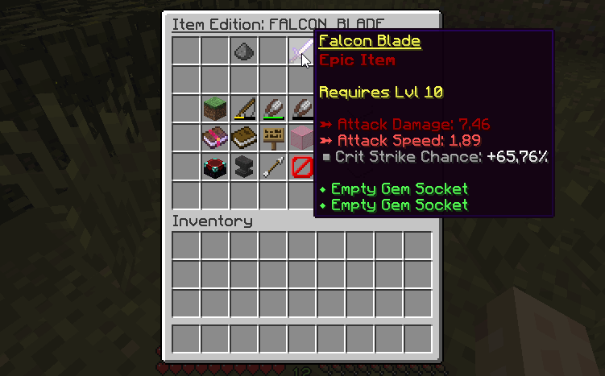

# 🖌️ Create An Item

This wiki page explains the two methods you can use to create items in MMOItems.

## Item Edition GUI

The item editor lets you create and edit items directly in-game without having to tamper with config files. This is a powerful and easy-to-understand method although we recommend advanced users to directly go for manual config file edits which is much faster if you know how all the stats are formatted.



1. Open the game and create an item using via this command: `/mi create <ITEM_TYPE> <YOUR_ITEM_ID>`
    1. You may use /mi list type to check all the available item types (Sword, Axe, Tool...).
    2. The item ID will be used in every command/config file to identify the item. It should be something like STEEL_DAGGER to make config setup cleaner.
2. The edition menu should open up after performing the create command. If you close it, you can still access it using this command: `/mi edit <ITEM_TYPE> <YOUR_ITEM_ID>`
    1. On the 5th slot of the inventory, you can see your item and its current stats. You can click the chest item to add it to your inventory.
    2. Every other item corresponds to an item stat that you can edit. Instructions on how to edit them are displayed directly in-game.
    3. Once you added all the stats you wanted, get your item and have fun!

## Manual Config Editing

Advanced users should consider using this method as it is way faster if you already know the item options you'd like to use and how to format them.

1. Open up the ``/MMOItems/item`` folder.
2. Select your item type and open the corresponding YML file using your favourite text editor.
3. Here is a config snippet that you can start with:

```yaml
YOUR_ITEM_ID:
  base:
    material: YOUR_ITEM_MATERIAL
```

4. The list of available materials can be found in the [Spigot javadocs](https://hub.spigotmc.org/javadocs/spigot/org/bukkit/Material.html). The item material is the first thing to add since it is the only real option an item needs to be able to be generated.
5. Add as much item options (Abilities, Attack Damage....) as you want. You can see 'all' of the available item options (and how to configure them) on [this wiki page](Item-Stats-and-Options).
6. Save the file and get back on Minecraft. Use /mi reload to let MMOItems load the item you just added to your config file, and use `/mi give <ITEM_TYPE> <YOUR_ITEM_ID>` to get your item!
