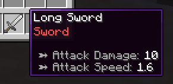
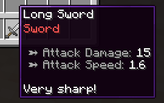

# 🏷️ Item Modifiers

::: tip
Make sure you read [this page](templates.md) first. The MMOItems item generation system is pretty complex and needs some time to be fully understood.
:::

## Example

Item modifiers are the **MVP's of the MMOItems random loot generation system**. Conceptually, an item always comes with its standard set of item stats. Take the following item for example - a Long Sword - it has 10 Atk damage and 1.6 Atk speed. These are its default stats, meaning if the item has no modifier, tier or anything attached to it, it will only have these stats.

```yaml
LONG_SWORD:
    base:
        material: IRON_SWORD
        name: '&fLong Sword'
        attack-damage: 10
        attack-speed: 1.6
```



Now imagine that 20% of the time, the following `Sharp` modifier now applies when generating this item. The stats provided by this modifier will stack up with the base item stats. The Atk damage is now `10 + 5 = 15` and the item now has extra lore.

```yaml
sharp_modifier:
    chance: 0.2 # 20% chance to be selected
    stats: # additional stats provided
        attack-damage: 5
        lore:
        - 'Very sharp!'
```



This means that there can be multiple versions of the same item, with different rarities, more or less powerful stats added to them.

## Adding item modifiers to items

For this tutorial, we will consider a sample item _Long Sword_ with two potential item modifiers, _Sharp_ (adds +5 Atk damage) and _Fiery_ (adds an on-hit burning ability).

The following config snippet can be placed inside the `/MMOItems/items/sword.yml` config file.

```yaml
LONG_SWORD:

    # Base item stats
    base:
        material: IRON_SWORD
        name: '&fLong Sword'
        attack-damage: 10
        attack-speed: 1.6

    # Modifiers which have a chance to be rolled
    modifiers:

        # First modifier, Sharp
        sharp:
            chance: 0.1 # 10% chance to apply
            stats:
                attack-damage: 3
                lore:
                - '&7Much sharper!'

        # Second modifier, Fiery
        fiery:
            chance: 0.05 # 5% chance to apply
            stats:
               ability:
                   on-hit:
                       type: burn
                       mode: on_hit
```

Let's break this config snippet down. We still have the base item stats under the `base` config section. These are the stats that the generated item will have if no modifier is applied.

What follows is the `modifiers` config section with two inner sections, one for each modifier (`sharp` and `fiery`). This is where you need to define all the modifiers that the generated item could potentially have. Modifiers are defined by the following properties: **roll chance**, **weight**, **item stats** and **prefix or suffix**.

## Modifier roll chance

Each modifier has a roll chance, which is the chance that the modifier will be applied to the generated item. In our example, the _Sharp_ modifier has a 10% chance to be applied, and the _Fiery_ modifier has a 5% chance to be applied. This means that if you generate 100 _Long Swords_, on average 10 of them will have the _Sharp_ modifier and 5 of them will have the _Fiery_ modifier.

This is by far the easiest and most straightforward way to implement randomness with modifiers.

```yml
LONG_SWORD:
    # ...
    modifiers:
        # ...
        sharp:
            # ...
            chance: 0.1 # 10% chance to apply
```

## List of item stats

These are the stats that will be added to the item if the modifier is applied. The format used here is the exact same as the one used to define base item stats in an [item template](templates.md). You can add ANY stat, item option, ability... to the modifier `stats` section.

```yml
LONG_SWORD:
    # ...
    modifiers:
        # ...
        sharp:
            # ...
            stats:
                attack-damage: 10
                ability:
                    on-hit:
                        type: poison
                        type: on-hit
                attack-speed: -0.1
                lore:
                - 'Lore line 1'
                - 'Lore line 2'
                custom-model-data: 10
```

## Prefixes & Suffixes

Modifiers can also have prefixes and/or suffixes, which are automatically applied to the item name when the modifier is selected. Prefixes are added before the item name, suffixes after. You can define both a prefix and a suffix for a single modifier.

Prefixes and suffixes are entirely optional, you can have modifiers with no prefix or suffix at all.

```yml
LONG_SWORD:
    # ...
    modifiers:
        # ...
        sharp:
            # ...
            prefix: '&fSharp'       # Optional
            suffix: '&7of the Bear' # Optional
```

The following syntax allows to limit the number of prefixes/suffixes shown on the item name, by setting a priority for each prefix/suffix. **Only the prefixes/suffixes with the highest priority will show.**

- If a prefix/suffix has a higher priority than another prefix/suffix, only the high priority prefix/suffix will show.
- If multiple prefixes/suffixes have the same priority, and if there are no other prefixes/suffixes with higher priority, all of them will show.

The default priority is 0, so 1 would hide all prefixes/suffixes with priority 0 (or no priority), 2 would hide all prefixes/suffixes with priority 1 and 0, etc.

```yml
LONG_SWORD:
    # ...
    modifiers:
        # ...
        sharp:
            # ...
            prefix:
                format: '&fSharp'
                priority: 3 # integer expected
```

## Modifier Weight & Capacity

The problem with the roll chance system is that it does not allow to you control how many modifiers an item can have. An item with 10 modifiers with 50% roll chance can still have (although unlikely) up to 10 modifiers applied to it, which is not very suitable for gameplay balancing.

To solve this problem, MMOItems uses a **modifier capacity** system. Each item has a modifier capacity which is determined by its item tier (see [this wiki section](../features/tiers.md#modifier-capacity-item-generation) to learn how to setup modifier capacity for your items).

- Each modifier has a weight, which is the amount of capacity that the modifier will use up if it is applied to the item.
- An item can only receive modifiers whose total weight is less than or equal to its modifier capacity.
- Modifiers are only applied if they roll successfully AND if the item has enough remaining modifier capacity to receive them.

### An Example

In the following example, the _Long Sword_ has two modifiers, _Sharp_ with a weight of 3 and _Fiery_ with a weight of 2.

- If the item has a modifier capacity of at least 5, it can receive both modifiers as `capacity > 3 + 2 = 5`
- If the item has a modifier capacity between 3 and 5 (), it can receive only one of these modifiers, either _Sharp_ or _Fiery_.
- If the item has a modifier capacity between 2 and 3, it can only receive the _Sharp_ modifier.
- If the item has a modifier capacity of less than 2, it cannot receive any modifier.

```yml
LONG_SWORD:
    # ...
    modifiers:
        sharp:
            # ...
            weight: 3.0
        fiery:
            # ...
            weight: 2.0
```

This modifier weight system adds up to the roll chance system! If the item has a modifier capacity of 5, **it can receive both modifiers, but it does not mean that it will always receive both**. Each modifier still has its own roll chance, so the item may receive either one of the two, both of them or none at all.

During item generation, MMOItems iterates through the whole modifier list, and for each modifier:

1. Rolls the modifier chance. If the roll fails, it skips to the next modifier.
2. Checks if the item has enough remaining modifier capacity. If not, it skips to the next modifier.
3. Applies the modifier (stats and prefix/suffix) to the item,
4. Reduces the item's remaining modifier capacity by the modifier.
5. Goes back to step 1 until all modifiers have been processed.

### Use Case

Weights only limit the number of modifiers an item can have, they do not guarantee that the item will have a certain number of modifiers. Therefore, you can use weights to balance items with a lot of modifiers and make sure they cannot have too many over-powered modifiers at the same time.

## Public Modifiers

Public modifiers are modifiers which you can use as shortcuts in order to spend less time in your item config files redefining the same modifiers over and over again. For instance, if you have multiple Swords in your game, and you want all of them to be able to roll the _Sharp_ modifier, you can define this modifier once as a public modifier, and then reference it in all your sword item configs.

Head to the `/modifiers` folder and create a new YAML config file (it can have any name). This folder may contain as many config files and subfolders as you want, MMOItems will load them all. Every config file can contain as many public modifiers as you want.

Here is an example of a public modifier config file:

```yml
# Gives on-hit poison to target
toxic:
    prefix: '&2Toxic'
    stats:
        ability:
            on-hit:
                type: poison
                type: on-hit
        lore:
        - 'Ouch-- so hot!!'

# Gives max mana
arcane:
    suffix: 'of the Arcane'
    stats:
        max-mana:
            base: 6
            scale: 1
            spread: .1
            max-spread: .3

of_accuracy:
    #prefix: '&bAccurate'
    suffix: 'of Accuracy'
    stats:
        critical-strike-chance:
            base: 9
            spread: .1
            max-spread: .3
        weapon-damage:
            base: 12
            spread: .1
            max-spread: .3
```

You can then reference these public modifiers in your item config files like this:

```yml
KATANA:
    base: # ...
    modifiers:
        toxic:
            weight: 2.5 # Can still be edited
            chance: .1  # Can still be edited
            # No need to provide anything else!
        of_accuracy:
            # ...
```

As you can see, you can still edit the roll chance and modifier weight to have it fine-tuned to the item you are working on, but you **no longer need to redefine the stats, prefix and suffix**.

## Modifier Groups (MI 6.9.5+)

::: tip
We recommend getting familiar with the modifier system logic before continuing to this section as it starts getting a bit technical!
:::

Modifier groups greatly increase the flexibility of the modifier system. They allow you to get much finer control over how many modifiers an item should have. Once you understand how modifier groups work, the possibilities for random loot are endless!

### Overview

Modifier groups are collections of modifiers (public or private) which can be used as a single modifier. When a modifier group is rolled (applied onto an item), it will roll all modifiers from its collection.

Beside making configuring multiple modifiers easier, modifier groups also allow you to **set a minimum and maximum number of modifiers that will be applied from the group**.

### Configuration

The following syntax snippet defines a public modifier group and can be pasted inside any YML config file located in the `/modifiers` folder.

```yml
sword_modifiers:
    min: 1    # Optional
    max: 3    # Optional
    chance: 1 # Default 1.0
    weight: 1 # Default 0.0

    modifiers:
        sharp: 0.8     # 80% chance to be applied
        toxic: 0.05    # 5% chance to be applied
        fiery: 0.05    # 5% chance to be applied
        accurate: 0.05 # 5% chance to be applied
        arcane: 0.05   # 5% chance to be applied
```

This modifier group contains three "sub-modifiers" : `toxic`, `sharp` and `fiery`.

The `min` and `max` options guarantee that at least 1 of these modifiers will be applied onto the item, and that at most 3 from these modifiers will be applied onto the item. Both of these options are optional, if you only specify the `min` option, then all modifiers could be rolled simultaneously (as long as the item has enough modifier capacity).

You can then reference this modifier group inside item configs, like in the following config snippet. The `sword_modifiers` group has a 30% chance to be rolled, and a weight of 1 if rolled. Modifier groups have their own roll chance and weight, just like simple modifiers.

```yml
# items/sword.yml
KATANA:
    base: # ...
    modifiers:
        some_modifier: # ...
        another_modifier: # ...
        sword_modifiers:
            chance: 0.3 # Default 1.0
            weight: 1   # Default 0.0
            min: 1              # Optional, overrides original value
            max: 2              # Optional, overrides original value
```

### Note

When generating an item, MMOItems first tries to roll all modifiers in the group and stops if it reaches the maximum number of modifiers. It will stop before reaching the maximum if the item runs out of modifier capacity, or if all modifiers have already been processed.

Then, if the minimum number of modifiers has not been reached, it will randomly sample and apply modifiers (according to their roll chance) from the group until the minimum is reached. If the item runs out of modifier capacity before reaching the minimum, it will stop and the item will have less modifiers than the minimum.

Note that when using modifier weights, the group is not guaranteed to reach the minimum number of modifiers, especially if the item starts with a low modifier capacity!

<details>
<summary>Additional Note</summary>
 This modifier allocation problem is actually a very complex combinatorial optimization problem, and finding a working/optimal solution is not trivial at all. The algorithm used by MMOItems is a greedy heuristic but it's still quite good in practice!
</details>

## Item stats which scale with the tier

The following example shows a very nice use case for modifier groups. In classic MMOItems, item stat values usually scale with the item level. However, you may want to have stats which scale rather with the item tier. For instance, you may want a _Rare_ item to always have +10% Critical Strike Chance, and a _Legendary_ item to always have +20% Critical Strike Chance.

While this is possible with classic modifier rules, using modifier groups makes it much easier to setup and manage.

```yml
critical_strike_group:
    min: 1
    max: 1
    modifiers:
        mod_common:
            chance: 0.8
            stats:
                tier: COMMON
                critical-strike-chance: 5
        mod_uncommon:
            chance: 0.16
            stats:
                tier: UNCOMMON
                critical-strike-chance: 10
        mod_rare:
            chance: 0.04
            stats:
                tier: RARE
                critical-strike-chance: 15
```

Using a modifier group with min and max set to 1 guarantees that exactly one of these modifiers will be applied to the item. The chance values ensure that the _Common_ modifier is rolled 80% of the time, the _Uncommon_ modifier 16% of the time and the _Rare_ modifier 4% of the time.

Every modifier corresponds to one tier. Unlike regular item generation (where the item tier is randomly picked), the modifiers are responsible for setting the item tier, which means that the item tier will be determined by the modifier rolled from this group. In parallel, the item will also receive a _Critical Strike Chance_ bonus, which depends on the modifier rolled, and therefore on the item tier.

Following this structure, you can choose to add more stats to each modifier and therefore have stats which scale with the item tier.

## Modifiers as "nodes"

::: tip
Again, we recommend getting familiar with the modifier group logic before continuing to this section.
:::

Modifiers are similar to nodes in a tree-like structure. Anywhere you are asked for a modifier, you can interchangably provide either a simple modifier, or a modifier group. You can use modifier groups inside of other modifier groups. Modifier groups have their own roll change and weight, just like simple modifiers.

All modifiers or modifier groups are simply nodes, and a modifier node has BOTH a `stats` section (modifier part) AND a `modifiers` section (group part). This means that you can have a modifier which provides stats AND rolls multiple sub-modifiers at the same time. Modifier groups have their own roll chance and weight, just like simple modifiers.

Here is a syntax snippet that illustrates the previous points.

```yml
LONG_SWORD:
    base: ...
    modifiers:
        first_modifier:                # Private definition of modifier, inside of template definition.
            weight: 2.5
            prefix: '&fSharp'
            stats:
                attack-damage: 3
                lore:
                - '&7Much sharper!'
        example_modifier_group:        # Private definition of group, inside of template definition.
            min: 1                     # Optional
            max: 3                     # Optional
            chance: 1                  # Default 1
            weight: 1                  # Default 0
            stats:                     # Extra stats provided by the group itself
                attack-speed: 1
                lore:
                - 'This is getting confusing'
            modifiers:
                bleed: 1               # Reference to public modifier
                blunt: 10              # Reference to public modifier
                fiery:                 # Private definition of modifier, inside of private
                    weight: 5          # group definition, inside of template definition.
                    prefix:
                        format: '&cFiery'
                        priority: 1
                    stats:
                        ability:
                            on-hit:
                                type: burn
                                mode: on_hit
                modifier_group:        # Using a group inside of a group.
                    min: 1
                    max: 2
                    modifiers:
                        water: 1
                        fire: 1
                        earth: 1

KATANA:
    base: ...
    modifiers:
        public_modifier_group: {}       # Simplest reference to public modifier group
```