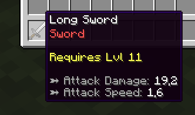
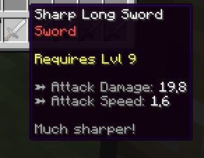
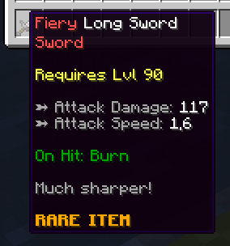

# 🗡️ Item Templates

When creating an item in MMOItems, you are actually creating an item **template**. An item template is composed of a set of **default** item options (display name, material, enchants, attack damage..), and a **set of item modifiers** which are chosen randomly and applied to the base item data when the item is given to a player.

This system designed is to make **ONE item template** able to generate **MULTIPLE versions/instances** of the same item. The item modifiers are what makes every version of the item unique: an endgame item instance would have many powerful modifiers while the newbie item instance would only have 1-2 weaker modifiers.

When being generated, items all have an **item level** which directly determines how strong the item stats are and a **modifier capacity** which determines how many modifiers the item can have. MMOItems item generator hooks onto the MMOItems tier system. The higher the item tier, the more modifiers the item has. In other words, the item tier determines the item **modifier capacity**.

The **item tier** and **item level** are our **"randomness cursors"**. They determine how powerful an instance of an item is. They are also independant, which means you can have high level weapons, with little to no modifiers, and conversely a newbie item with a lot of modifiers.

## Item Examples

We'll be going over a few examples to understand the basic concept of the MMOItems item generator.

### Example 1

  

These items use the same template, which is an item called `Long Sword`. However, the right one has a `Sharp` modifier which gives him +3 Atk Damage while the left one has no modifier.

These two items have the same attack speed because it was chosen not to scale with the item level. However the attack damage does scale with the item level: although the first item has got a higher level, the second item has a `Sharp` modifier and therefore has more attack damage.

The `Sharp` modifier gives the second item the `Sharp` prefix and adds an extra line of text in the item lore.

### Example 2

  

The item at the right has a much higher item level and therefore his attack damage is much higher. It also has two modifiers: `Sharp` and `Fiery`. `Sharp` still gives the item +3 Atk Damage but it's pretty useless given its level. `Fiery` gives the item a nice red name prefix and an on-hit burn ability.

The second item has the `Rare` item tier, therefore has much more modifier capacity than the non-tiered sword, which explains why it received two modifiers. Non-tiered items also have a modifier capacity, but it is much lower.

You can only see the `Fiery` prefix because this modifier has a higher priority (although you can configure the modifiers so that all the prefixes show, and have funny item names with 10 suffixes or prefixes at the same time!).

Last but not least, a higher level does not always mean more modifiers - the modified weapon has a lower level than the one with no modifier.

### Example 3


The default item is a bow with some attack damage and crit chance. The first `Heavy` modifier makes it two-handed, adds a few attack points and some critical strike power. The second modifier which has a suffix adds an on-hit ability.

## Example Item

This is how an item template looks in the MMOItems config files.

```yaml
LONG_SWORD:
    base:
        material: IRON_SWORD
        attack-damage:
            base: 10
            scale: 1
        critical-strike-chance: 30
        # More item stats here...
    modifiers:
        first-modifier:
            prefix: 'Modifier Prefix'
            stats:
                attack-damage: 3
                # More item stats here...
        second-modifier:
            suffix: 'Modifier Suffix'
            stats:
                pvp-damage: 20
                # More item stats here...
```

## Item Templates

Item templates are the most fundamental tool to generate random items. They are defined by a list of **default item stats** which the resulting item will have no matter what, and a list of **item modifiers** which will be randomly picked and applied to the resulting item to impact its rarity.

```yml
LONG_SWORD:
    
    # Basic template options
    option:
        tiered: true
        level-item: true
        roll-modifier-check-order: false
        capacity:
            base: 10
            scale: 3

    # Base item data
    base:
        material: IRON_SWORD
        name: '&fLong Sword'
        attack-speed: 1.6
        attack-damage:
            base: 6
            scale: 1.2
        required-level:
            base: 0
            scale: 1

    # Template modifiers
    modifiers: 
        sharp:
            chance: 0.3
            prefix: '&fSharp'
            stats:
                attack-damage: 3
                lore:
                - '&7Much sharper!'
```

Some comments on the config snippet above:

- The `base` section corresponds to the base item stats. For example, the base item is an iron sword which name is `Long Sword`. The default attack speed is 1.6 and the weapon has 6 Atk damage increased by 1.5 point for every item level.
- The `option` section is used to configure a few additional options for your template. See next paragraph for more information.
- The `modifiers` section contains all the modifiers which can be applied to the item.

Item generation templates can be found under the `/MMOItems/items` folder. You may add as many YML configs as you want in that folder to sort your templates.

## Item Template Options

A small list of extra options for your item template. Except capacity set them to `true` to enable them

| Template Option           | Description                                             |
| ------------------------- | ------------------------------------------------------- |
| ``roll-modifier-check-order`` | Scrambles the item modifiers list before rolling them when generating items    |
| ``tiered``  | A random tier will be picked for your item if none is specified when generating the item.  This accounts for the `/mi generate` command, but also for station crafting recipes! |
| ``level-item`` | A random item level will be picked for your item if none is specified when generating the item. |
| ``capacity`` | `capacity` can be used to impose a formula for modifier capacity to your item without having to use an item tier. It overrides both the default modifier capacity formula as well as the formula provided by the tier of the generated item. |