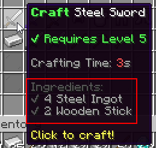

# 🪵 Ingredients 

The most important part about crafting recipes is the recipe ingredients (physical items any player must have to use the recipe). Recipes each have a list of ingredients the player must have in their inventory in order to use the recipe. There are multiple types of incredients, including:

- items generated using MMOItems
- vanilla items (not generated using MI) with a custom display name
- items from MythicMobs/Crucibles
- items from Oraxen, Nexo or ItemsAdder



## Example

For instance, let's say we want to create a recipe for the _Steel Sword_ item. We want to use both vanill and items from MMOItems: 2 vanilla sticks and 4 ingots (custom items from MMOItems):
```yml
# crafting-stations/cs_example.yml

recipes:
  steel-sword:
    output: 'mmoitems{type=SWORD,id=STEEL_SWORD}'
    #...
    ingredients:
    - 'mmoitem{type=MATERIAL,id=STEEL_INGOT,amount=4}'
    - 'vanilla{type=STICK,amount=2}'
```

## Available Ingredients

| Ingredient | Usage | Comments    |
|------------|-------|-------------|
| MMOItems | `mmoitem{type=SWORD,id=TWO_HANDED_LONGSWORD,level="7..10"}` | You can specify a range of item levels. Use `2..` for _2 And Higher_ and `..10` for _Up To Level 10_. |
| Vanilla Item | `vanilla{type=DIAMOND,name="Shiny Diamond"}` | If set, the `name` requires the item to have a specific display name. It is only optional, this requirement won't apply if not set. |
| Oraxen | `oraxen{id=amethyst}` |
| Nexo | `nexo{id=amethyst}` |
| ItemsAdder | `itemsadder{id=baseball_bat}` |
| MythicMobs/Crucible | `mythic{id=KingsCrown}` |

For any item, there is a `display=...` option to change how the ingredient looks in the item lore. In the following example, whatever the name of the item is, say _Baseball bat_, it will display as _Very Large Baseball Bat_ in the recipe lore.
```yml
recipes:
  steel-sword:
    #...
    ingredients:
    - nexo{id=baseball_bat,display="Very Large Baseball Bat"}
```

You can also change the amount of any ingredient using `amount=...`. **Make sure your recipes do not have TWO identical ingredients! This is a tiny limitation due to how crafting stations are designed - you cannot have the recipe require, say 10 Iron Ingots + 10 Iron Ingots. These ingredients need to be merged into one, larger, ingredient that is 20 Iron Ingots.** If needed, you can use amounts larger than 64 for one ingredient, it will work just fine.
```yml
recipes:
  steel-sword:
    #...
    ingredients:
    - vanilla{type=STICK,amount=60}
```