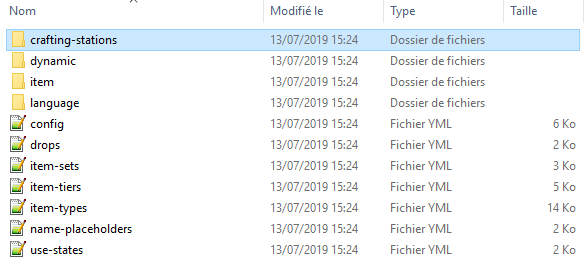
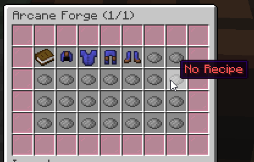
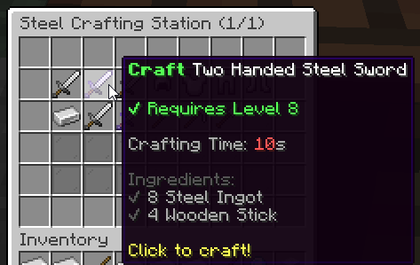

# ⚒️ Crafting Stations

Crafting stations are UIs players can open to easily craft items through recipes which require ingredients and conditions. Ingredients are physical requirements (items which players must have in their inventory in order to proceed with the craft) whereas conditions are virtual (money, class, level...) requirements.

## Opening a crafting station to a player

### Admin command

You can check the list of available crafting stations by using `/mi stations list`. You can make a player open a crafting station GUI by using the following command:
```txt
/mi stations open <station-id> <player>
```

We recommend admins to bind this command to a NPC or special block, so that the station is opened when interacting with some entity or block. Since this is an admin command, and you are therefore NOT supposed to be giving access to this command to players.

### Player Command

Every crafting station can also have its own custom open command. You can find below sample code taken from the default crafting station named `arcane-forge`. This feature is quite easy-to-use and comes handy if you need to setup special perks for your players, without the need to interact with a NPC or sign.

```yaml
# Optional. Defines a command to open the crafting station UI.
# Remove this config section to disable.
#
# These commands have a known limitation. If you change the command
# name or remove the crafting station, you will need to restart the
# server to unregister/remove the unused/previous command, as Bukkit
# does not allow to unregister commands while the server is running.
#
# Unless it is some high-end perk, we don't recommend using this,
# using the `/mi stations open <station> <player>` command from a NPC
# usually works better from a gameplay perspective.
command:
    name: 'arcaneforge' # The command itself
    description: 'Open the arcane forge' # Command description
    usage: '/arcaneforge' # Command usage
    permission: 'mmoitems.arcane_forge' # Permission needed to use the command
    aliases: [ af, mmoitems_af ] # Command aliases
    message:
        no-perm: '&cYou don''t have enough permissions.' # Message shown when missing permission
        not-a-player: '&cThis command is for players only.' # Message shown when sender is not a player
```

This feature has a known limitation however, due to Spigot not permitting to remove commands while the plugin is running. Consequently, if you change the command name or delete the crafting station, the command will be left hanging and will NOT be unregistered from the server when reloading MMOItems, **until the next server restart**. MMOItems will detect these ghost commands and show a warning in the console everytime `/mi reload` is ran.

## Creating a new crafting station

Crafting stations are saved inside the `/crafting-stations` folder. Every YML file in that folder corresponds to one crafting station. The easiest way to create a crafting station is to copy the YML config file corresponding to one of the default crafting stations, and change it as much as you need. The `/crafting-stations` can be organized into subfolders for clarity and ease of use.

The configuration file name will be used as the crafting station internal ID, which you will need in order to open up the station to players using the admin command presented above.



## Basic Options

```yml
name: 'Arcane Forge' # General name
max-queue-size: 10

recipes: ... # Recipes available at that crafting station
gui-layout: ... # GUI general layout
confirm-gui-layout: ... # General layout for the right-click "preview" GUI
```

Every crafting station needs some basic information provided in the station config file, starting with the `name` option (it is NOT the actual GUI name). The `max-queue-size` option dictates how many items a player can place in the crafting queue.



## Crafting Station Example

```yaml
name: 'Steel Crafting Station (#page#/#max#)'
max-queue-size: 10
sound: ENTITY_EXPERIENCE_ORB_PICKUP

recipes:
    two-handed-steel-sword:
        output: 'mmoitem{type=GREATSWORD,id=TWO_HANDED_STEEL_SWORD}
        crafting-time: 10
        conditions:
        - 'level{level=8}'
        ingredients:
        - 'mmoitem{type=MATERIAL,id=STEEL_INGOT,amount=8}'
        - 'vanilla{type=STICK,amount=4}'
```


