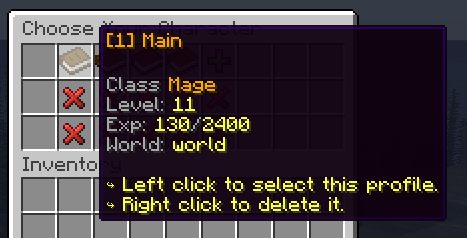

# 🏷️ Adding Placeholders

Plugins like MMOCore implement custom profile placeholders like profile class, level and experience. Such placeholders depend on the player profile, so a little bit of extra work is required compared to regular PAPI placeholders.



## Implement `PlaceholderProcessor`

The `PlaceholderProcessor` interface has two methods:

- `#getDataModule()` which should return your profile data module.
- `#processPlaceholderRequest(PlaceholderRequest)` which is the most important method of the interface. This should asynchronously fetch profile data, extract information from it and register its placeholders, and eventually call the `#validate()` method on the `PlaceholderRequest` instance.

For example, here is the MMOCore implementation of the `#processPlaceholderRequest` method.

```java
void processPlaceholderRequest(PlaceholderRequest placeholderRequest) {
    final PlayerData fictiveData = new PlayerData(new MMOPlayerData(placeholderRequest.getProfile().getUniqueId()));
    MMOCore.plugin.playerDataManager.loadData(fictiveData).thenRun(() -> {
        placeholderRequest.addPlaceholder("class", fictiveData.getProfess().getName());
        placeholderRequest.addPlaceholder("level", fictiveData.getLevel());
        placeholderRequest.addPlaceholder("exp", MythicLib.plugin.getMMOConfig().decimal.format(fictiveData.getExperience()));
        placeholderRequest.addPlaceholder("exp_next_level", MythicLib.plugin.getMMOConfig().decimal.format(fictiveData.getLevelUpExperience()));
        // Skipping some of the placeholders.....

        placeholderRequest.validate();
    });
}
```

Here is how your `#processPlaceholderRequest` should look like:

- Use `phRequest.getProfile().getUniqueId()` to access the UUID of the profile,
- Load your profile data asynchronously (using async Bukkit tasks!),
- Once data is loaded, register as many placeholders as needed using `phRequest.addPlaceholder(String, String)`. The first argument should be the placeholder key, like `class` or `level`, the second argument should be the placeholder string value. If your profile data module identifier is `mmocore`, and the placeholder key is `class` then the final placeholder would be `mmocore_class`,
- Inform MMOProfiles you are done registering placeholders using `phRequest.validate()`.

## Register your instance of `PlaceholderProcessor`

Use the following method to register your placeholder processor, this must be done when registering your profile data module.

```java
ProfileProvider provider = /* profile provider */;
PlaceholderProcessor yourPlaceholderProcessor = /* TODO */;
provider.registerPlaceholders(yourPlaceholderProcessor);
```
