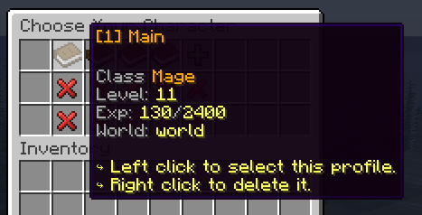
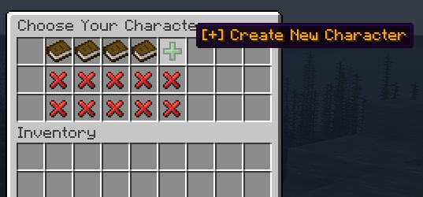

# 🦾 Profile Selection

The profile selection GUI is the first thing players will see when logging into the server. This UI shows all the profiles the player has registered and basic information about each one of these profiles. Players can create or remove profiles, or choose one. They won't be able to quit this UI until they choose a profile.


You can fully customize this GUI by modifying the file `gui/profile-list.yml`. Below, you can find the complete list of all the placeholders you can use to show all the profile information you find relevant. We recommend using a server resource pack to improve the look of your GUI, all of this is possible with MMOProfiles GUI's.



## Creating a new profile
If the player has enough profile slots, they can create a new profile by clicking the emerald. MMOProfiles will ask the profile name, and then the new profile will pop up in the list.



## Placeholders

These are the placeholders you can use in the `items.profile.lore` config option located inside of the `/MMOCore/language/gui/profile-list.yml` config file. This corresponds to what will be displayed in the profile item lore, for every profile in the inventory.

```yml
# Default config
lore:
- ''
- '&7Class &6{mmocore_class}'
- '&7Level: &e{mmocore_level}'
- '&7Exp: &e{mmocore_exp}&7/&e{mmocore_exp_next_level}'
- '&7World: &e{world}'
- ''
- "&e↪ Left click to select this profile."
- "&e↪ Right click to delete it."
```

### Vanilla placeholders

| Placeholder | Value |
|-------------|-------|
| `{profile_name}` | The profile name |
| `{last_time_played}` | Last time the player played with this profile. |
| `{slot}` | The slot corresponding to the profile |
| `{health}` | Profile's health. |
| `{level}` | Profile's level. |
| `{exp}` | Profile's exp. |
| `{balance}` | Profile's balance. |
| `{food}` | Profile's food level. |
| `{saturation}` | Profile's saturation. |
| `{air_level}` | Profile's air level. |
| `{world}` | The world the player will be in if he chooses the profile. |
| `{spawn_world}` | World of player's bed spawn point. |
| `{attribute_<name>}` | Profile's vanilla attribute value. For example, `{attribute_max_health}` |

### MMOCore Placeholders

| Placeholder | Value |
|-------------|-------|
| `{mmocore_class}` | MMOCore class name |
| `{mmocore_level}` | MMOCore main player level |
| `{mmocore_attribute_<name>}` | Points spent in a certain attribute. Not to be mistaken for the player's vanilla attributes. |
| `{mmocore_profession_<name>}` | Level in a certain profession |
| `{mmocore_exp}` | Current player exp |
| `{mmocore_exp_next_level}` | Amount of exp to reach next level |

