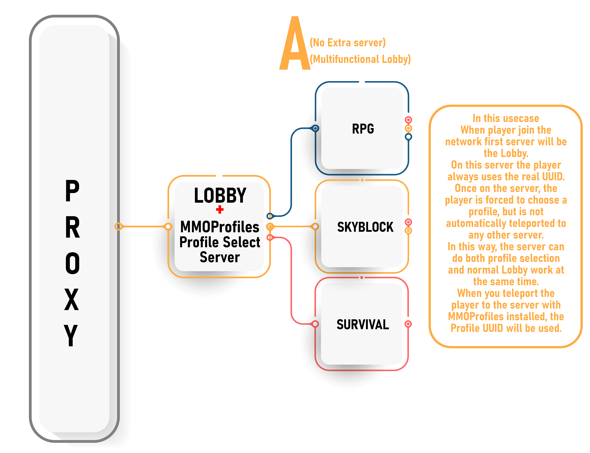
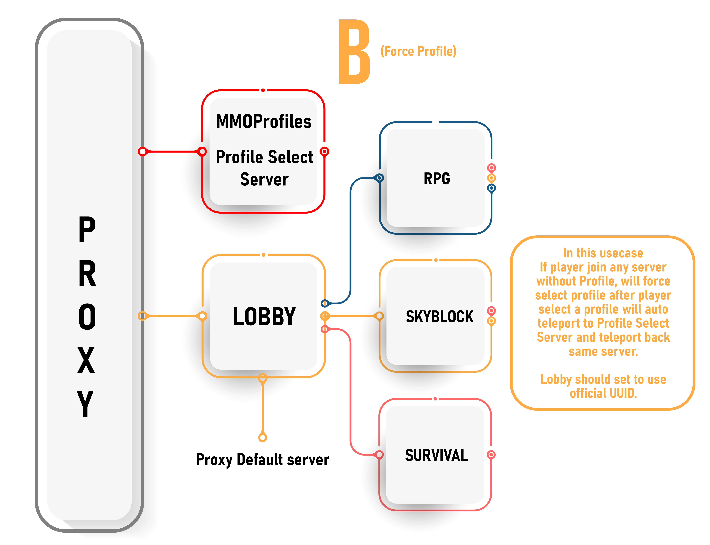
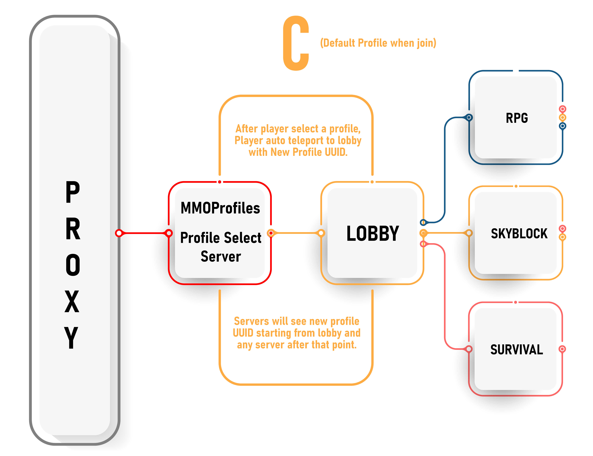
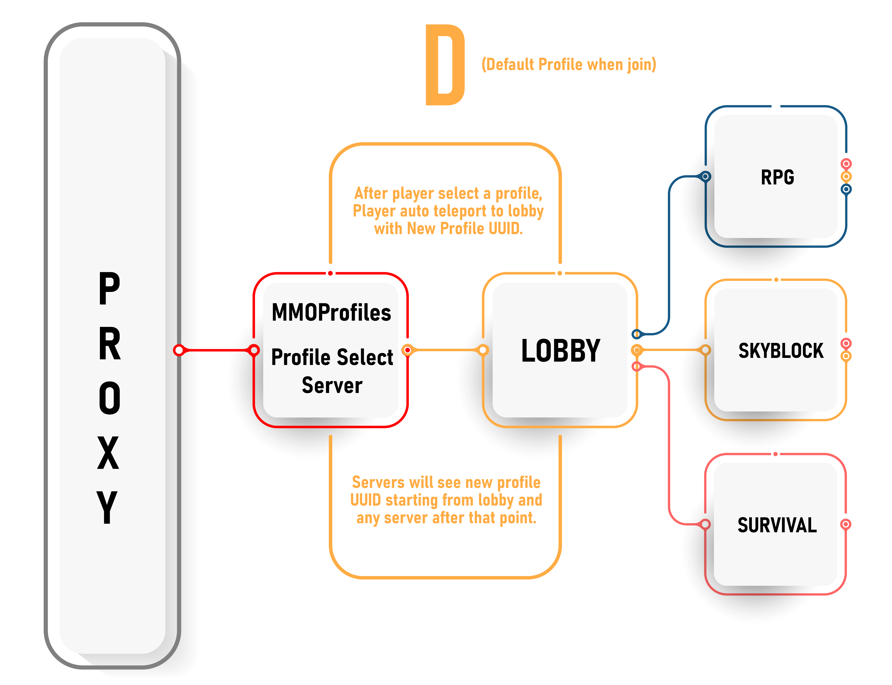

# 🫅 Proxy-Based Profiles

This feature was introduced in MMOProfiles 1.1 snapshots and allows for profile-specific progress for any type of player data, for any plugin. Modern proxies like Velocity or BungeeCord allow you to switch the player's UUID when switching servers, effectively tricking all plugins into thinking that another player joined the server.

This feature has a huge advantage: **this makes literally any plugin storing player data compatible with MMOProfiles without the need of having plugin-specific code**, which is known to be a very tedious task. More on that later.

_UUID switching_ has already been implemented in some plugins in the past, most of them being outdated now. MMOProfiles provides an up-to-date solution, packed with all of the other most important MMOProfiles features, namely configurable GUI-based profile selection, and extra compatibility with the MMO plugin suite. Our implementations are also very stable, since they do not rely on version-dependent code.

**You'll need at least one proxy and two servers in order to use this feature.**

## Why such a feature?

As you might know, it is hard for MMOProfiles to be compatible with literally every plugin out there. Supporting profile-based player data requires some heavy modifications to any plugin codebase - it requires the plugin to wait for MMOProfiles to provide a UUID, before making a database request based on that UUID.

This is quite hard to do for plugins outside of the MMO plugin suite. Although we have provided a well structured and open-source profile API for other developers to build against MMOProfiles, we of course cannot expect other developers to natively support it - which is why we've been working on a solution which requires no effort from any other developer.

## How do I enable it?

The following tutorial works on the assumption that you already know about proxies and MySQL databases. If that's not the case, you won't be able to understand it.

1. On every backend server where you'll be using MMOProfiles:
   - Install the [latest version of ProtocolLib](https://www.spigotmc.org/resources/protocollib.1997/). This is the most important hard dependency for the proxy-based profile selection feature.
   - Install the latest version of MMOProfiles. If you have other MMO plugins installed (including MythicLib), make sure they're up to date.
   - Make sure you toggled on MySQL usage in your MMOProfiles config file, otherwise player data will not be synchronized between servers.
   - If you're running 1.19+ spigot builds, you will also need the [NoEncryption](https://github.com/Doclic/NoEncryption) or [FreedomChat](https://modrinth.com/plugin/freedomchat) plugin which fixes an issue with signed chat packets. Otherwise, they will be instantly kicked when trying to talk through the in-game chat. This plugin unsigns in-game chat, you can learn more about it on their project GitHub if you're still unsure.
   - Set `enforce-secure-profile` to `false` in server.properties.
2. Install the same MMOProfiles JAR file on your proxy server. The main JAR file contains the code of both a Spigot plugin and a BungeeCord/Velocity plugin.
3. If you are using Velocity, make sure the `force-key-authentication` is set to `false`.

This **currently only works on Velocity** (BungeeCord support is planned) and the only supported backend server version is 1.20.2+ (1.16-1.19 support is also planned but requires adapting the code to older versions of the Minecraft protocol).

## Specifications

MMOProfiles needs to be installed on the following backend servers:

* lobby servers where players shall be asked to pick a profile
* "play" servers where players can play with their selected profile

Other servers, like minigame servers, servers implementing a gamemode fully uncorelated to profiles (or even temporary servers used to switch player UUIDs) do not need MMOProfiles installed.

### Play server VS lobby servers

In most proxy configs, you'll have lobby servers, where players connect when joining your Minecraft proxy, and "play" servers where players will play once they choose their profile.

### Options for play servers

* Toggle on the `kick_if_no_profile` option to prevent players from joining a server if they haven't chosen a profile.
  * This should be used on full RPG servers where players are required to select a profile before playing.
  * This option should be disabled on lobby servers and enabled on all of your play servers (it's up to you).

### Options for lobby servers

* Toggle on the `unselect_profile_on_login` option to have players automatically unselect their profile when joining the server.
  * This is great for lobby servers which players should join with no profile selected.
  * This means that players connecting to this server will be switched back to their official UUID.
* You may specify your play servers using the config option `target_servers`. These are the servers the players will be teleported to, from the lobby server, right after profile selection.
  * This is also the option you need to use if you want to toggle on `back_to_initial_server` (see below), in which case it will be the list of the temporary servers MMOProfiles will be using to perform that in-and-out UUID switch.
* By switching on `back_to_initial_server`, players will stay on the profile selection server.
  * Proxies need at least one server switch in order to properly switch the player's UUID, MMOProfiles will first send the player to such "temporary" server, and instantly send them back to the initial server. The UUID switch will be performed on the second server switch.
  * If you want your players to only play on one specific server (where they can both select their profile AND play), you can use this temporary server option to have all the players stay on one specific server. You don't need a very performant server backend for such temporary servers, as players will only be joining for a few seconds at most.
  * Also, you don't need MMOProfiles installed on these temporary UUID-switch servers.
* Be sure to use a different `server-identifier` on lobby servers. You need to set a different identifier name for all your servers that do not have the same map.

The spawn point for new profiles is specified using the `new-profile-spawn-point` option. Notice that while this option is to be specified in the MMOProfiles config file of the lobby server, this location has to have meaning in the play server. It is the location where players with a new profile will be teleported to.

## Known and unfixable issues
- Due to the PacketEvents API returning a null player object when a player re-joins the same server, you cannot use this plugin on versions `1.20.5–1.21.6`. Using a `1.21.8+` server is recommended. (If you really need versions 1.20.5–1.21.6, you can request the custom PacketEvents build we run for these versions on our Discord server.)
- Since your UUID has changed, Spectator mode will no longer work even if you are OP. If you really need it, replace the profile UUID in your player data with your real UUID.
- If you left `default-profile` set to `true` and connect an existing server in proxy mode, the first profiles of players whose data exists in the `world\playerdata` folder will automatically created with their real UUIDs. In proxy mode, if you use the proxy in `offline mode`, once your players select a profile with a real UUID, their UUID will not change even if they choose another profile. Turn off `default-profile` and start from scratch, or use your proxy server in online mode.

## Supported/Tested Plugins

### Permissions

We tested LuckPerms, GroupManager, CorePerms.

#### [CorePerms](https://gitlab.com/Tanerx/CoreTools/-/wikis/features/coreperms) <Badge type="tip" text="recommended" />

CorePerms natively supports MMOProfiles and is the recommended plugin.** Without any additional setup, you can add permissions and groups that will be active both on the selected profile or across all of the player's profiles.

#### [LuckPerms](https://www.spigotmc.org/resources/luckperms.28140/)

Official UUID group permission always apply to all Profile UUID. All profile permission ignored when using LuckPerms. **But this may not work for some plugins. When this happens, you need to add the permissions directly to the profile uuid.**

- If you want Official UUID group permissions and Profile UUID permissions work same time, you can use the [`MMOProfilesExtraPerms`](https://github.com/CKATEPTb-minecraft/MMOProfilesExtraPerms) plugin made by [**CKATEPTb**](https://github.com/CKATEPTb-minecraft).

- If you want the permissions added to profiles to take effect immediately, you need to use the [`MMOProfilePerms`](https://modrinth.com/plugin/mmoprofileperms). Plugin made by [**call911nowplz**](https://github.com/call911nowplz).

**Important LuckPerms note:** Since we changed the UUIDs of the players, LuckyPerms shows very long errors in the console, thinking that we pulled the offline player's data from the database. To avoid seeing these errors, simply set `vault-unsafe-lookups` to `true` in `config.yml`.

#### Problematic plugins

- **GroupManager:** If deleted permission exists in another profile, it is added again when the server is restarted. **Not recommended use with MMOProfiles**.

### Money (Vault)

Vault has to be installed in order to support most economy plugins. We tested CoreTools, PlayerPoints, Economy and XConomy.

::: warning
`synced-data.balance` must be set to `false` if you want all profiles to have only one shared balance, leaving it to `true` will make each profile have its own balance.
:::

#### [CoreTools](https://gitlab.com/Tanerx/CoreTools/-/wikis/features/economy) <Badge type="tip" text="recommended" />

CoreTools does not require any special configuration and **supports MMOProfiles natively**.

#### [PlayerPoints](https://www.spigotmc.org/resources/playerpoints.80745/)

- The `Vault` config option must be enabled
- MySQL must be enabled and all servers must be connected to the same database

#### [Economy](https://www.spigotmc.org/resources/economy.87053/)

- Set `StartingBalance` to `0`
- MySQL must be enabled and all servers must be connected to the same database

#### [XConomy](https://www.spigotmc.org/resources/xconomy.75669/)

- Only work with `synced-data.balance` set to `true`
- Set `UUID-mode` to `SemiOnline`
- Set `disable-cache` to `true`
- MySQL must be enabled and all servers must be connected to the same MySQL database

### Quest Plugins

Below you can see the list of quest plugins that we have tested and confirmed to work smoothly. You need to activate MySQL and connect all your servers to the same database.

- [QuestCreator](https://www.spigotmc.org/resources/questcreator-new-sqlite-support-and-data-conversion.38734/)
- [BetonQuest](https://www.spigotmc.org/resources/betonquest-all-your-adventure-supplies-versatile-quests-in-depth-conversations.2117/)
- [Quests](https://www.spigotmc.org/resources/quests.3711/)
- [BeautyQuests](https://www.spigotmc.org/resources/beautyquests.39255/)

### Storing Items, Backpacks

Make sure that all servers are connected to the same MySQL server.

- [MMOInventory](https://www.spigotmc.org/resources/99445/) <Badge type="tip" text="recommended" />
- [CoreTools PlayerVaults](https://gitlab.com/Tanerx/CoreTools/-/wikis/features/playervaults) <Badge type="tip" text="recommended" /> CoreTools does not require any special configuration and supports **MMOProfiles natively**.
- [Minepacks](https://www.spigotmc.org/resources/minepacks-backpack-plugin-mc-1-7-1-20.19286/)
- [EPIC BackPacks](https://www.spigotmc.org/resources/%E2%9C%85-epic-backpacks.28981/)
- [Bank](https://www.spigotmc.org/resources/bank-1-20-sale-20-off.3556/)

### Skyblock

- [BentoBox](https://www.spigotmc.org/resources/bentobox-bskyblock-acidisland-skygrid-caveblock-aoneblock-boxed.73261/) **Working properly.** All profiles have separate islands. https://www.youtube.com/watch?v=N2xzzcDeTyU
- [Iridium Skyblock](https://www.spigotmc.org/resources/iridium-skyblock-1-13-1-20.62480/) **Working properly.** All profiles have separate islands. https://www.youtube.com/watch?v=iht7P-ac-rI
- [SuperiorSkyblock2](https://www.spigotmc.org/resources/87411/) **Not working properly.** All profiles only see you as a same player.

### Others

- [Races of Thana](https://www.spigotmc.org/resources/1-13-1-20-races-of-thana%E3%83%BBcustom-gui-attributes-day-night-effects-and-more.59110/)
- [CoreTools](https://gitlab.com/phoenix-dvpmt/CoreTools/-/wikis/home) [PlayerVaults](https://gitlab.com/phoenix-dvpmt/CoreTools/-/wikis/features/playervaults), [Variables](https://gitlab.com/phoenix-dvpmt/CoreTools/-/wikis/features/variables) and [AuctionHouse](https://gitlab.com/phoenix-dvpmt/CoreTools/-/wikis/features/auctionhouse) features natively support MMOProfiles.

## Recommendations

* Always enable `unselect_profile_on_login` on your lobby server. In this way, players return to the official UUID every time they enter this server. The permissions or money you add while the player is not online will be updated when the player is online.
  * If you want players to select profiles on the lobby server but turn off teleporting automatically, simply set `target_servers: []`
  * If you want to not show the character selection in your lobby server, you can activate `no-gui-on-login`
  * Since the player official UUID has returned, sharing the money and permissions you sell in in-game stores with other profiles will be seamless.
  * SharedPermissions you added to any profile is not official UUID will be lost. Always add SharedPermissions to official UUID only.
  * When the player is not online, the vault money you add outside of the official UUID will not be shared with other profiles until the profile is selected.

## Usage examples

**A)** Multifunctional Lobby. With this installation, there is no need for an extra server. The server undertakes both the lobby and Profile selection work. In this setup, as in every lobby, it is the server owner's responsibility to set up the player teleportation system.

**Lobby:**

* Set target servers to `target_servers: []` (Cancels the player from auto-teleporting after profile select)
* Set true `unselect_profile_on_login` (It forces the player to use real UUID every time they enter this server.)

**All other servers:**

* Set true `kick_if_no_profile` (If the player is teleported to this server without selecting a profile due to an error, it will not allow entry.)
* Set false `unselect_profile_on_login` (It should remain false to not change the player's UUID to the official UUID.)
* Set target servers to your lobby in all other servers. 

**B)** Force profile all or selected servers. `back_to_initial_server` set to `true` for every profile except lobby.

* `No need to install MMOProfiles on Profile Select Server.`
* To control Vault money and SharedPermissions in profiles, it is recommended to install MMOProfiles in the lobby and turn off forced profile selection. `no-gui-on-login` to `true`

**C)** Forcing a profile on a particular server with profile selection before join.

* `back_to_initial_server` set to `true` for every RPG servers.
* No need to install MMOProfiles on other servers.
* To control Vault money and SharedPermissions in profiles, it is recommended to install MMOProfiles in the lobby and turn off forced profile selection. `no-gui-on-login` to `true`

**D)** Forcing a profile on the whole network when player enter the server.

* `kick_if_no_profile` set to `true` make sure player have profile all the time.
* It is mandatory to install MMOProfiles on all servers.

