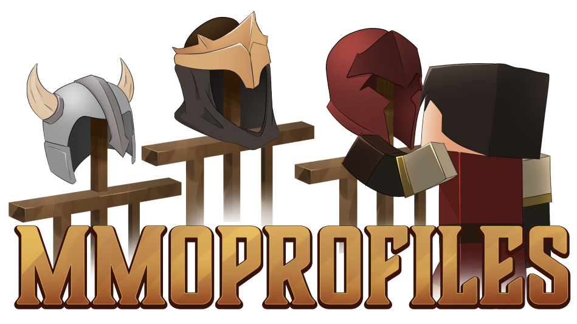

# 🏠 Home

***
**Welcome to the MMOProfiles Wiki!**
***
# Get MMOProfiles on [Polymart](https://polymart.org/product/4121/mmoprofiles) or [SpigotMC](https://www.spigotmc.org/resources/mmoprofiles.109942/)

MMOProfiles is a modern plugin that enables players to have multiple character slots/user profiles, each having its own progress. MMOProfiles supports health and food, inventory, location, bed spawn point, permissions, ender-chest and much more. It was also designed to function seamlessly with other plugins including MMOCore, MMOInventory and MMOItems by supporting data storage for multiple profiles. 

If you don't see what you need in the wiki, please join the [Discord](https://phoenixdevt.fr/discord) and look for further support. We are also trying to keep the wiki updated: let us know if you see something wrong or a typo!

Navigate to the next page to start installing MMOProfiles!