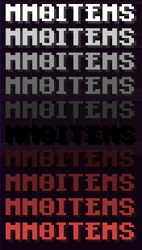

# 🪲 Frequent Issues

Use this list of common issues with MythicLib/MMOItems/MMOCore to diagnose your issue whenever you feel like something isn't right. It is recommended to read [this page](report.md) first.

Sometimes support over the Discord server is pretty slow given the amount of tickets and staff availability. Before reporting a bug using a Discord ticket, please make sure your issue is not one of the following. If you can fix it yourself using the following instructions, you will both gain time (that you'd have lost waiting for an answer) and make staff gain time so that they can work on fixing more complex bugs.

Issues specific to one of the MMO plugins are marked with brackets, like `Cannot cast abilities (MMOItems)`.

Always check your full server logs for plugin error logs because more than half the issues come with logs associated to them. Issues that often come with error logs are indicated in that list.

## Keep MythicLib up-to-date

Keep in mind MythicLib is necessary to run MMOItems/MMOCore and that it is a plugin too. A MI issue with MMOItems might entirely be caused by a anterior MythicLib startup issue. Always make sure it's not an issue with ML first.

Error logs which include a `NoClassDefFoundError` or `NoSuchMethodError`, like `Could not load ... in folder 'plugins' org.bukkit.plugin.InvalidPluginException: java.lang.NoClassDefFoundError: ...` can be due to either an outdated plugin or some plugin not loaded properly (check for startup errors).

## Plugin loading order issue

Severe plugin compatibility issues can happen when the MMO plugins don't load in a specific predefined order on server startup. It does sometimes happen with circular dependencies (A -\> B -\> C -\> A), forcing Bukkit or Spigot to ignore soft dependencies. **The most common issue is MythicMobs loading after all of the MMO plugins, which shouldn't happen at the required load order is the following:**\
`MythicMobs > MythicLib > MMOCore > MMOItems > MMOInventory`

Recent versions of MythicLib contain a script that fews for circular dependencies. If you are having loading order issues, check the startup logs of MythicLib as they will most likely indicate a message that looks like this:\
`Found a dependency cycle! Please make sure that the plugins involved load with no errors.`\
If you get such a message, you can either uninstall one of the plugins in the loop to break it, or try and correct the load order manually using the following fix. You can also contact the developers of the plugins involved as it unfortunately is up to them to fix that dependency cycle.

If you realize that MythicLib loads before MythicMobs for instance, one possible fix is to open the MythicLib.jar file and edit its `plugin.yml` internal file: by making MythicMobs a hard dependency you are forcing Bukkit to enable MythicMobs before MythicLib.

Previous `plugin.yml`:

```yml
# ....
softdepend: [ WorldGuard,Residence,Factions,MythicMobs,PlaceholderAPI ]
# ....
```

Fixed `plugin.yml`:

```yml
depend: [MythicMobs]
softdepend: [ WorldGuard,Residence,Factions,PlaceholderAPI ]
```

This is for your server start command to use plugin.yml if you are using paper/paper fork 1.19.2+

```bash
-Dpaper.useLegacyPluginLoading=true
```

## Dependency issue, preventing ML/MI/MC from starting

MMOItems, MMOCore and MMOInv assume that their dependencies had no issues loading. If any of the MMO plugin dependencies fail loading the MMO plugins will most likely disable as well. Always check your startup logs for error prior the MMO plugin error to make sure it's not an issue with a dependency.

For instance, if MythicMobs fails loading - either because of a configuration issue on the user end or a plugin bug -, MythicLib will probably not function properly and throw a startup error.


## `java.sql.SQLException: Column 'times_claimed' not found`

Your MMOCore database it out of date due to a change in MMOCore 1.9. You can either update to MMOCore \>1.9.5 or manually register the missing column. Updating your MySQL data table is fairly easy though, you just have to add a new string column called `times_claimed` (use the `LONGTEXT` data type):

```sql
ALTER TABLE mmocore_playerdata ADD COLUMN times_claimed LONGTEXT;
```

## Cannot break any block (MMOCore)

Please carefully read the following [wiki page](../mmocore/features/mining.md) as you might not have configured your tool permission sets.


## Health bar is stuck to 10 hearts

The health bar uses 10 hearts (equivalent to 20 HP) whatever maximum health you currently have. That option was implemented to allow server owners to utilize very large amount of health points without obstructing the player screen. You can disable this option in the main MythicLib config file. Since MythicLib 1.3.4 this option is now toggled **OFF** by default to reduce potential confusion.

## `Cannot invoke "io.lumine.mythic.core.skills.SkillExecutor.getSkill(String)" because "skillManager" is null`

This issue sometimes happen when MythicMobs loads after the MMO plugins. Please refer to the issue above called _Plugin loading order issue_.

## Color codes not working

MMOItems is currently transitioning to the MiniMessage format. If you have any issues with these please do report them in the issue tracker. Since ML 1.5 the MMO plugins are pretty lenient on what color codes you can use.

Here is a conversion table that indicates what tag corresponds to what color code

| Color Code | Tag | Alias |  | Color Code | Tag | Alias |
|------------|-----|-------|--|------------|-----|-------|
| `&0` | `<black>` | `<#000000>` |  | `&a` | `<green>` | `<#55FF55>` |
| `&1` | `<dark_blue>` | `<#0000AA>` |  | `&b` | `<aqua>` | `<#55FFFF>` |
| `&2` | `<dark_green>` | `<#00AA00>` |  | `&c` | `<red>` | `<#FF5555>` |
| `&3` | `<dark_aqua>` | `<#00AAAA>` |  | `&d` | `<light_purple>` | `<#FF55FF>` |
| `&4` | `<dark_red>` | `<#AA0000>` |  | `&e` | `<yellow>` | `<#FFFF55>` |
| `&5` | `<dark_purple>` | `<#AA00AA>` |  | `&f` | `<white>` | `<#FFFFFF>` |
| `&6` | `<gold>` | `<#FFAA00>` |  | `&k` | `<obfuscated>` | `<obf>` |
| `&7` | `<gray>` | `<#AAAAAA>` |  | `&l` | `<bold>` | `<b>` |
| `&8` | `<dark_gray>` | `<#555555>` |  | `&m` | `<strikethrough>` | `<st>` |
| `&9` | `<blue>` | `<#5555FF>` |  | `&n` | `<underlined>` | `<u>` |
| `&o` | `<italic>` | `<i>` |  | `&r` | `<reset>` | `<r>` |
| Line break | `<newline>` | `\n` |  | Rainbow | `<rainbow>` | None |

You may also use `<color:#FFFFFF>` or `<color:black>` for colors, while the `§` character instead of `&` remains natively supported by Bukkit.

To create a **horizontal** gradient of colors: `<gradient:[color1]:[color...]:[phase]>......</gradient>` where `[color]` is a hex color or simply something like `green`. To create a **vertical** gradient of colors: `<transition:[color1]:[color2]:[phase]>......</transition>`



| Example Color Code | Picture |
|--------------------|---------|
| `<gradient:#FBEB19:#FD8C30><bold>MMOITEMS</gradient>` |  |
| `<color:#FF0000><bold>MMOITEMS or <#FF0000><bold>MMOITEMS` |  |
| `<transition:white:black:red:0.0><bold>MMOITEMS</transition>`<br>`<transition:white:black:red:0.1><bold>MMOITEMS</transition>`<br>`<transition:white:black:red:0.2><bold>MMOITEMS</transition>`<br>`<transition:white:black:red:0.3><bold>MMOITEMS</transition>`<br>`<transition:white:black:red:0.4><bold>MMOITEMS</transition>`<br>`<transition:white:black:red:0.5><bold>MMOITEMS</transition>`<br>`<transition:white:black:red:0.6><bold>MMOITEMS</transition>`<br>`<transition:white:black:red:0.7><bold>MMOITEMS</transition>`<br>`<transition:white:black:red:0.8><bold>MMOITEMS</transition>`<br>`<transition:white:black:red:0.9><bold>MMOITEMS</transition>`<br>`<transition:white:black:red:1.0><bold>MMOITEMS</transition>` |  |

## Issue with FactionsBridge not loading

`java.lang.NoClassDefFoundError: cc/javajobs/factionsbridge/FactionsBridge`

You most likely have a Factions plugin installed. You need to install [FactionsBridge](https://www.spigotmc.org/resources/factionsbridge.89716/) which is a hard dependency when using any Factions plugin (it's like Vault but for factions). MythicLib has native support for most Factions plugins: you cannot deal skill damage to players within the same faction.

## Mana from AureliumSkills not working on items (MMOItems)

Sometimes AureliumSkills integration will fail with MMOItems. You can diagnose this issue by using `/mi debug info` which will display most fields (level and mana) to 0 even though AureliumSkills action bar says otherwise.

This sometimes happen when reloading the server, in which case a simple relog will fix the issue on the player side. Just make sure you fully restart the server instead of using `/reload`, which often ends up messing stuff up with plugins.

## Updating your server from \<1.20.4 to 1.20.5+

Minecraft 1.20.5 changes how NBT tags are stored within items. While vanilla Minecraft makes sure to convert items placed inside of player and chest inventories, items stored in non-vanilla/external databases (MMOProfiles, MMOInventory...) are not automatically converted.

If you are updating your server from \<1.20.4 to any version above, you have to convert your items stored in your MMOProfiles/MMOInventory databases to a format that does not depend on server version, upgrade your server, and convert the items back. Fortunately, MMOLib has a tool to have this done automatically. This tool comprises of one command and requires NBTAPI to be installed.

1. Download [NBTAPI](https://www.spigotmc.org/resources/nbt-api.7939/) from here and install it on your server.
2. Close your server and **backup your MMOProfiles/MMOInventory user databases** in case anything goes wrong**.**
3. Start your server in \<1.20.4 and **make sure no players log in** while performing the following steps. Do NOT upgrade your server just yet!
   1. Run the commands `mmoprofiles convert-item-nbts` and `mmoinventory convert-item-nbts` from the server console and wait for completion. Your items are now in a version-safe data format.
   2. Close your server. You can now safely upgrade to 1.20.5+
   3. Start your updated server, run the following commands from the server console: `mmoprofiles convert-item-nbts from` and `mmoinventory convert-item-nbts from` (notice the second "from" parameter) and wait for completion.
4. You can now uninstall NBTAPI from your server. Players can now safely login again.

You can take your time after running the first command batch, just make sure no player logs in after using the commands and before you upgrade your server version. Otherwise, the player who logged in in the meantime will suffer from item NBT corruption.