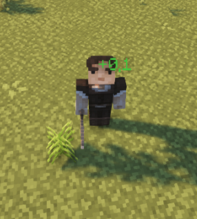

# ‼️ Damage Indicators

You can edit damage and regen indicators in the config file `indicators.yml`. MythicLib can use a wide range of popular holograms plugins to display regen/attack indicators around the target entity.

## Basic Config

::: details Default Config

```yml
damage_indicators:

  # Enable/disable damage indicators alltogether
  enabled: true

  # Under 0.1 damage, no indicator will show
  min_damage: 0.1

  # Use format: 'ᜌ{icon} &f{value}ᜌ' along with the resource pack
  # provided in the wiki in order to remove the gray background
  format: '{icon} &f{value}'
  decimal_format: '0.#'

  custom_font:
    enabled: false
    normal:
      '0': 'ᜀ'
      '1': 'ᜁ'
      '2': 'ᜂ'
      '3': 'ᜃ'
      '4': 'ᜄ'
      '5': 'ᜅ'
      '6': 'ᜆ'
      '7': 'ᜇ'
      '8': 'ᜈ'
      '9': 'ᜉ'
      'dot': 'ᜊ'
      'inter': 'ᜍ'
    crit:
      '0': 'ᜐ'
      '1': 'ᜑ'
      '2': 'ᜒ'
      '3': 'ᜓ'
      '4': '᜔'
      '5': '᜕'
      '6': '᜖'
      '7': '᜗'
      '8': '᜘'
      '9': '᜙'
      'dot': 'ᜋ'
      'inter': 'ᜍ'

  # single => one indicator only
  # packet => one indicator per damage packet (!!)
  # type   => one indicator per damage type
  group_by: packet
  damage_type_splits: [weapon, skill]
  damage_type_icon_join: '' # Join by space character

  icon:
    weapon:
      normal: '&c🗡'
      crit: '&c&l🗡'
    skill:
      normal: '&6☄'
      crit: '&6&l☄'
    projectile:
      normal: '&a➶'
      crit: '&a&l➶'
    physical:
      normal: '&4✘'
      crit: '&4&l✘'
    magic:
      normal: '&9✩'
      crit: '&9&l✩'

  split_holograms: true
  holograms_join: ' ' # Split by space character

  move: true
  radial_velocity: 1
  gravity: 1
  initial_upward_velocity: 1
  y_offset: 0.1
  entity_height_percent: 0.75
  r_offset: 0.5
  entity_width_percent: 0.75
  tick_period: 3
  lifespan: 20
```

:::

You can edit the indicator formats using the `format` option. The `icon` section lets you configure the icons that correspond to every damage type.

### Physics Options

When increasing `radial_velocity` the holo will fly farther away (if the holo plugin you're using supports moving holograms - some just don't -). Increasing the `gravity` option will make your holo fly faster to the ground. Conversely increasing `initial_upward_velocity` will make your holo fly higher. `y_offset` can be used if you want to apply a flat Y offset to the location where you're displaying the damage indicators. Last but not least, setting `entity_height_percent` to `.75` - for instance - will have the holo display at 75% of the target entity's height (this then stacks up with the flat Y coordinate offset), and setting it to 100% will have it display at the top of the entity's bounding box.


When toggling off `move`, holograms will be static and won't move from their initial position.

### Holograms

When toggling on `split_holograms`, each icon will be displayed in its own hologram rather than all icons being displayed in the same hologram. When set to `false`, you can configure how the icons are joined together using the `holograms_join` config option. For instance, if you set it to a comma followed by a space `" "`, an indicator displaying both weapon and skill damage will show the weapon icon, then a comma and a space, then the skill icon. This would look like this: `🗡, ☄` (followed by the indicator damage value).

## Using a custom font

Enable custom fonts by toggling on the `custom_fonts.enabled` config option. MythicLib will then replace any numeric character (0-9) with the character you specified in the config. You can also configure the character that ML is going to use for the decimal separator (`dot`) as well as a character that will be planed in between all the other characters.

Using custom textures you can then use a resource pack to have damage indicators with fully custom characters. Here is a [resource pack](https://www.dropbox.com/s/yih3hsdq6o6eak0/Font.zip?dl=1) that works with the default MythicLib config that you can check to understand how to use custom fonts within ML indicators.

## `groupby`

The parameter `group_by` lets you choose how damage packets together to form indicators. There are three available options:
- `single`: groups all damage packets to the entity in one single indicator
- `packet`: creates one indicator per damage packet, where each indicator displays the total damage of the packet and its list of damage types (one icon per damage type). **This is the option most people would expect by default.**
- `type`: you choose what damage types are displayed. With this option, you need to specify the damage types to split by in the `damage_type_splits` config option. For each damage type specified, one indicator will be created displaying the total damage of that type. If a damage type is not present in the damage packet, no indicator will be created for it.

In case a single hologram contains multiple damage type icons, you can configure how the icons are joined together using the `damage_type_icon_join` config option. For instance, if you set it to a comma followed by a space `" "`, an indicator displaying both weapon and skill damage will show the weapon icon, then a space, then the skill icon. This would look like this: `🗡 ☄` (followed by the indicator damage value).

### Example

Let's say that a player just hit a mob with a 100 Atk Damage weapon (_Physical, Weapon_ damage). An on-hit skill triggers, dealing 30 _Skill, Magic_ damage. Finally, elemental stats present on the item deal an additional 20 _Fire-Weapon_ damage.

| Mode | Resulting Indicators | Comment |
|------|----------------------|---------|
| `single` | `🗡☄✘ 150` | One single indicator
| `packet` | `🗡✘ 100`, `☄✩ 30`, `🔥🗡 20` | One per packet |
| `type` | `🗡 120`, `☄ 30` | One per damage type specified |

## Regen/Heal Indicators

They share most of their options with damage indicators. These appear when regenerating health through potions, natural regeneration, skills... You can also apply custom fonts to regen indicators following the same syntax as with damage indicators.

::: details Default Config

```yml
regen_indicators:

  # Enable/disable damage indicators alltogether
  enabled: false

  # Under 0.1 health regen, no indicator will show
  min_regen: 0.1

  # Use format: 'ᜌ{icon} &f{value}ᜌ' along with the resource pack
  # provided in the wiki in order to remove the gray background
  format: '&a+{value}'
  decimal_format: '0.#'

  custom_font:
    enabled: false
    '0': 'ᜀ'
    '1': 'ᜁ'
    '2': 'ᜂ'
    '3': 'ᜃ'
    '4': 'ᜄ'
    '5': 'ᜅ'
    '6': 'ᜆ'
    '7': 'ᜇ'
    '8': 'ᜈ'
    '9': 'ᜉ'
    'dot': 'ᜊ'
    'inter': 'ᜍ'

  move: true
  radial_velocity: 1
  gravity: 1
  initial_upward_velocity: 1
  y_offset: 0.1
  entity_height_percent: 0.75
  r_offset: 0.5
  entity_radius_percent: 0.75
  tick_period: 3
  lifespan: 20
```
:::


