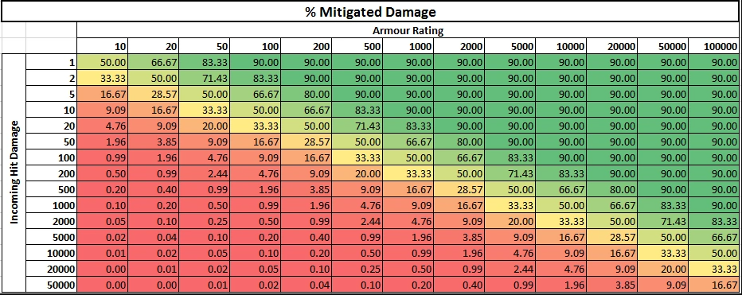

# 💔 Damage

MMOItems and MMOCore share the same damage system. Any attack, from melee sword hits to MMOCore abilities, has a specific set of damage types which can be any of the following:

- **physical**, **magic** or **unarmed** damage
- **projectile** damage
- **weapon** or **skill** damage
- **on-hit** damage (on-hit damage doesn't trigger on-hit effects)
- **dot** or damage over time
- **minion** damage

**e.g:** a bow deals weapon-physical-projectile damage. An ice crystal spell deals projectile-magic-skill damage.

## Stats increasing damage dealt

Attack damage can be increased by several stats including Physical/Magical/Projectile/Weapon/Skill damage, but also other damage stats including **PvE/PvP/Undead Damage** which rather depend on the entity you are attacking.

Since MythicLib 1.3 these stats all add up "linearly" and don't stack up geometrically. For instance, +50% skill damage and +50% magical damage will increase magical-skill damage by `50% + 50% = 100%` rather than `150% * 150% - 100% = 125%`. This 25% difference gets super huge when multiple stats are taken into account at the same time, like when adding PvE damage or Undead damage on top of it.

## Stats reducing incoming damage

These are stats like `Magic Damage Reduction` or `Damage Reduction`. Unlike damage-increasing stats, these stats do stack up geometrically. Combining _10% Dmg Red_ and _10% Fall Dmg Red_ will **NOT** result in `10% + 10% = 20%` damage reduction for fall damage, but rather `100% - 90% * 90% = 19%`. This 1% difference gets bigger the higher the player stats are.

This calculation makes these statistics less op when they get bigger, and also make sure the damage never reaches 0 and always stays positive. In a nutshell, when considering damage-increasing stats or damage reduction stats, MythicLib always considers what's worse for the attacker.

## Defense

Defense is a player stat which you can use in both MMOItems and MMOCore. It was introduced to bypass the 30 armor points vanilla limit which prevents users from having high armor values. The defense formula can be edited in the main MythicLib plugin config.

```yml
# Defines how defense behaves. The formula should return the
# final amount of damage dealt, given the following inputs:
# - damage dealt #damage#
# - current player defense #defense#
#
# The default formula is inspired from Path of Exile, you can
# learn more about it on their wiki: https://pathofexile.fandom.com/wiki/Armour
#
# natural   <-> non-elemental damage
# elemental <-> fire/water/.. damage
defense-application:
  natural: '#damage# - #defense#'
  elemental: '#damage# * (1 - (#defense# / (5 * #damage# + #defense#)))'
```

Here's a table indicating how much damage is dealt given an amount of elemental defense and initial attack points, using the default elemental defense formula which is the one used in Path of Exile. 

This formula was changed in MythicLib 1.4 if you'd like to use the previous one, here it is. It has the downside of not taking into account the incoming amount of damage, making adjusting this formula for both high and low levels harder.

```yml
defense-application: '#damage# * (1 - (#defense# / (#defense# + 100)))'
```

The most important math functions are supported by the formula interpreter. For instance, you can use `sqrt(16)` (returns 4), `pow(2, 3)` will return 8, `atan2`, `min(10, 5)` will return 5, etc. If you're unsure what methods are supported, just give them a try.

## Critical Strikes

Weapons and skills can deal critical strikes, increasing the damage dealt. Please refer to the [On-Hit Effects](on-hit-effects.md) page for more information about critical strikes.

## Damage Mitigation

Please refer to the [Damage Mitigation](mitigation-types.md) page for more information about damage mitigation.

## Damage Indicators

Please refer to [this page](damage-indicators.md) for more information about damage indicators.
