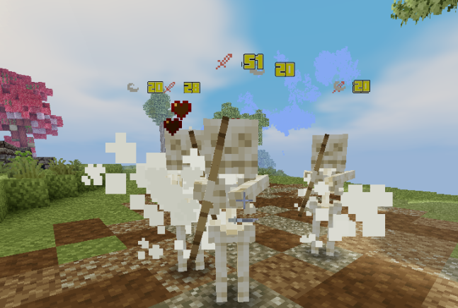

# 💔 Damage

MMOItems and MMOCore share the same damage system. Any attack, from melee sword hits to MMOCore abilities, has a specific set of damage types which can be any of the following:

- **physical**, **magic** or **unarmed** damage
- **projectile** damage
- **weapon** or **skill** damage
- **on-hit** damage (on-hit damage doesn't trigger on-hit effects)
- **dot** or damage over time
- **minion** damage

**e.g:** a bow deals weapon-physical-projectile damage. An ice crystal spell deals projectile-magic-skill damage.

## Stats increasing damage dealt

Attack damage can be increased by several stats including Physical/Magical/Projectile/Weapon/Skill damage, but also other damage stats including **PvE/PvP/Undead Damage** which rather depend on the entity you are attacking.

Since MythicLib 1.3 these stats all add up "linearly" and don't stack up geometrically. For instance, +50% skill damage and +50% magical damage will increase magical-skill damage by `50% + 50% = 100%` rather than `150% * 150% - 100% = 125%`. This 25% difference gets super huge when multiple stats are taken into account at the same time, like when adding PvE damage or Undead damage on top of it.

## Stats reducing incoming damage

These are stats like `Magic Damage Reduction` or `Damage Reduction`. Unlike damage-increasing stats, these stats do stack up geometrically. Combining _10% Dmg Red_ and _10% Fall Dmg Red_ will **NOT** result in `10% + 10% = 20%` damage reduction for fall damage, but rather `100% - 90% * 90% = 19%`. This 1% difference gets bigger the higher the player stats are.

This calculation makes these statistics less op when they get bigger, and also make sure the damage never reaches 0 and always stays positive. In a nutshell, when considering damage-increasing stats or damage reduction stats, MythicLib always considers what's worse for the attacker.

## Defense

Defense is a player stat which you can use in both MMOItems and MMOCore. It was introduced to bypass the 30 armor points vanilla limit which prevents users from having high armor values. The defense formula can be edited in the main MythicLib plugin config.

```yml
# Defines how defense behaves. The formula should return the
# final amount of damage dealt, given the following inputs:
# - damage dealt #damage#
# - current player defense #defense#
#
# The default formula is inspired from Path of Exile, you can
# learn more about it on their wiki: https://pathofexile.fandom.com/wiki/Armour
#
# natural   <-> non-elemental damage
# elemental <-> fire/water/.. damage
defense-application:
  natural: '#damage# - #defense#'
  elemental: '#damage# * (1 - (#defense# / (5 * #damage# + #defense#)))'
```

Here's a table indicating how much damage is dealt given an amount of elemental defense and initial attack points, using the default elemental defense formula which is the one used in Path of Exile. 

This formula was changed in MythicLib 1.4 if you'd like to use the previous one, here it is. It has the downside of not taking into account the incoming amount of damage, making adjusting this formula for both high and low levels harder.

```yml
defense-application: '#damage# * (1 - (#defense# / (#defense# + 100)))'
```

The most important math functions are supported by the formula interpreter. For instance, you can use `sqrt(16)` (returns 4), `pow(2, 3)` will return 8, `atan2`, `min(10, 5)` will return 5, etc. If you're unsure what methods are supported, just give them a try.

## Critical Strikes

Weapons may deal **critical strikes** which by default multiply damage dealt by 2 (configurable using config.yml) and display firework particles around the target. Skills may deal **skill critical strikes** which displays totem particles around the target while multiplying damage dealt by 1.5 (configurable as well).

By default, critical strikes for both skills and weapons are on a 3sec cooldown, although this value can be edited.

Here is the default configuration for critical strikes (`MythicLib/config.yml`):

```yml
critical-strikes:
  weapon:
    coefficient: 2 # Default = 2 meaning crits deal 200% of the initial damage
    cooldown: 3
  skill:
    coefficient: 1.5 # Default = 1.5 meaning crits deal 150% of the initial damage
    cooldown: 3
```

## Damage Mitigation

Learn more about damage mitigation on the [MMOItems Wiki](https://gitlab.com/phoenix-dvpmt/mmoitems/-/wikis/Damage%20Mitigation). The damage mitigation system is the same for MMOCore and MMOItems.

Some of the options for damage mitigation can be edited in the main MythicLib config file. For base/min/max values of damage mitigation-based stats, you should also check the `MythicLib/stats.yml` config file.

::: details Default Config

```yml
# Default and max. values of armor stats. These systems
# all have a cooldown which can be reduced using the
# '*** Cooldown Reduction' item stat.
mitigation:

  # Edit mitigation messages here. Leave to blank for no message.
  message:

    # Whether or not they should display on action bar instead of chat
    action-bar: true

    parry: '&cYou just parried #damage# damage.'
    block: '&cYou just blocked #damage# damage.' # Use #power# to display block power.
    dodge: '&cYou just dodged #damage# damage.'

  block:
    cooldown: 5.0

  dodge:
    knockback: 1.0
    cooldown: 5

  parry:
    knockback: 1.0
    cooldown: 8.0
```
:::

## Damage Indicators

Damage indicators were centralized from MMOCore and MMOItems to MythicLib. You can edit these in the main plugin config. MythicLib uses holograms plugins to display regen/attack indicators around the target entity.

::: details Default Config

```yml
  damage:
    enabled: true
    decimal-format: '0.#'
    format: '{icon} &f{value}'
    custom-font:
      enabled: true
      normal:
        '0': 'ᜀ'
        '1': 'ᜁ'
        '2': 'ᜂ'
        '3': 'ᜃ'
        '4': 'ᜄ'
        '5': 'ᜅ'
        '6': 'ᜆ'
        '7': 'ᜇ'
        '8': 'ᜈ'
        '9': 'ᜉ'
        'dot': 'ᜊ'
        'inter': 'ᜍ'
      crit:
        '0': 'ᜐ'
        '1': 'ᜑ'
        '2': 'ᜒ'
        '3': 'ᜓ'
        '4': '᜔'
        '5': '᜕'
        '6': '᜖'
        '7': '᜗'
        '8': '᜘'
        '9': '᜙'
        'dot': 'ᜋ'
        'inter': 'ᜍ'
    icon:
      weapon:
        normal: '&c🗡'
        crit: '&c&l🗡'
      skill:
        normal: '&6★'
        crit: '&6&l★'
    split-holograms: true
    radial-velocity: 1
    gravity: 1
    initial-upward-velocity: 1
    entity-height-percent: 0.75
    y-offset: 0.1
```

:::

You can edit the indicator formats using the `format` option. The `icon` section lets you configure the icons that you want to display when the player is dealing weapon/skill damage. MythicLib separates three types of damage: weapon, skill and elements. If you want these to display on one single holo, set `split-holograms` back to false.

When increasing `radial-velocity` the holo will fly farther away (if the holo plugin you're using supports moving holograms - some just don't -). Increasing the `gravity` option will make your holo fly faster to the ground. Conversely increasing `initial-upward-velocity` will make your holo fly higher. `y-offset` can be used if you want to apply a flat Y offset to the location where you're displaying the damage indicators. Last but not least, setting `entity-height-percent` to .75 - for instance - will have the holo display at 75% of the target entity's height (this then stacks up with the flat Y coordinate offset), and setting it to 100% will have it display at the top of the entity's bounding box.



### Using a custom font

Enable custom fonts by toggling on the `custom-fonts.enabled` config option. MythicLib will then replace any numeric character (0-9) with the character you specified in the config. You can also configure the character that ML is going to use for the decimal separator (`dot`) as well as a character that will be planed in between all the other characters.

Using custom textures you can then use a resource pack to have damage indicators with fully custom characters. Here is a [resource pack](https://www.dropbox.com/s/yih3hsdq6o6eak0/Font.zip?dl=1) that works with the default MythicLib config that you can check to understand how to use custom fonts within ML indicators.

## Regen/Heal Indicators

They share most of their options with damage indicators. These appear when regenerating health through potions, natural regeneration, skills... Since MythicLib 1.6.2 development builds, you can also apply custom fonts to regen indicators following the same syntax as with damage indicators.

::: details Default Config

```yml
  regen:
    enabled: false
    decimal-format: '0.#'
    format: '&a+#'
    radial-velocity: 1
    gravity: 1
    initial-upward-velocity: 1
    entity-height-percent: 0.75
    y-offset: 0.1
    custom-font:
      enabled: false
      '0': 'ᜀ'
      '1': 'ᜁ'
      '2': 'ᜂ'
      '3': 'ᜃ'
      '4': 'ᜄ'
      '5': 'ᜅ'
      '6': 'ᜆ'
      '7': 'ᜇ'
      '8': 'ᜈ'
      '9': 'ᜉ'
      'dot': 'ᜊ'
      'inter': 'ᜍ'
```
:::

